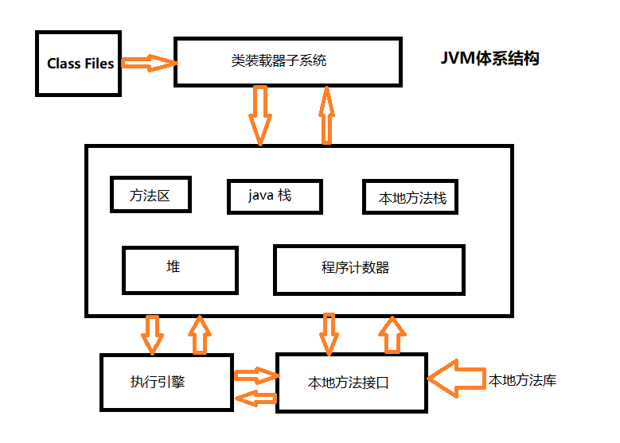

### JVM学习

<hr>

#### 1、认识JVM

（1）JVM语言规范：定义什么是Java虚拟机

Java语言和Java虚拟机相对独立的，很多其他语言也是支持Java虚拟机规范的，比如如Clojure、Groovy、JRuby、Jython、Scala等

+ Class文件类型
+ 运行时数据
+ 帧栈
+ 虚拟机的启动
+ 虚拟机指令集


整数的表示：

> -6								 -1
>
> 原码：10000110					10000001
>
> 反码：11111001					11111110
>
> 补码：11111010					11111111
>
> 为什么用补码？
>
> 1）计算0（既不是正数，也不是负数），因为我们不知道0是整数还是负数
>
> 使用补码可以没有歧义的表示0（0的补码无论是正数还是负数都是全0表示的）
>
> 2）补码让计算更方便
>
> -6 + 5												-3 + 5
>
> 11111010		-6									11111101
>
> 00000101		 5									00000101
>
> =====================================
>
> 11111111		-1									00000010	(2)

浮点数的表示：

> （1）Float类型：符号位（1） 指数位（8） 位数（23）
>
> s	e e e e e e e e	m m m m m m m m m m m m m m m m m m m m m m m 
>
> 如果指数位e全0，则附加位为0，否则尾数附加位为1
>
> -5的表示：1 <font color="red">1 0 0 0 0 0 0 1</font>	01000000000000000000000
>
> -1\* 2^(129-127)*(2^0+2^-2)   完整表达式：-1 \* 2^(2^7+1)
>
> 值的计算：s\*m\*2 ^ (e-127)  \* (隐藏位 + m \* 2^-1 + m * 2·^-2 + m \* 2^-3 + ... + m \* 2^-23)；127是固定位移数


（2）JVM需要对Java Library提供以下支持

这些都是Java语言本身是无法实现的，必须通过底层实现，这些真正的loader是无法访问到的

+ 反射	java.lang.reflect
+ ClassLoader
+ 初始化class和interface
+ 安全相关：java.security
+ 多线程
+ 弱引用


（3）VM指令集

+ l2i类型转化
+ aload astore出栈入栈操作（进栈，出栈）
+ iadd isub运算（相加，相减）
+ ifeq ifne流程控制（相等和不等）
+ invokevirtual invokeinterface invokespecial invokestatic函数调用
+ javap反编译


#### 2、Java虚拟机的运行机制

（1）JVM启动流程

java xxx.java --->  装载配置（jvm.cfg）--->   根据配置找到JVM.dll ----> 初始化JVM（获得JNIEnv接口，findClass通过它来实现） ----> 找main方法并运行


（2）JVM基本结构

PC寄存器

+ 每一个线程拥有一个PC寄存器
+ 在线程创建时，创建寄存器
+ 指向下一条指令的地址
+ 执行本地方法时，PC的值是undefined


### atguigu-JVM学习


#### 1、JUC

JUC：java.util.concurrent

进程：如`xxx.exe`

线程：如360，提供很多的功能窗口，都是`360.exe`下的线程

+ 选修课必逃，必修课选逃


并发：多个线程抢一个资源

并行：同时做不同的事情


##### 1.1 JUC介绍

3个包

+ java.util.concurrent
+ java.util.concurrent.atomic
+ java.util.concurrent.locks


##### 1.2 JUC的demo

题目：3个售票员，卖30张票

编写企业级的多线程代码：

<font color="red">高内聚，低耦合的前提下，使用线程操作资源类</font>


java多线程的几种状态：

通过Thread.State可以查看源码，并看到介绍

NEW：虚拟机创建线程对象

RUNNABLE：线程在虚拟机中处于运行状态，等待操作系统（比如处理器）分配资源执行

BLOCKED：线程中断状态，等待进入一个同步代码块或方法

WAITING：等待状态，等待其它线程执行完指定操作后，通过唤醒后执行

TIMED_WAITING：指定线程等待时间，等待完成继续执行

TERMINATED：线程完成执行


线程操作资源类

```java
public class Tickets {
    private volatile int total = 30;
    private Lock lock = new ReentrantLock();

    public void sale() {
        lock.lock();
        try {
            if (total > 0)
                System.out.println(Thread.currentThread().getName() + "卖出" +
                        total-- + "张票，还剩" + total + "张票");
        } catch (Exception e) {
            e.printStackTrace();
        } finally {
            lock.unlock();
        }
    }

    public static void main(String[] args) {
        Tickets ticket = new Tickets();
        new Thread(() -> {
            for (int i = 0; i < 30; i++) {
                ticket.sale();
            }
        }, "Clerk A").start();
        new Thread(() -> {
            for (int i = 0; i < 30; i++) {
                ticket.sale();
            }
        }, "Clerk B").start();
        new Thread(() -> {
            for (int i = 0; i < 30; i++) {
                ticket.sale();
            }
        }, "Clerk C").start();
    }
}
```


鸭子浮水脚下滑，看不到的才是真本事

ReentrantLock：可重复锁


##### 1.3 函数式编程

Lambda表达式就是解决匿名内部类大量冗余代码而出现的

```java
@FunctionalInterface
interface Foo {
    //函数式接口只能定义一个方法
    //如果不写这个注解，也会隐式加上@FunctionalInterface
    void say();
}

public class Lambda {
    public static void main (String[] args){
        Foo foo = () -> System.out.println("hello");
    }
}
```


java8允许函数式接口部分实现方法（2014，2015出的 java8）

```java
@FunctionalInterface
interface Add {
    int add(int x, int y);
	
    //实现默认方法
    default int multiply(int x, int y) {
        return x * y;
    }

    default int subtract(int x, int y) {
        return x - y;
    }
	
    //实现静态方法
    static int divide(int x, int y) {
        return x / y;
    }
    
    static int sqr (int x){
        return (int)Math.sqrt(x);
    }
}
```


java8 ：

+ ArrayList默认初始值10，1.5倍扩容，使用`Arrays.copyOf`进行扩容（源码的`grow()`方法原长度右移一位并加原长度）
+ HashMap初始值16，1倍扩容（源码的`resize()`方法中左移一位）


##### 1.4 并发读写异常

`ConcurrentModificationException`并发读写异常

如何证明ArrayList是线程不安全的

```java
public class TestList {
    public static void main (String[] args){
        List<String> list = new ArrayList<>();   
        //solution：new Vector<>();
        //solution1: Collections.synchronizedList(new ArrayList<>());
        //solution2：new CopyOnWriteList();写实复制,底层就是
        //可能出现并发读写异常
        for(int i = 0; i < 3; i++){
            new Thread(() -> {
                list.add(UUID.randomUUID().substring(0,8));
                System.out.println(list);
            },String.valueOf(i)
            ).start();
        }
    }
}
```


写实复制源码

```java
public boolean add(E e) {
    final ReentrantLock lock = this.lock;
    //当前线程添加元素时，其它线程自旋
    lock.lock();
    try {
        //获取数组
        Object[] elements = getArray();
        int len = elements.length;
        //生成一个长度+1的新数组，并写在最后一个元素上
        Object[] newElements = Arrays.copyOf(elements, len + 1);
        newElements[len] = e;
        //设置新数组为存放元素数组
        setArray(newElements);
        //释放资源，告知其它线程可以操作数据了
        return true;
     } finally {
         lock.unlock();
     }
}
```


HashSet底层就是HashMap，value是常量preset，一个对象

解决并发读写异常：

+ `ArrayList` -> `CopyOnWriteArrayList`
+ `HashSet` -> `CopyOnWriteHArraySet`
+ `HashMap` -> `ConcurrentHashMap`


##### 1.5 锁

8锁问题

+ synchronized：对象锁，多个线程操作同一个资源类，synchronized修饰的方法，锁的是资源类


```java
public class TestLock {
    public static void main(String[] args) throws Exception {
        Phone phone1 = new Phone();
        Phone phone2 = new Phone();

        //1.标准访问
        new Thread(() -> {
            try {
                //TimeUnit.SECONDS.sleep(2);
                phone1.sendEmail();
            } catch (Exception e) {
                e.printStackTrace();
            }
        },"thread A").start();
        //排队等候
        Thread.sleep(10);
        new Thread(() -> {
            phone1.sendSMS();
            //phone2.sendSMS();
        },"thread B").start();
    }
}

class Phone {
    public synchronized void sendEmail () {
        //与Thread.sleep()的工具类
        System.out.println("send email");
    }
    
    public synchronized void sendSMS () {
        System.out.println("send SMS");
    }
    
    public void sayHello () {
        System.out.println("hello");
    }
}
```

（1）标准访问

两个synchronized方法，两个线程（A在B前），同一个资源类

`synchronized`：**<font color="blue">对象锁</font>**，多个线程操作同一个资源类，synchronized修饰的方法，锁的是资源类

输出：

"send email"

"send SMS"


（2）暂停4妙

两个synchronized方法，两个线程，主线程休眠10毫秒后才创建B线程（A线程代码先休眠4妙），同一个资源类

输出：

"send SMS"

"send email"


（3）暂停4妙，与普通方法

输出：

"hello"

"send email"


（4）静态同步锁

`static synchonized`：**<font color="blue">全局锁，类锁</font>**，此时不管有多少实例，锁的是类


##### 1.6 多线程通信

（1）高内聚，低耦合，线程操作资源类

（2）判断/干活/通知

（3）防止虚假唤醒


生产者和消费者模型

（1）使用if导致的虚假唤醒

```java
class AirCondition {
    private int number = 0;
    
    public synchronized void increment () {
        //1.判断
        if(number != 0){
            this.wait();
        }
        //2.干活
        number++;
        System.out.println();
        //3.通知
        this.notifyAll();
    }
    
    public synchronized void decrement () {
        //1.判断
        if(number == 0){
            this.wait();
        }
        //2.干活
        number--;
        System.out.println();
        //3.通知
        this.notifyAll();
    }
    
    public static void main (String[] args){
        Production prod = new Production();
        new Thread(() -> {
            for (int i = 0; i < 10; i++)
                prod.increment();
        }, "A").start();
        new Thread(() -> {
            for (int i = 0; i < 10; i++)
                prod.decrement();
        }, "B").start();
        new Thread(() -> {
            for (int i = 0; i < 10; i++)
                prod.increment();
        }, "C").start();
        new Thread(() -> {
            for (int i = 0; i < 10; i++)
                prod.decrement();
        }, "D").start();
    }
}
```


（2）使用while防止虚假唤醒

````java
class Production {
    private int num = 0;
    private int count = 0;

    public synchronized void increment() {
        while (num != 0) {
            try {
                this.wait();
            } catch (InterruptedException e) {
                e.printStackTrace();
            }
        }
        num++;
        count++;
        System.out.println("thread " + Thread.currentThread().getName() + ": " + num + ";count: " + count);
        this.notifyAll();
    }

    public synchronized void decrement() {
        while (num == 0) {
            try {
                this.wait();
            } catch (InterruptedException e) {
                e.printStackTrace();
            }
        }
        num--;
        count++;
        System.out.println("thread " + Thread.currentThread().getName() + ": " + num + ";count: " + count);
        this.notifyAll();
    }
}
````


（3）新版本写法

```java
class AirCondition {
    private int number = 0;
    private Lock lock = new ReentrantLock();
    
    public void increment () {
       lock.lock();
        try{
            while(num != 0);
            number++;
            System.out.println();
        }catch(Exception e){
            e.printStackTrace();
        }finally{
            lock.unlock();
        }
    }
    
    public void decrement () {
       lock.lock();
        try{
            while(num == 0);
            number--;
            System.out.println(num);
        }catch(Exception e){
            e.printStackTrace();
        }finally{
            lock.unlock();
        }
    }
    
    public static void main (String[] args){
        Production prod = new Production();
        new Thread(() -> {
            for (int i = 0; i < 10; i++)
                prod.increment();
        }, "A").start();
        new Thread(() -> {
            for (int i = 0; i < 10; i++)
                prod.decrement();
        }, "B").start();
        new Thread(() -> {
            for (int i = 0; i < 10; i++)
                prod.increment();
        }, "C").start();
        new Thread(() -> {
            for (int i = 0; i < 10; i++)
                prod.decrement();
        }, "D").start();
    }
}
```


ReentrantLock

wait()   ----->   condition.await()

notify() ----->    conditon.signalAll()


```java
class AirCondition {
    private int number = 0;
    private Lock lock = new ReentrantLock();
    private Condition condition = lock.newCondition();
    
    public void decrement () {
       lock.lock();
        try{
            while(num == 0){
                condition.await();
            };
            number--;
            System.out.println(num);
            condition.signalAll();
        }catch(Exception e){
            e.printStackTrace();
        }finally{
            lock.unlock();
        }
    }
}
```


精准打印demo

三个线程A，B，C，实现精准调用，A线程打印5次，B打印10次，C打印15次

（1）线程操作资源类

（2）判断/干活/通知

为什么使用ReentrantLock，实现高内聚，低耦合，精确执行线程

```java
class ShareData {
    private int number = 1;
    private Lock lock = new ReentrantLock();
    private Condition condition1 = lock.newCondition();
    private Condition condition2 = lock.newCondition();
    private Condition condition3 = lock.newCondition();
    
    public void print5 () {
        lock.lock();
        try{
            //1.判断
            while(num != 1){
                condition1.await();
            };
            //2.干活
            number--;
            System.out.println(num);
            //3.通知
            condition.signal();
        }catch(Exception e){
            e.printStackTrace();
        }finally{
            lock.unlock();
        }
    }
}

public class ConditionDemo {
    public static void main (String[] args){
        
    }
}
```


##### 1.7 锁的介绍

###### 1.7.1 synchronized锁的用法

synchronized：对象锁，同一个对象的同步方法必须等第一个抢到对象资源的线程执行完才能继续执行

static synchronized：类锁，所有使用类的方法必须等第一个抢到类资源的线程执行完才能继续执行

无锁的普通方法，不受锁的影响

对象锁和类锁也是没有竞争条件的


虚假唤醒：

多个线程操作一个资源类，使用`if`判断，会导致虚假唤醒，等待线程可能有两个功能相同的线程，此时会出现同时操作资源的问题，所以java官方文档要求使用`while`每次进入方法都要不断进行判断后再操作资源


###### 1.7.2 ReentrantLock使用

优势：精确唤醒

操作资源类：

```java
class Product {
    private int number = 0;
    //可重入锁
    private Lock lock = new ReentrantLock();
    private Condition condition = lock.newCondition();

    public void increment() {
        lock.lock();
        try {
            while (num != 0) {
                try {
                    //通知其它等待
                    condition.await();
                } catch (InterruptedException e) {
                    e.printStackTrace();
                }
            }
            num++;
            count++;
            System.out.println("thread " + Thread.currentThread().getName() + ": " + num + ";count: " + count);
            //唤醒所有
            condition.signalAll();
        } catch (Exception e) {
            e.printStackTrace();
        } finally {
            lock.unlock();
        }
    }

    public void decrement() {
        lock.lock();
        try {
            while (num != 0) {
                try {
                    condition.await();
                } catch (InterruptedException e) {
                    e.printStackTrace();
                }
            }
            num--;
            count++;
            System.out.println("thread " + Thread.currentThread().getName() + ": " + num + ";count: " + count);
            condition.signalAll();
        } catch (Exception e) {
            e.printStackTrace();
        } finally {
            lock.unlock();
        }
    }
}
```

精确操作资源类：

number=1，执行print5方法，打印五次number；

number=2，执行print10方法，打印十次number；

number=3，执行print15方法，打印十五次number；

```java
class ShareData {
    //标志位
    private int number = 1;
    private Lock lock = new ReentrantLock();
    //三个锁
    private Condition condition1 = lock.new Condition();
    private Condition condition2 = lock.new Condition();
    private Condition condition3 = lock.new Condition();
    
    public void print5 () {
        lock.lock();
        try{
            //1.判断
            while(number != 1){
                condition1.await();
            }
            //2.干活
            for(int i = 0; i < 5; i++){
                System.out.println(i);
            }
            //3.通知
            number = 2;
            condition2.signal();
        }catch(Exception e){
            
        }finally{
            lock.unlock();
        }
    }
    
    public void print10 () {
        lock.lock();
        try{
             //1.判断
            while(number != 2){
                condition2.await();
            }
            //2.干活
            for(int i = 0; i < 10; i++){
                System.out.println(i);
            }
            //3.通知
            number = 3;
            condition3.signal();
        }catch(Exception e){
            
        }finally{
            lock.unlock();
        }
    }
    
     public void print15 () {
        lock.lock();
        try{
             //1.判断
            while(number != 3){
                condition3.await();
            }
            //2.干活
            for(int i = 0; i < 15; i++){
                System.out.println(i);
            }
            //3.通知
            number = 1;
            condition1.signal();
        }catch(Exception e){
            
        }finally{
            lock.unlock();
        }
    }
}

public class TestMain {
    public static void main (String[] args){
        //1.创建资源类
        ShareData data = new ShareData();
        //2.线程操作资源类
        new Thread(() -> {
            data.print5();
        },"A").start();
        new Thread(() -> {
            data.print10();
        },"B").start();
        new Thread(() -> {
            data.print15();
        },"C").start();
    }
}
```


###### 1.7.3 Callable接口

获取线程返回值的接口

 函数式接口

```java
public class CallableTest implements Callable<String> {
    public String call () throws Exception {
        return "test callable...";
    }
    
    public static void main (String[] args){
        //FutureTask实现了Runnable和RunnableFuture接口
        FutureTask ft = new FutureTask(new CallableTest());
        new Thread(ft,"A").start();
        String resultStr = ft.get();
    }
}
```


#### 2、JVM

##### 2.1 JVM面试题

（1）请谈谈你对JVM的理解？java8的虚拟机有什么更新？


（2）什么OOM？什么是StackOverFlowError？有哪些方法分析？


（3）JVM的常用参数调优有哪些？


（4）谈谈JVM中，对类加载器你的认识？


##### 2.2 JVM体系结构

Java Virtual Machine运行在操作系统上（Windows、Linux等）

硬件体系：如Intel体系、SPAC等

JVM运行在操作系统之上，它与硬件没有直接的交互




###### 2.2.1 类加载器

类加载器ClassLoader，将本地class文件加载到内存，创建类的模板存储在方法区

- 启动类加载器Bootstrap ClassLoader（C++编写）
- 扩展类加载器Extension ClassLoader（Java编写）
- 应用程序类加载器AppClassLoader：加载当前应用classpath下的所有类

class文件都有特定标识，让JVM识别并能进行加载（`cafe babe...`）


查看类加载器

```java
public class ClassLoaderTest {
        public static void main(String[] args) {
               //因为Bootstrap Class Loader是C++编写的，无法打印，结果为null
               System.out.println(Object.class.getClassLoader());
            
               //null
               System.out.println(ClassLoader.class.getClassLoader());

               ClassLoaderTest loader = new ClassLoaderTest();
            
               //AppClassLoader
               System.out.println(loader.getClass().getClassLoader());
        }
}
```

操作系统上有了JRE，首先会加载rt.jar（Java的语言包）

双亲委派模型：不重，不漏，更安全

沙箱安全机制：防止人为的恶意代码污染源代码


###### 2.2.2 本地方法栈和java栈

+ 本地方法栈：作用是融合不同编程语言为java所用，在内存中专门开辟空间保存native的方法，在执行引擎执行时加载native libraries。

+ 流行程度：现在使用越来越少，除非与硬件有关，企业级应用中已经比较少见，因为现在Socket通信已经很流行（Web Service），我们只需要调用合作企业提供的微服务接口。

所有由C++编写的方法，存放在本地方法栈（`native`），到这个地步都是java语言无法解决的，需要调用底层操作系统或者是第三方C语言函数库方法来支持

+ Java语言的方法放在java栈中，native等第三方支持的方法放在本地方法栈


**方法区**，**堆**所有线程共享，存在垃圾回收


大数据工程师：用restful风格获取对方服务器的数据，处理各种第三方的数据源并分析


###### 2.2.3 程序计数器

Program Counter Register：程序计数寄存器，register在计算机中表示寄存器的意思

作用：每个线程都有一个程序计数器，是线程私有的，本质是一个指针，指向下一个要执行的指令代码的地址


**java栈**，**本地方法栈**，**程序计数器**都是线程私有的占用空间较小，不存在垃圾回收机制

**方法区**，**堆**所有线程共享，存在垃圾回收


##### 2.3 方法区

**规范**：各线程共享的运行时区域，**储存每一个类的结构信息**，运行时常量池，字段和方法数据，构造函数和普通方法的**字节码**内容。（不同JVM实现不同）

**注意**：不同虚拟机的实现不同，最典型的就是永久代（PermGen）和元空间（MetaSpace）


方法区：

+ java7叫做**永久代**，分为**静态常量池**（存放类的信息等）和**运行时常量池**（字符串常量池等），默认是虚拟分配好的空间大小
+ java8叫做**元空间**，从JVM中剥离出来，直接使用系统的内存，作用是如同静态常量池存放类的元数据信息等，只是字符串常量池转移到堆空间中


元空间详解：https://www.cnblogs.com/duanxz/p/3520829.html


> **java7规范**：
> 方法区 space = new PermGen();//永久代
> **java8规范**：
> 方法区 space = new MetaSpace();//元空间


##### 2.4 java栈

**栈负责运行，堆负责存储**

计算机：程序 = 算法 + 数据结构

企业：程序 = 框架 + 业务逻辑


栈的概念：

栈也叫栈内存，主管Java程序的运行，是在线程创建时创建，它的生命周期是跟随线程的生命周期，线程结束内存也就释放，对于栈来说，不存在垃圾回收机制，线程结束，栈就结束了，生命周期和线程一致，是线程私有的。8中基本类型的变量，对象的引用变量，实例方法都是在函数的栈内存中分配。


栈保存的东西：方法，引用类型，8种基本类型

将方法放入栈中，我们称之为栈帧。


**栈帧**中包含本地变量，输入、输出参数，栈操作（记录出栈，入栈操作），栈帧数据（包含类文件、方法等等）


StackOverFlowError：错误


堆、栈、方法区的交互关系

HotSpot是使用指针的方式来访问对象：

+ java堆中会存放访问**类元数据**的地址
+ reference存储的是对象的地址


类元数据：描述数据的数据


##### 2.5 堆

堆：新生代，老年代，元空间

新生代

+ 伊甸园区
+ 幸存者0区
+ 幸存者1区

java8将永久存储区变为了元空间


Eden满了：触发Young GC

Old区满了：Full GC多次，OutOfMemoryError


<font color="blue">堆异常原因：</font>

+ java虚拟机的堆内存设置不够，可以通过-Xms，-Xmx来调整
+ 代码创建了大量对象，并且长时间不能被垃圾收集器收集（存在被引用）


基本类型传值，引用类型传引用


###### 2.5.1 对象生命周期和GC

物理上堆只有新生区和老年区，逻辑上包含永久区（java7叫法，java8为元空间）

堆：新生区（1/3），养老区（2/3）

新生区：Eden（8/10），from（1/10），to（1/10）

每复制一次数据，都将数据的标识+1，记录回收次数

第一次Young GC：Eden基本清空，存活的数据复制到from区

第二次Young GC：Eden和from区清空，存活数据复制到to区

第三次Young GC：Eden和to区清空，存活数据复制到from区

第三次Young GC：Eden和from区清空，存活数据复制到to区

............

15次Young GC没有回收的数据进入老年区


元空间在方法区，没有垃圾回收，用于存放类似rt.jar（java语言包）自身所携带的Class，Interface的元数据，关闭JVM才会释放所占用内存


###### 2.5.2 堆参数调优

-Xms 初始化大小，-Xmx 最大化大小

-Xmn new区大小，设置new区大小，通常不调

**永久代**使用JVM的堆内存，可以使用MaxPermSize控制

java8以后**元空间**并不在虚拟机中，而是使用本机物理内存，可以加载多少元数据由系统实际可用空间来控制


-Xms设置初始分配大小，默认物理内存的1/64

8\*1024/64 = 128M

-Xmx设置最大大小，默认物理内存的1/4

2048M


电脑爱好者：

我的电脑右键管理，查看设备管理器/处理器，查看信息


java程序员查看方式：

Runtime可以获取运行时数据区信息

```java
public class CheckOSArgs {
    public static void main (String[] args){
       Runtime run = Runtime.getRuntime();
       System.out.println("操作系统CPU核数：" + run.availableProcessors());
       //JVM堆最大内存
       long maxMemory = run.maxMemory();
       //JVM实际开辟的堆最大内存
       long totalMemoty = run.totalMemory();
       //默认系统内存1/4左右
       System.out.println("JVM试图开辟的内存大小：" + maxMemory/(double)1024/(double)1024 + "MB");
       //默认系统内存1/64左右
       System.out.println("JVM实际开辟的内存大小：" + totalMemoty/(double)1024/(double)1024 + "MB");
    }
}
```


注意：-Xmx和-Xms默认设置一样，避免内存忽高忽低，产生停顿（避免GC和应用程序争抢内存）

停顿原因：主程序运行，JVM产生很多垃圾，理论值和真实值忽高忽低，GC垃圾回收也要使用JVM的内存来进行回收，就会停顿进行内存的分配


IDEA配置JVM参数

Run/Edit Configurations中VM Options中配置

`-Xmx1024m -Xms1024m -XX:+PrintGCDetails`

`-XX:+PrintGCDetails`打印GC的信息


OOM错误测试：

设置为10M的heap内存大小

```java
byte[] bytes = new byte[40*1024*1024];
```


##### 2.6 常量池

常量池分为静态常量池和运行时常量池

静态常量池：用来存储.class文件的元数据信息

java7中方法区由常量池组成，静态常量池中存放字节码信息，运行时常量池存放String对象

java8中将方法区命名为元空间，并从JVM中分离出去，占用系统本地内存（rt.jar，class元数据等），字符串常量池存放在堆内存


###### **<font color="blue">永久代为什么被替换了</font>**

思考一下，为什么使用元空间替换永久代？

表面上看是为了避免OOM异常。因为通常使用PermSize和MaxPermSize设置永久代的大小就决定了永久代的上限，但是不是总能知道应该设置为多大合适, 如果使用默认值很容易遇到OOM错误。

当使用元空间时，可以加载多少类的元数据就不再由MaxPermSize控制, 而由系统的实际可用空间来控制。

更深层的原因还是要合并HotSpot和JRockit的代码，**JRockit从来没有所谓的永久代**，也不需要开发运维人员设置永久代的大小，但是运行良好。同时也不用担心运行性能问题了,在覆盖到的测试中, 程序启动和运行速度降低不超过1%，但是这点性能损失换来了更大的安全保障。


##### 2.7 GC相关

（1）GC是什么？

分代搜集算法

次数频繁上搜集Young区，少搜集Old区，基本不动MetaSpace

**GC不是Young、Old、MetaSpace一起回收的**


（2）为什么Full GC比Young GC慢？

因为Full GC的扫描的空间比Young大


###### 2.7.1 日志搜集

+ `-XX:+PrintGCDetails`：打印GC详细搜集日志信息


###### 2.7.2 垃圾回收算法

（1）引用计数法

JVM一般不使用这种垃圾回收算法

每次对象赋值时均要维护引用计数器，计数器本身有消耗，如果存在5个引用，就记录5，每减少一次引用，自减1，当为0时，进行回收

缺点：

+ 计数器本身有消耗（很多对象，消耗太大）
+ 较难处理循环引用（实例相互引用对方，容易出现无法回收的问题）

循环引用:

```java
public class Test {
    private byte[] bytes = new byte[2*1024*1024];
    Object instance = null;
    
    public static void main (String[] args){
        Test test1 = new Test();
        Test test2 = new Test();
        test1.instance = test2;
        test2.instance = test1;
        test1 = null;
        test2 = null;
        System.gc();
    }
}
```

甲骨文问题：

+ 以下代码谈谈你的看法？

两个线程，程序入口main的线程，和GC线程

```java
public class Test {
    public static void main (String[] args){
        //不是立刻执行，和开启线程一样不是立即执行
        System.gc();
        Thread.sleep(10);
        ...
    }
}
```

IDEA有多个线程：语法检测线程，语法提示线程


+ 为什么一般不允许使用`System.gc()`

默认会同时对老年代和新生代进行垃圾回收，过于频繁的手动触发GC对于程序性能没有好处，因为GC线程消耗内存资源

如果JVM设置了DisableExplicGC，调用后相当于执行了一个空的函数执行


（2）复制算法（Copying）

<font color="blue">Young GC年轻代采用的算法</font>

优点：不会产生**空间碎片**

缺点：需要**额外空间**（Eden From区和To区）

原理：

将伊甸园区和from区不回收数据复制到to区，每次回收没有回收的对象年龄+1，当这个对象15（默认15岁）次回收仍然引用存在，就会进入老年代

`-XX:MaxTenuringThreshold`可以设置对象最大年龄（只能 < 15）

手动调节让回收年龄减小，当老年代空间较大，可以降低Young区的压力

Eden: From: To = 8 : 1 : 1


（3）标记清除（Mark-Sweep）

<font color="blue">FUll GC老年代采用的算法</font>

优点：不浪费空间

缺点：产生空间碎片，两次扫描，耗时严重，需要停止应用程序

原理：

算法分成标记和清除两个阶段，先标记要回收的对象，然后统一回收对象

程序运行期间，若可以使用的内存耗尽，GC线程就会被触发并将程序暂停，随后将要回收的对象标记一遍，最后统一回收这些对象，然后让应用程序恢复运行。


（4）标记压缩（Mark-Compact）

<font color="blue">标记清除压缩算法</font>

优点：不浪费空间，减少了空间碎片

缺点：多了压缩操作，比较耗时

原理：在标记清除的基础上，增加了对象空间压缩的功能，Full GC的过程中会花更过的时间


**哪一种算法比较好？**

垃圾回收没有最好的算法，根据不同代的特性，对应最适合的算法

年轻代特点对象存活率低，空间较老年代小，用**复制算法**最好

老年代特点对象存活率高，空间相较年轻代大，用**标记清除**和**标记清除压缩算法**更好


#### 3、JMM

JMM，Java的并发采用的共享内存模型，描述了一组规范，通过这组规范定义了程序中各个变量的访问方式


<font color="red">**原理**</font>：JVM运行程序的实体是线程，每个线程创建时，JVM都会为其创建一个工作内存（Java栈），Java内存模型中规定所有变量都成存储在主内存中，主内存是共享内存区域，所有线程都可以访问，<font color="blue">但是线程对变量的操作必须在工作内存中进行，首先要将变量从主内存拷贝到线程自己的工作内存空间中，然后变量进行操作，操作完成后将变量写回主内存</font>，不能直接操作主内存中变量，各个线程的工作内存中存储着内存中的变量拷贝副本，因此**不同线程间无法访问对方的工作内存**，线程间通信必须通过主内存来完成。


JMM保证以下特性：

+ 可见性：线程操作主内存的值，其它线程也要更改这个值
+ 原子性：不可分割，更改数据都成功或者都失败
+ 有序性


CPU　> 内存 > 硬盘

为何买电脑看三级缓存：CPU算的比较快，运算完存储在缓存，内存从缓存读取数据，缓存越大，电脑CPU利用效率越高


volatile：保证可见性，不保证原子性，禁止指令重排

原理：通知机制，线程之间的变量是互相不可访问的，volatile修饰的变量，在被线程修改后，会通知其它线程将自己的工作内存中的变量值也进行修改


代码演示：

```java
public class TestVolatile {
    volatile int num = 10;
    public void changeNum (int val) {
        this.num = val;
    }
    
    public static void main (String[] args) {
        TestVolatile tv = new TestValotile();
        new Thread(() -> {
            System.out.prinln("****come in thread AAA****");
            try{
                Thread.sleep(3000);
            }catch(Exception e){
                
            }
            tv.changeNum();
        },"AAA");
        while(num == 10){
            
        }
        System.out.println("Main thread num:" + num);
    }
}
```


### atguigu-JUC、JVM最新

JUC：并发工具类

java.util.concurrent

java.util.locks

java.util.atomic


（1）进程与线程

进程与操作系统有关系

线程：轻量级的线程，共享这个进程内存中开辟中的资源


word.exe就是一个进程，电脑突然关机，提醒你是否恢复到上级编辑位置，这个就是一个容灾线程，我们拼写单词错误报红线，就是一个语法检测线程


（2）并发和并行

什么是并发？

多个线程同时间抢一个资源

什么是并行？

线程之间同一时间，各自运行


### 详解synchronized

synchronized实现原理


```java
public class Demo implements Runnable {
    int count = 0;
    MyLock lock = new MyLock();
    
    public static void main(String[] args){
        System.out.println(ClassLayout.parseInstance(lock));
    }
    
    public void run () {
        synchronized (lock) {
            TimeUnit.SECONDS.sleep(3);
            count++;
        }
    }
}

class MyLock {
    int state;
}
```


对象的布局：

对象的组成部分

+ 对象头
  + markword：前8byte描述
  + klass pointer
+ 实例数据
+ 对齐填充（将多余的空间处理为计算机好处理的8的整数倍）


markword(8byte)

unused：25bit hash:31bit unused：1bit age: 4bit(每回收一次年龄加1)

biased_lock：1bit  lock：2bit


对象的状态有几种？普通，偏向锁，轻量级锁，重量级锁，GC标记


jdk的虚拟机工具：openjdk.java.net/groups/hotspot/docs/HotSpotGlossary

maven repository：加载org.openjdk.jlo的jar包 (java layout)