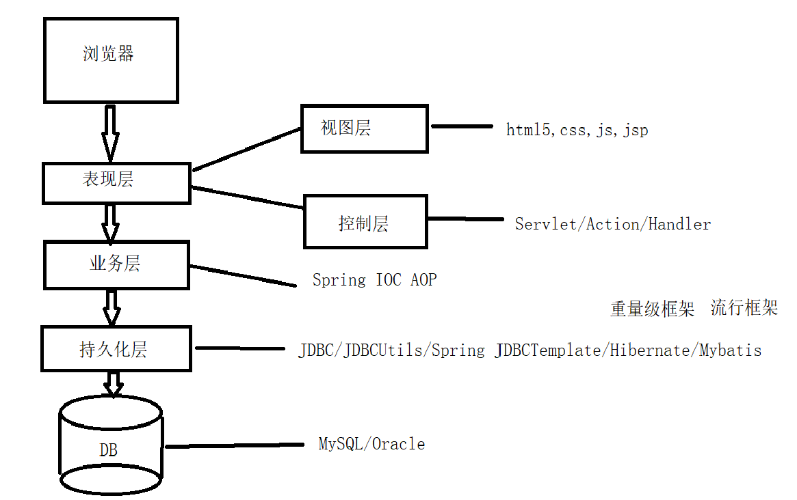

### Maven与Git

<hr>

#### 1、为什么我们需要学习maven

（1）我们已经掌握的技术图：




（2）目前技术存在的问题：

+ 一个项目就是一个工程：如果一个项目非常庞大，不适合使用package划分模块，最好每一个模块对应一个工程，利于分工协作
+ 项目中jar包必须手动复制粘贴到lib文件夹下：同样的jar包文件重复出现在不同的项目工程中，有需要使用引用这个文件接口，并不需要把jar包复制过来
+ 一个jar包依赖的其它jar包需要下载，自己手动加入项目中（不同官网提供jar包五花八门）
+ 例子：commons-fileupload-1.3.jar依赖commons-io-2.0.1.jar，庞大的项目jar包的依赖关系也会很复杂


（3）Maven就是为了解决这些痛点，一个规范的jar包仓库，内容是可靠的


#### 2、Maven介绍

Maven是一款服务于Java平台的自动化构建工具（自动化构建工具发展：Make-> Ant -> Maven -> Gradle）


构建：以Java源文件，框架配置文件，JSP，HTML等资源为原材料，去生产一个可以运行的项目的过程

IDEA下构建Maven项目

使用一个标准的目录结构和一个默认的构建生命周期，使开发变得简单


构建环节：

> 1、清理：表示在编译代码前将之前的内容清除
>
> 2、编译：将源代码编译为字节码
>
> 3、测试：运行单元测试用例程序
>
> 4、报告：测试程序的结果
>
> 5、打包：将Java项目打成jar包
>
> 6、安装：将jar或war生成到maven仓库中
>
> 7、部署：将jar或war从maven仓库中部署到Web服务器上运行


maven基本理解：

maven本地仓库---远程仓库（私服）---中央仓库（maven团队维护管理）

pom.xml用于配置项目依赖（通过坐标找到唯一jar包）

没有jar包，先找本地仓库，没有找中央仓库下载


##### （1）maven核心概念

> 1、约定的目录结构
>
> + 工程名是根目录
> + src：存放源码
> + pom.xml：Maven核心配置文件
> + main目录：存放主程序
> + test目录：存放测试程序
> + Java目录：存放Java源文件
> + resource目录：存放框架或其它工具的配置文件
>
> 约定 > 配置 > 编码
>
> 2、常用maven命令
>
> 注意：执行与构建过程相关的maven命令必须进入`pom.xml`文件夹下
>
> ```java
> mvn clean:清理
> mvn compile:编译主程序
> mvn test-cmpile:编译测试程序
> mvn test:执行测试
> mvn package:打包
> ```


POM

项目对象模型（Project Object Model）

Maven的坐标：

使用下面3个向量在仓库中定位一个maven工程

（1）groupid：公司或组织域名倒序+项目名

（2）artifactid：特征，模块名

（3）version：版本


Maven工程的坐标与仓库路径的对应关系：

```xml
<groupid>org.springframework</groupid>
<artifactid>spring-core</artifactid>
<version>4.0.0.RELEASE</version>
```

仓库中位置：

目录结构按照这个关系坐标创建，文件名为artifactid+version，这样可以确保每一个包保存是唯一的

`org/springframework/spring-core/4.0.0.RELEASE/spring-core-4.0.0.RELEASE.jar`


仓库中保存的内容

+ Maven自身所需要的插件

+ 第三方框架或工具的jar包

+ 个人开发的Maven工程

依赖之间如何互相引用

使用`mvn install`


maven使用流程

> 1、下载maven压缩包
>
> Maven仓库地址：http://mavenrepository.com/
>
> Maven下载地址：http://maven.apache.org/download.cgi
>
> Maven下载：Apache官网
>
> 2、配置`MAVEN_HOME`环境变量
>
> 然后将变量拼接`/bin`加入到Path中
>
> 3、修改配置文件
>
> 配置文件：
>
> `conf/settings.xml`
>
> ```xml
> <!--配置本地仓库地址：maven不会自动创建本地仓库，需要自己创建一个仓库文件夹-->
> <localRepository>D:\LocalMavenLib</localRepository>
> 
> <!--镜像：阿里云-->
> <mirrors>
> 	<mirror>
> 　　   <id>alimaven</id>
> 　　   <mirrorOf>central</mirrorOf>
> 　　   <name>aliyun maven</name>
>       <url>http://maven.aliyun.com/nexus/content/groups/public/</url>
> 	</mirror>
> </mirrors>
> ```


Dubbo（分布式）、Log4j（日志）、Maven（仓库）、rocketMq（阿里）、Tomcat（服务器）


#### 3、Maven工程搭建

阿里员工：如何成为顶级的程序员？

Justin在阿里演讲中的回答：

（1）勇于出错

（2）积极参与开源

（3）发量不重要


##### （1）基础

构建：是将工程编译得到的结果部署到服务器上的过程

编译：.java文件编译为.class文件

坐标：包名（公司）+ 名称 + 版本号

SNAPSHOT：快照版本，不稳定的，随时可能更新的

RELEASE：稳定版本，发布版本


##### （2）约定

maven有一个约定好的目录结构：设计思想，**<font color="blue">“约定优于配置”</font>**

通过统一规范

Enable Auto-Import允许自动引包，自动生成Maven项目的包结构


##### （3）目录结构

Maven自动导入web的目录结构：

> ***src***
>
> ------**main**
>
> -------------java
>
> -------------resources
>
> -------------**webapp**
>
> -------------------------WEB_INF
>
> ------------------------------web.xml
>
> ------**test**
>
> ---------------java
>
> ---------------resources
>
> ------**pom.xml**


##### （4）常见功能

+ mvn -v 查看版本号

+ 出现报错，找到Help --> show log in explorer查看报错日志

  **<font color="red">Unable to import Maven project：</font>**

  **IDEA版本与高版本Maven不兼容，一般降低Maven版本**

+ Google：guava，提供很多Java的工具包

  我们发现Guava下又有很多jar包，这就是**依赖的递进关系**

+ external libraries就是我们引入的jar包，可以查看jar包的递进关系

+ exclusion标签，排除递进关系中不需要的jar

```xml
<dependency>
	<groupid>com.google.guava</groupid>
    <artifact>guava</artifact>
    <version>28.1-jre</version>
    <exclusions>
    	<exclusion>
        	<groupid>com.google.code.finbugs</groupid>
    		<artifact>jsr305</artifact>
        </exclusion>
    </exclusions>
</dependency>
```

+ scope标签，定义作用的时机

```xml
<exclusion>
     <groupid>com.google.code.finbugs</groupid>
     <artifact>jsr305</artifact>
     <!--compile编译阶段使用，test测试阶段使用，package打包时使用
			verify校验阶段使用，install安装使用，clean项目清理
			validate校验项目可用性，site网站站点创建
			deploy部署阶段使用，
		-->
     <scope>runtime</scope>
</exclusion>
```


##### （5）maven指令与功能

`mvn clean -compile`项目路径下执行命令就会将项目打包生成target文件夹

`mvn clean package`项目的target文件夹中生成项目的jar包

`mvn clean install`打包文件并存储到本地仓库中

`mvn clean deploy`首先配置远程仓库地址，然后打包上传到远程仓库中，这样别人就能使用这个jar包


跳过测试阶段：

方式一：`mvn package -DskipTests`跳过单元测试的执行，单仍然会编译代码，如果测试代码有bug，还是没法通过，**不推荐使用**

方式二：`mvn package -Dmaven.test.skip=true`常用命令，既不会执行也不会编译


查看依赖树：pom.xml文件中右键选择Diagrams，就可以查看jar包之间的依赖关系


`mvn dependency:tree`也可以查看依赖树，作用是解决jar包冲突


#### 4、Git

背景：最早由linus手动合并代码，SVN需要收费，Linus使用一个BitKeeper来进行代码管理，最早BitKeeper给了Linux免费的使用权，但是一位Linux大牛尝试破解BitKeeper并被BitKeeper公司发现，于是收回了使用权，于是Linus花了两周时间写出了Git来进行版本管理。


Git & Github

Github：基于Git工具的代码托管平台

Git：管理团队的代码


将远程代码克隆到本地

`git clone https://github.com/example`找到要存代码的位置，然后执行命令，就会将项目下载到当前文件夹中，打开项目，在pom.xml文件上，右键add as maven project


配置git，获取更改权限

`git config --list`显示配置列表，用户名和邮箱

`git config --global user.name "username"`配置用户名

`git config --global user.email "address"`配置邮箱


想使用git的地址下载，必须配置ssh密钥

+ 本地生成密钥，命令：`ssh-keygen -t -rsa -C "邮箱"`

  执行命令后，设置文件夹保存key，然后我们的key在生成的.pub文件中，复制粘贴到Github

+ github上配置密钥，settings/ SSH and  GPG keys/ new ssh key添加即可

+ 验证添加成功：`ssh -T git@github.com`

+ 我们尝试下载.git链接的文件，证明关联成功

