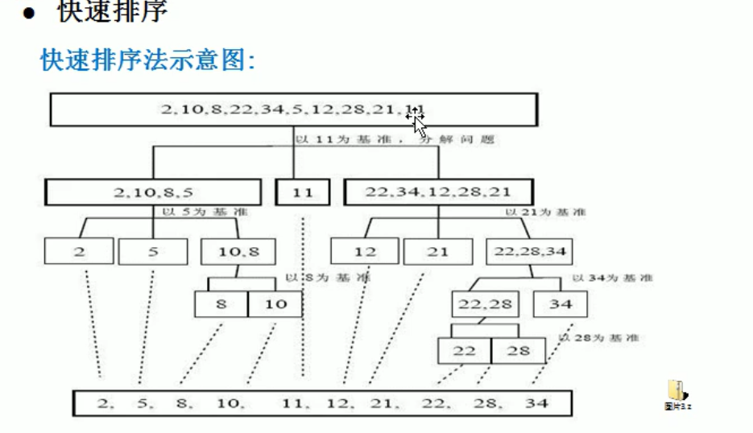

### 排序算法

<hr>


#### 1、排序算法分类

- 内部排序：将所需要处理的数据都加载到内部存储器中进行排序
- 外部排序：数据量过大，内存不足全部加载所有数据，需要借助外部存储来进行排序


##### （1）内部排序

内部排序的算法：插入（直接插入、希尔）、选择（简单选择、堆排）、交换（冒泡排序，快速排序）、归并、基数排序（桶排升级版）

外部排序：结合内存和外部存储设备


##### （2）度量算法的两种方法

度量一个程序执行时间的两种方法

（1）事后统计法：统计依赖于计算机硬件、软件环境，需要先运行，然后计算运行时间（要求相同计算机，相同状态下的比较 ）

（2）事前估算的方法：通过时间复杂度


##### （3）时间复杂度

时间频度：一个算法的时间频度与算法中语句的执行次数成正比例，用T(n)表示，通常忽略低次项，忽略系数

（1）一般情况下，算法中基本操作语句执行次数的问题规模是n的某个函数，用`T(n)`表示，若有某个辅助函数`F(n)`,n趋向∞时，`T(n)/F(x)`的极限为不为0的常数时，记作`T(n) = O(F(n))`,称O(F(n))为算法的渐进时间复杂度，简称时间复杂度

（2）T(n) = n^2+7n+6,T(n) = 3n^2+8n+8，他们的T(n)不同，但是时间复杂度相同

（3）常见时间复杂度

```java
常数阶O(1)
    
对数阶O(log)
int i = 1;
while(i<n){i = i * 2;}//i*2^m = n,O(log2 n)

线性阶O(n)
for(int i = 0; i < n; i++){j++;}//O(n)

线性对数阶O(nlog)
//nlog2 n
for(m=1;m<n;m++){
    i = 1;
    while(i < n){
        i *= 2;
    }
}
    
平方阶O(n^2)
for(int i = 1;i< m;i++){
    for(int j = 1; j < m; j++){
        ...;
    }
}
   
立方阶O(n^3)
//3次for循环
    
k次方阶O(n^k)
//k次for循环
    
指数阶O(2^n):尽量避免这种算法
public void jiecheng (int n){
	if(n == 1){
		return  1;
	}else{
		for(int i = 1; i < 8; i++){
			jiecheng(n-1);
		}
	}
}
```


最坏时间复杂度和平均时间复杂度


##### （4）常用排序算法特性

| 名称  | 平均时间复杂度 | 最坏时间复杂度 | 最好时间复杂度 | 空间复杂度 | 稳定性 |
| :---: | :------------: | :------------: | :------------: | :--------: | :----: |
| 选择  |     n[^2]      |     n[^2]      |     n[^2]      |     1      |  不稳  |
| 冒泡  |     n[^2]      |     n[^2]      |     n[^2]      |     1      |   稳   |
| +插入 |     n[^2]      |     n[^2]      |     n[^2]      |     1      |   稳   |
|  +堆  |   n*(log n)    |   n*(log n)    |   n*(log n)    |     1      |  不稳  |
| 希尔  |    n[^1.3]     |     n[^2]      |       n        |     1      |  不稳  |
| +归并 |   n*(log n)    |   n*(log n)    |   n*(log n)    |     n      |   稳   |
| +快排 |   n*(log n)    |     n[^2]      |   n*(log n)    | n*(log n)  |  不稳  |
|  桶   |     n + k      |     n[^2]      |       n        |   n + k    |   稳   |
| 计数  |     n + k      |     n + k      |     n + k      |   n + k    |   稳   |
| 基数  |     n * k      |     n * k      |     n * k      |   n + k    |   稳   |

稳定性：


空间复杂度

用于度量算法所耗费存储的空间（Redis，memcache都是空间换时间）


重要的排序算法：插入排序、堆排序、归并排序，快速排序


#### 2、常见排序算法

##### （1）冒泡排序

性能：4-5秒（80000数据）

```java
public void bubbleSort (int[] arr){
    int len = arr.length;
    for(int i = 0; i < len - 1; i++){
        boolean flag = true;
        for(int j = 0; j < len - i - 1; j++){
            if(arr[j] > arr[j+1]){
                flag = false;
                int temp = arr[j];
                arr[j] = arr[j+1];
                arr[j+1] = temp;
            }
        }
        //如果有一次没有位置交换，说明排序已经完成
        if(flag)break;
    }
}
```


##### （2）选择排序

性能：2-3秒（80000数据）

思路：每次从没有确定的数值中找到数组中最小值的索引，与开始的第一个值进行交换

选择排序和冒泡排序时间复杂度都是`O(n^2)`，但是选择排序效率更高，因为每一轮只交换一次

```java
public void selectSort (int[] arr) {
    int len = arr.length;
    for(int i = 0; i < len - 1; i++){
        int minIndex = i;
        for(int j = i + 1;j < len; j++){
            if(arr[minIndex] > arr[j]){
                minIndex = j;
            }
        }
        //优化：如果索引没变化，就不用交换值
        if(minIndex != i){
            int temp = arr[i];
        	arr[i] = arr[minIndex];
        	arr[minIndex] = temp;
        }
    }
}
```


##### （3）插入排序

插入排序：属于内部排序法，是对排序元素以插入的方式找寻该元素的适当位置，达到排序目的。


思路：把n个待排序元素看成一个有序表和一个无序表，开始时有序表只包含一个元素，无序表中含有n-1个元素，把它的排序码依次与有序元素的排序码进行比较，将它插入到有序表中的适当位置，使之成为新的有序表。


插入排序存在问题

结论：当需要插入的数是较小的数时且靠后，后移次数明显增多，对效率有影响

性能：4-5秒（80000数据）

```java
public void insertSort (int[] arr) {
    for(int i = 1;i< arr.length;i++){
        //定义获一个插入值，和插入值前面的索引
        int insertValue = arr[i];
        int insertIndex = i - 1;
        //每一个与插入值进行比较，比插入值大，就后移
        while(insertIndex >= 0 && insertValue < arr[insertIndex]){
            arr[insertIndex+1] = arr[insertIndex];
            insertIndex--;
        }
        //优化
        if(insertIndex+1 != i){
            arr[insertIndex+1] = insertValue;
        }
    }
}
```


##### （4）希尔排序

**希尔排序**是简单插入排序经过改进后的一个更高效的版本，也叫**缩小增量排序**。


思想：希尔排序是记录按下标的一定增量的分组，对每组使用直接插入排序算法排序；随着增量的逐渐减少，每组包含的关键词越来越多，当增量减至1时，整个文件恰好被分为一组，算法终止。


希尔排序对有序序列在插入时采用**交换法**

希尔排序对有序序列插入时采用**移动法**


交换法思路：先分组，可以将后面小的数移动到前面，经过多轮后实现排序


个人手写的希尔排序

```java
//采用交换法的希尔排序
public static void shellSort (int[] arr){
        //将数据按照除以二的数据量进行分组
        int temp;
        int deltaX = arr.length/2;
        while(deltaX > 0){
            for(int i = deltaX; i < arr.length; i++){
                //注意deltaX变小时，这个循环是要根据增量挨个比较的
                //所以不能用i写死，否则交换少了很多轮
                for(int j = i - deltaX;j >= 0; j-=deltaX){
                    //错误写法
                    if(arr[j] > arr[i]){
                        temp = arr[j];
                        arr[j] = arr[i];
                        arr[i] = temp;
                    }
                    //正确写法：将i全部变为j + deltaX
                    if(arr[j] > arr[j+deltaX]){
                        temp = arr[j+deltaX];
                        arr[j+deltaX] = arr[j];
                        arr[j] = temp;
                    }
                }
            }
            deltaX /= 2;
        }
    }
```


交换法的希尔排序 代码：

性能最差：17秒（80000数据）

```java
//采用交换法的希尔排序
public void hillSort (int[] arr){
    //将数据按照除以二的数据量进行分组
    int temp;
    int len = arr.length;
    for(int gap = len/2; gap > 0; gap/=2){
        for(int i = gap; i < len; i++){
            for(int j = i - gap; j >=0; j-=gap){
                if(arr[i] < arr[j]){
                    temp = arr[i];
                    arr[i] = arr[j];
                    arr[j] = temp;
                }
            }
        }
    }
}
```


移动法的希尔排序代码：

```java
/*
    * 采用移动法（加入插入排序）的希尔排序
    * */
    public static void shellSort2 (int[] arr){
        int len = arr.length;
        for(int gap = len/2; gap > 0; gap /= 2){
            for(int i = gap; i < len; i++){
                //插入值
                int value = arr[i];
                //插入索引
                int index = i - gap;
                while(index >= 0 && arr[index] > value){
                    arr[index+gap] = arr[index];
                    index -= gap;
                }
                //优化减少一次赋值操作
                if(index != i - gap){
                    arr[index+gap] = value;
                }
            }
        }
    }
```


##### （5）快速排序

快速排序时对冒泡排序的改进。


思想：通过一趟排序将要排序的数据分割成独立的两个部分，其中一部分的所有数据都比另一部分的所有数据要小，然后按照此方法对两部分数据分别进行快速排序，整个排序过程可以递归进行，依次达到使整个数据变成有序数列。


快排示意图：




快速排序：

分析：

（1）找到一个值，作为中轴值

（2）从左至右，右至左分别与中轴值进行比较，如果左边值比中轴值大，右边值比中轴值小，交换位置，此时完成中轴值左边都比它小，右边比它大

（3）然后判断左值和右值，如果相等，左值左移，右值右移（防止死递归）

（4）根据左值，和右值确定两边继续递归

（5）递归：找中值继续比较交换，最后一次递归只有两个值比较交换顺序后，就能得到有序的数组


空间换时间

```java
public void quickSort (int[] arr,int left,int right){
    //左下标
    int l = left;
    //右下标
    int r = right;
    //中轴值
    int pivot = arr[(left+right)/2];
    //临时变量
    int temp = 0;
    //将比pivot大的值放右边，小的放左边
    while(l<r){
        //找到pivot左边一直找，直到找到大于等于pivot值才退出
        while(arr[l] < pivot){
            l += 1;
        }
        //找到pivot右边一直找，直到找到小于等于pivot值才退出
        while(arr[r] > pivot){
            r -= 1;
        }
        //如果l>r说明pivot的左右两边的值，左边全部是小于等pivot
        //右边全是大于等于pivot了
        if(l >= r){
            break;
        }
        //交换
        temp = arr[l];
        arr[l] = arr[r];
        arr[r] = temp;
        //交换完后发现arr[l] == pivot，前移
        if(arr[l] == pivot){
            r -= 1;
        }
        //交换完后发现arr[r] == pivot，后移
        if(arr[r] == pivot){
            l += 1;
        }
    }
    //如果l==r,必须l++,r--,否则会栈溢出
    if(l == r){
        l++;
        r--;
    }
    //向左递归
    if(left < r){
        quickSort(arr,left,r);
    }
    //向右递归
    if(right > l){
        quickSort(arr,l,right);
    }
}
```


##### （6）归并排序

思想：merge-sort，利用归并的思想实现的排序算法。采用分治策略（divide-and-conquer），将一些小的问题递归求解（divide），在conquer阶段将得到的答案修补在一起。


归并排序时间复杂度很低（O(NlogN)）

```java
/*
    * 归并排序
    * */
    //治
    public static void mergeSort (int[] arr,int left,int right,int[] temp) {
        if(left < right){
            int mid = (left + right) / 2;//中间索引
            mergeSort(arr,left,mid,temp);
            mergeSort(arr,mid+1,right,temp);
            //每分解一次就合并一次
            merge(arr,left,mid,right,temp);
        }
    }

    //分
    //left表示左边序列初始索引，mid中间索引，right右边索引，temp临时数组
    public static void merge (int[] arr,int left,int mid,int right,int[] temp) {
        int i = left;
        int j = mid + 1;
        //执行临时数组的第一个索引
        int t = 0;
        //1.先把左右两边（有序）的数据按照规则填充到temp数组
        //直到左右两边的有序序列，有一边处理完毕为止
        while(i <= mid && j <= right){
            if(arr[i] <= arr[j]){
                temp[t] = arr[i];
                t += 1;
                i += 1;
            }else{
                temp[t] = arr[j];
                t += 1;
                j += 1;
            }
        }
        //2.把有剩余数据一边的数据一次填充到temp中
        while(i <= mid){
            temp[t] = arr[i];
            t += 1;
            i += 1;
        }
        while(j <= right){
            temp[t] = arr[j];
            t += 1;
            j += 1;
        }
        //3.将temp的数组元素拷贝到arr中
        t = 0;
        int tempLeft = left;
        while(tempLeft <= right){
            arr[tempLeft] = temp[t];
            t += 1;
            tempLeft += 1;
        }
    }
```


##### （7）基数排序

基数排序：也叫桶排序，属于分配式排序，它是通过键值的各个位置的值，将要排序的元素分配至某些桶中，达到排序的作用。


基数排序法是属于稳定性的排序，基数排序法是效率高的稳定性排序算法，是桶排序的扩展。


思路：根据元素的位数，从低位到高位，依次根据桶的数量求模放入桶，最后按照顺序取出桶的数，当最高位比较完后，数组排序就完成了


<font color="blue">基数排序速度比桶排、归并更快，当数据量特别大的时候，每一个桶的空间特别大，注意内存！</font>


基数排序代码

```java
public static void radixSort (int[] arr){
    //定义二维数组，有10个一维数组，每个元素都是一个桶
    //为了防止在放入数的时候，数据溢出，每个桶的大小要为数组长度
    int[][] buckets = new int[10][arr.length];
    //每个桶需要指示有效数据的变量
    //定义一个一维数组指示每个包含元素的个数
    int[] bucketElemNum = new int[10];
    
    //获取最大数的位数
    int max = arr[0];
    for(int i = 1; i < arr.length; i++){
        if(arr[i] > max){
            max = arr[i];
        }
    }
    int maxLength = (max+"").length;
    
    for(int i = 0,n = 1; i < maxLength; i++,n *= 10){
        //根据位放到指定的桶里
        for(int j = 0; j < arr.length; j++){
        //获取个位数
        int digitUnit = arr[j]/n%10;
        //将值放进对应桶里的没有元素的地方
        buckets[digitUnit][bucketElemNum[digitUnit]] = arr[j];
        bucketElemCounts[digitUnit]++;
        }
        
        //按照桶的顺序和里面的数量进行遍历，并放到数组中
    	int index = 0;
    	for(int k = 0; k < buckets.length; k++){
        	if(buketElemNum[k] != 0){
            	for(int l = 0; l < bucketElemNum[k]; l++){
                	arr[index++] = buckets[k][l];
            	}
        	}
        //需要将每个桶的计数清零
        bucketElemNum[k] = 0;
    	}
    }  
}
```


排序算法的稳定性：相同的值，先出现也在前面，我们认为算法是稳定的。


##### （8）堆排序

（1）堆排序是利用堆这种数据结构，堆排序是一种选择排序，它的最坏、最好、平均时间复杂度都是O(nlog n)，是不稳定排序

（2）堆是完全二叉树

- 每个节点的值，都大于等于左右孩子节点的值，成为**大顶堆**
- 没有要求左右孩子节点的值
- 每个节点的值都小于或等于左右孩子节点的值，称为**小顶堆**

（3）升序采用大顶堆，降序采用小顶堆


堆排序思想

（1）将待排序序列结构构成一个大顶堆（不需要构建二叉树）

（2）此时整个序列的最大值就是堆顶的根节点

（3）将其与末尾元素进行交换，此时末尾就是最大值

（4）然后将剩余n-1个元素重新构成一个堆，这样会得到n个元素的次小值，如此反复执行，就能得到一个有序序列了。

可以看到构建大顶堆的过程中，元素的个数逐渐减少，最后得到一个有序序列。


堆排序基本思路

（1）将无须序列构成为一个堆（大顶堆或小顶堆）

（2）将堆顶元素和末尾元素交换，将大元素沉到数组末端

（3）重新调整结构，使其满足定义，然后继续交换堆顶元素与当前末尾元素，反复执行调整，交换，知道整个序列有序


堆排序代码实现

```java
public class HeapSort{
    public void heapSort (int[] arr){
       //根据非叶子节点自下而上完成最大值的上浮
        for(int i = arr.length/2 - 1; i >= 0; i--){
            adjustHeap(arr,i,arr.length);
        }
        //将上浮的值交换到数组后面
        int temp = 0;
        for(int j = arr.length-1;j>0;j--){
            temp = arr[j];
            arr[j] = arr[0];
            arr[0] = temp;
            adjustHeap(arr,0,j);
        }
    }
    
    //注意非叶子节点i是自下而上的
    //数组为待调整数组，i表示非叶子节点数组中索引
    //length堆多少个元素进行调整，length在逐渐减少
    //功能：完成将非叶子节点的树调整成大顶堆
    public void addjustHeap (int[] arr,int i,int length){
        int temp = arr[i];
        for(int k = i*2 + 1; k < length; k = k*2 +1){
            //如果左子节点比右子节点小，切到右子节点
            if(k + 1 < length && arr[k] < arr[k+1]){
                k++;//指向右子节点
            }
            //找到子节点中比较大的与当前非叶子节点比较
            if(arr[k] > temp){
                //如果子节点大于父节点，把较大的值赋值给当前节点，让i指向k
                arr[i] = arr[k];
                //切换到当前节点的下一个节点继续循环比较
                i = k;
            }else{
                break;//
            }
        }
        //当循环结束后，已经将i为父节点的树的最大值，放在了最顶上
        //将找到的非叶子节点值赋值过去，完成交换
        arr[i] = temp;
    }
}
```


堆排序速度特别快，不是递归而是迭代，所以强

