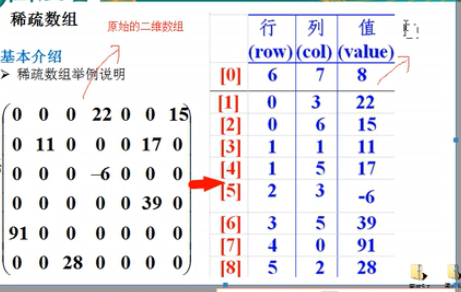

### 经典算法面试题（韩昌顺算法课）

<hr>


#### 1、常用算法介绍

1、马踏棋盘 --- 图形深度优先算法+贪心算法

2、八皇后问题（92种）--- 回溯算法

3、约瑟夫问题（丢手帕问题）

4、修路问题（最小生成树 --- 普利姆算法）

5、最短路径问题（弗洛伊德算法）

6、汉诺塔（分支算法）


+ 算法是程序的灵魂，优秀的程序可以在做海量数据计算的时候，依然能保持高速计算

+ <font color="blue">如果你不想永远成为代码工人，你必须学习算法</font>


数据结构和算法的关系

程序 = 数据结构 + 算法


#### 2、数据结构

数据结构分类

+ 线性结构：存在一对一的线性关系

  - 常见线性结构：数组(Array)、队列(Queen)、链表、栈(Stack)

  - 线性结构：顺序存储结构和链式存储结构
    - 顺序表：存储元素是连续的
    - 链表：存储元素不一定是连续的

+ 非线性结构
  - 常见非线性结构：二维数组、多维数组、广义类、树结构、图结构


##### （1）稀疏数组

当一个数组中大部分元素是0或者为同一个值的数组时，可以使用稀疏数组来保存该数组

处理方法：

+ 记录数组有几行几列，有多少不同的值
+ 把具有不同值的元素的行列及值记录在一个小规模的数组中，从而缩小程序规模


###### 1、稀疏数组




稀疏数组实例（sparse array）

二维数组转稀疏数组思路分析：

（1）遍历原始数组，得到有效数据的个数sum

（2）根据sum就可以创建稀疏数组 `int[sum+1][3]`，第一个数据用来复盘，所以要多创建一行

（3）将二维数组的有效数据存入到稀疏数组


稀疏数组转二维数组

（1）先读取稀疏数组的第一行，创建一个二维数组

（2）读取稀疏数组后几行的数据，并赋值给原始二维数组


###### 2、稀疏数组实例

实现五子棋棋盘数据保存

```java
public class SparseArray {
    public static void main (String[] args){
        //1表示黑子，2表示白子
        int chessArr[][] = new int[11][11];
        chessArr[1][2] = 1;
        chessArr[2][3] = 2;
        //输出原始数组
        System.out.println("原始数组：");
        for(int[] arr : chessArr){
			int z = 0;
            for(int data : arr){
                System.out.print(data + "\t");
				z++;
				if(z%11==0)System.out.println();
            }
        }
		System.out.println("稀疏数组：");
        //将二维数组转为稀疏数组
        int sum = 0;
        //统计有效值的个数
        for(int[] arr2 : chessArr){
            for(int data2 : arr2){
                if(data2!=0){
                    sum++;
                }
            }
        }
        //创建稀疏数组
        int[][] sparseArr = new int[sum+1][3];
        //将第一行数据初始化
        sparseArr[0][0] = chessArr.length;
        sparseArr[0][1] = chessArr[0].length;
        sparseArr[0][2] = sum;
		//赋值
        int index = 1;
        for(int i = 0; i < chessArr.length; i++){
            if(index==sum+1)break;
            for(int j = 0; j < chessArr[0].length;j++){
                if(chessArr[i][j] != 0){
                    sparseArr[index][0] = i;
                    sparseArr[index][1] = j;
                    sparseArr[index][2] = chessArr[i][j];
                    index++;
                }
            }
        }
        //打印稀疏数组
        for(int i = 0; i < sparseArr.length; i++){
            System.out.printf("%d\t%d\t%d\n",sparseArr[i][0],sparseArr[i][1],sparseArr[i][2]);
        }
        //将稀疏数组恢复为二维数组
        int[][] chessArr2 = new int[sparseArr[0][0]][sparseArr[0][1]];
        for(int i = 1; i < sparseArr.length; i++){
            chessArr[sparseArr[i][0]][sparseArr[i][1]] = sparseArr[i][2];
        }
        //打印恢复后的稀疏数组
        //恢复后的二维数组
        for(int i = 0; i < chessArr2.length; i++){
			int z = 0;
            for(int j = 0; j < chessArr2[0].length; j++){	
                System.out.printf("%d\t",chessArr[i][j]);
				z++;
				if(z%11==0)System.out.println();
            }
        }
    }
}
```


##### （2）队列

队列：是一个有序列表，可以用数组和链表实现。


+ 队列遵循先入先出原则


###### 1、数组实现不可复用队列

```java
package util;

public class CircleQueue {
    //初始化数组的长度，用来判断
    private int maxSize;
    //起始索引
    private int front;
    //结束索引
    private int rear;
    //初始数组
    private int[] arr;

    //初始化参数
    public CircleQueue (int maxSize){
        //防止最后一个元素添加不进去，扩大1
        this.maxSize = maxSize + 1;
        arr = new int[maxSize+1];
        front = 0;
        rear = 0;
    }

    public boolean isEmpty () {
        return rear == front;
    }
    
    //因为rear和front一直是紧挨着的
    //所以只要rear+1就应该是front
    //所以算法是(rear+1)%maxSize==front
    public boolean isFull () {
        return (rear + 1) % maxSize == front;
    }

    public void add (int n) {
        if(isFull()){
            System.out.println("queue is full.");
            return;
        }
        //直接将数据加入
        arr[rear] = n;
        //将rear后移
        rear = (rear + 1) % maxSize;
    }

    public int get () {
        if(isEmpty()){
            System.out.println("queue is empty.");
            return 0;
        }
        int result = arr[front];
        front = (front + 1) % maxSize;
        return result;
    }

    //显示队列所有数据
    public void show () {
        if(isEmpty()){
            System.out.println("empty");
            return;
        }
        //
        for(int i = front; i <front + size();i++){
            System.out.printf("arr[%d]=%d\t",(i%maxSize),arr[i%maxSize]);
        }
    }
	
    //获取有效元素个数
    public int size () {
        return (rear + maxSize - front) % maxSize;
    }
}

```

存在问题：这不是一个环形队列，数据使用一次就不能使用了，没有达到复用的效果。


###### 2、数组实现环形队列

数组模拟环形队列思路分析

（1）front元素指向数组的第一个元素，初始值为0

（2）rear指向队列的最后一个元素的后一个位置，空出一个空间做约定

（3）当队列满时，`(rear+1)%maxSize==front `

（4）当`rear==front`时，队列为空

（5）有效数据个数`(rear + maxSize - front) % maxSize`

（6）**遍历的判断**：`i < front + (rear + maxSize - front) % maxSize`较难理解，记下来

<font color="blue">注意：要空一个空间。</font>

```java
public class CircleQueue {
    //初始化数组的长度，用来判断
    private int maxSize;
    //起始索引
    private int front;
    //结束索引
    private int rear;
    //初始数组
    private int[] arr;
    
    //初始化参数
    public CircleQueue (int maxSize){
        this.maxSize = maxSize;
        arr = new int[maxSize];
        front = 0;
        rear = 0;
    }
    
    public boolean isEmpty () {
        return rear == front;
    }
    //因为rear和front一直是紧挨着的
    //所以只要rear+1就应该是front
    //所以算法是(rear+1)%maxSize==front
    public boolean isFull () {
        return (rear + 1) % maxSize == front;
    }
    
    public void add (int n) {
        if(isFull()){
            System.put.prinln("queue is full.");
            return;
        }
        //直接将数据加入
        arr[rear] = n;
        //将rear后后移
        rear = (rear + 1) % maxSize;
    }
    
    public int get () {
        if(isEmpty()){
            System.put.prinln("queue is empty.");
            return;
        }
        int result = arr[front];
        front = (front + 1) % maxSize;
        return result;
    }
    
    //显示队列所有数据
    public void show () {
        if(isEmpty){
            System.out.println("empty");
            return;
        }
        //假设maxSize=5,fron=2,rear=0
        //这确实是对的
        for(int i = front; i <front + size();i++){
            System.out.printf("arr[%d]=%d/t",i%maxSize,arr[i%maxSize]);
        }
    }
    
    public int size () {
        return (rear + maxSize - front) % maxSize;
    } 
}
```


##### （3）单向链表

（1）链表是以节点的方式来存储的

（2）每一个节点包括data域，和next域

（3）每一个节点不一定是连续存放的

（4）链表分带头结点的链表和没有头节点的链表，根据实际需求确定


创建一个单链表

（1）先创建一个头节点，表示单链表的头

（2）用next连接到下一个


###### 1、无序的单向链表方法实现

```java
public class SingleLinkedList {
    //先初始化一个头节点
    private HeroNode head = new HeroNode(0,"","",null);
    
    //添加方法
    public void add (HeroNode heroNode) {
        HeroNode temp = head;
        while(true){
            //找到尾巴退出循环
            if(temp.next == null){
                break;
            }
            temp = temp.next;
        }
        //挂上新节点
        temp.next = heroNode;
    }
    
    //遍历单向链表
    public void list () {
        HeroNode temp = head;
        while(true){
            if(temp.next == null){
                break;
            }
            System.out.println(temp.next.toString());
            temp = temp.next;
        }
    }
}
class HeroNode {
    public int no;
    public String name;
    public String nickname;
    public HeroNode next;
    
    public HeroNode (int no,String,name,String nickname,HeroNode next){
        this.no = no;
        this.name = name;
        this.nickname = nickname;
        this.next = next;
    }
    
    public String toString () {
        return "no:"+no+"---name:"+name;
    }
    
}
```


###### 2、有序的单向链表实现

直接在内存中就可以排序，比数据库操作要快

```java
//单链表中添加一个方法
public void addByOrder (HeroNode heroNode) {
        HeroNode temp = head;
        while(true){
            //如果已经没有下一个节点
            //已经是最大了，直接添加到后面
            if(temp.next==null){
                temp.next = heroNode;
                break;
            }
            //从小到大，下一个节点大，就要插入到它前面
            if(temp.next.no > heroNode.no){
                HeroNode middle = temp.next;
                temp.next = heroNode;
                heroNode.next = middle;
                break;
            }else if(temp.next.no == heroNode.no){
                System.out.println("Same number!");
                break;
            }else{
                //取出下一个节点，进行新一轮比较
                temp = temp.next;
            }
        }
}

 //根据编号进行查找，只能更改编号外的信息
    public void update (HeroNode newHeroNode){
        HeroNode temp = head;
        while(true){
            if(temp.next == null){
                System.out.println("the number is not exist or empty list.");
                break;
            }
            if(temp.next.no == newHeroNode.no){
                temp.next.name = newHeroNode.name;
                break;
            }
            temp = temp.next;
        }
    }

    //从链表中删除节点
    public HeroNode remove (int no){
        HeroNode temp = head;
        HeroNode result;
        while(true){
            if(temp.next == null){
                System.out.println("list is empty or the no is not exsist.");
                return null;
            }
            if(temp.next.no == no){
                //如果存在，将后面的链表连到temp上
                result = temp.next;
                temp.next = temp.next.next;
                break;
            }
            temp = temp.next;
        }
        return result;
    }
```


###### 3、单链表面试题

（1）求单链表中有效节点个数

```java
public int getLength () {
    if(head.next == null){
        return 0;
    }
    HeroNode temp = head.next;
    int length = 0;
    while(temp != null){
        length++;
        temp = temp.next;
    }
    return length;
}
```

（2）查找单链表倒数第n个节点

```java
public HeroNode findLastIndexNode (int index){
    //如果没有保存头节点以外节点，返回null
    if(head.next == null){
        return null;
    }
    //严谨判断：index不合规范，进行处理
    int size = getLength();
    if(index <=0 ){
        System.out.println("illegal parameter.");
        return null;
    }
    if(index > size){
        index %= size;
    }
    //进行遍历: 5个元素，查找倒数2,i < size - index
    HeroNode current = temp.next;
    for(int i = 0; i < size - index; i++){
        current = temp.next;
    }
    return current;
}
```


（3）腾讯面试题，反转链表

我的手写：

```java
 public void reverseList () {
        if(head.next == null){
            System.out.println("list is empty.");
        }
        //思路：新的head节点一次保存原来头节点的下一个节点，在往新节点头部添加
        HeroNode newHead = new HeroNode(0,"");
        HeroNode temp;
        while(head.next != null){
            temp = head.next;
            //每次
            head.next = head.next.next;
            //将取出来的节点插入新头中去
            if(newHead.next == null){
                //注意原来的next还有后面节点的尾巴，必须干掉
                temp.next = null;
                newHead.next = temp;
            }else{
                HeroNode middle = newHead.next;
                newHead.next = temp;
                //其他节点尾巴在这里被干掉
                temp.next = middle;
            }
        }
        head.next = newHead.next;
        System.out.println("reversion complete.");
    }
```

视频代码：

```java
public void reverse () {
    if(head.next == null){
        System.out.println("list is empty.");
        return;
    }
    //当前节点
    HeroNode cur = head.next;
    //下一节点
    HeroNode next = null;
    //创建新头
    HeroNode newHead = new HeroNode(0,"");
    //遍历操作
    while(cur != null){
        next = cur.next;//保存车尾
        cur.next = newHead.next;//车头指向新的车位
        newHead.next = cur;//车头与新车位连接
        cur = next;//后移
    }
    head.next = newHead.next;
    newHead.next = null;
}
```


（4）百度面试题逆序打印单链表

​	1）先反转，在打印会破坏链表原来结构，当数据较多时，反转性能差

​	2）利用数据结构栈先进后出的特性，实现逆序打印


​	3）利用Java提供的栈对象实现反转打印

```java
public class Demo {
    public static void main (String[] args){
        Stack<String> stack = new Stack<>();
        //入栈
        stack.add("jimmy");
        stack.add("king");
        stack.add("Lake");
        //出栈
        //print: Lake,king,jimmy
        while(stack.size() > 0){
            System.out.println(stack.pop());
        }
    }
}
```


​	4）实现逆序打印

```java
public void reversePrint () {
    if(head.next == null){
        System.out.println("list is empty");
        return;
    }
    Stack<HeroNode> stack = new HeroNode<>();
    HeroNode cur = head.next;
    while(cur != null){
        stack.push(cur);
        cur = cur.next;
    }
    while(stack.size() > 0){
        System.out.println(stack.pop());
    }
}
```


##### （4）双向链表

单向链表的缺点

（1）查找方向只有一个方向，双向链表可以从前或从后开始查找

（2）单向链表不能自我删除，需要靠辅助节点，双向链表可以自我删除


双向链表实现分析

1）遍历方式与单链表一样

2）添加（默认添加到最后）：先添加到双向链表的最后

3）修改操作和单向链表一样

4）删除，因为是双向链表，可以实现自我删除


###### 1、双向链表实例

```java
public class DoubleLinkedList {
    HeroNode head = new HeroNode(0,"");
    
    //删除节点
    public HeroNode delete (int no) {
        if(head.next == null){
            System.out.println("list is empty");
            return null;
        }
        HeroNode temp = head.next;
        while(true){
            if(temp == null){
                System.out.println("no is not exist.");
                break;
            }
            if(temp.no == no){
                temp.prev.next = temp.next;
                //如果删除的是最后一个节点，要判断
                if(temp.next != null){
                    temp.next.prev = temp.prev;
                }
                break;
            }
            temp = temp.next;
        }
        return temp;
    }
    
    //按照顺序添加节点
    public void addByOrder (HeroNode newNode) {}
}

class HeroNode {
    int no;
    String name;
    HeroNode prev = null;
    HeroNode next = null;
    
    public HeroNode (int no,String name){
        this.no = no;
        this.name = name;
    }
}
```


###### 2、双向环形链表

约瑟夫问题：设编号1-n围着坐一圈，约定从编号k（k在1-n之间）的节点从1开始报数，数到m的人出队列，它的下一位从1开始报数，一次类推，直到所有人出列为止，由此产生一个出队列编号的序列

假设n=5，m=2，从k=1开始

出队列顺序：2 -- 4 -- 1 -- 5 -- 3


不带头的环形链表

1）first指针指向第一个节点，自己指向自己

2）last辅助指针表示最后一个节点，next指向新的节点


个人实现的双向环形链表

```java
package util;

import java.util.ArrayList;

public class CircleLinkedList {
    Node first;
    Node last;
    int size = 0;
    //添加
    public void add (Node newNode){
        size++;
        if(first == null){
            first = newNode;
            first.next = first;
            first.prev = first;
            last = first;
            return;
        }
        //添加新节点
        Node temp = first;
        while(true){
            if(temp == last){
                last.next = newNode;
                newNode.prev = last;
                newNode.next = first;
                last = newNode;
                break;
            }
            temp = temp.next;
        }
    }

    //删除
    public Node delete (int no) {
        if(first == null){
            System.out.println("list is empty.");
            return null;
        }
        Node temp = first;
        //只有一个元素
        if(size == 1){
            first = null;
            last = null;
            size--;
        }else{
            while(true){
                if(temp == last && temp.no != no){
                    System.out.println("no is not exist.");
                    break;
                }
                if(temp.no == no){
                    //是不是尾节点
                    size--;
                    if(temp == last){
                        temp.prev.next = first;
                        last = temp.prev.next;
                        break;
                    }
                    //不是尾节点
                    temp.prev.next = temp.next;
                    temp.next.prev = temp.prev;
                    break;
                }
                temp = temp.next;
            }
        }
        return temp;
    }

    //遍历
    public void list () {
        if(first == null){
            System.out.println("list is empty.");
            return;
        }
        Node temp = first;
        while(true){
            System.out.println(temp.toString());
            if(temp == last ){
                break;
            }
            temp = temp.next;
        }
    }

    //顺序添加
    public void addByOrder (Node newNode){
        if(newNode == null){
            System.out.println("node is null.");
            return;
        }
        //没有节点直接添加
        if(first == null){
            first = newNode;
            first.prev = first;
            first.next = first;
            last = first;
            size++;
            return;
        }
        Node temp = first;
        //如果成为新的首节点
        if(newNode.no < temp.no){
            size++;
            first = newNode;
            first.prev = last;
            first.next = temp;
            temp.prev = first;
            last.next = first;
            return;
        }else if(newNode.no == temp.no){
            System.out.println("same number,reject.");
            return;
        }else{
            while(true){
                //判断是否到了尾节点
                if(temp == last){
                    if(temp.no < newNode.no){
                        size++;
                        temp.next = newNode;
                        newNode.prev = temp;
                        newNode.next = first;
                        last = newNode;
                        break;
                    }else if(temp.no == newNode.no){
                        System.out.println("same number,reject!");
                        break;
                    }else{
                        size++;
                        temp.prev.next = newNode;
                        newNode.prev = temp.prev;
                        newNode.next = temp;
                        temp.prev = newNode;
                        break;
                    }
                }
                //中间节点插入情况
                if(newNode.no < temp.no){
                    size++;
                    temp.prev.next = newNode;
                    newNode.prev = temp.prev;
                    newNode.next = temp;
                    temp.prev = newNode;
                    break;
                }else if(newNode.no == temp.no){
                    System.out.println("same number,reject!");
                    break;
                }
                //后移
                temp = temp.next;
            }
        }
    }

    // 1 2 3 4 5
    //约瑟夫问题：出圈，假设5个节点，开始节点为2，报3的出圈，顺序3-1-5-2-4
    public void outCircle (int startNum,int countNum) {
        //判断参数是否合法
        if(startNum > size || countNum > size || countNum < 1 || startNum < 1){
            System.out.println("illegal argument.");
            return;
        }
        if(first == null){
            System.out.println("list is empty.");
            return;
        }
        //如果只有一个节点
        if(size == 1){
            System.out.println(first);
            return;
        }
        //定义两个指针,一个是开始节点，一个是结束节点
        Node firstNode = first;
        Node lastNode = last;
        for(int i = 0; i < startNum - 1; i++){
            firstNode = firstNode.next;
            lastNode = lastNode.next;
        }
        //开始出列，结束条件 first == last
        while(true){
            if(firstNode == lastNode){
                System.out.println(firstNode.no + " gets out of the list.");
                break;
            }
            for(int i = 0; i < countNum - 1; i++){
                firstNode = firstNode.next;
                lastNode = lastNode.next;
            }
            //移除当前节点
            Node temp = firstNode;
            firstNode = firstNode.next;
            firstNode.prev = lastNode;
            lastNode.next = firstNode;
            System.out.println(temp.no + " gets out of the list.");
        }
    }

}

class Node {
    int no;
    String name;
    Node prev;
    Node next;

    public Node (int no,String name) {
        this.no = no;
        this.name = name;
    }

    public String toString () {
        return "number:" + no + "\tname:"+ name;
    }
}

class TestList {
    public static void main(String[] args) {
        CircleLinkedList list = new CircleLinkedList();
        Node node1 = new Node(1,"A");
        Node node2 = new Node(2,"B");
        Node node3 = new Node(3,"C");
        Node node4 = new Node(4,"D");
        Node node5 = new Node(5,"E");
        list.addByOrder(node4);
        list.addByOrder(node5);
        System.out.println("-------------------");
        list.list();
        System.out.println("-------------------");
        // 1 4 5   1 - 4 - 5
        list.outCircle(1,2);
    }
}
```


小孩出圈思路分析

（1）首先用一个指针first（第一个报数的指针）指向尾节点，一个指针表示当前节点（current）

（2）假设数到k的出列，那么移动次数为k-1，两个指针同时移动k次，目的是知道头和尾

（3）头和尾开始移动k-1次，然后干掉current指向的当前节点，让它指向下一节点

（4）当`current == first`循环结束


###### 3、双向环形链表实现约瑟夫问题

```java
// 1 2 3 4 5
    //约瑟夫问题：出圈，假设5个节点，开始节点为2，报3的出圈，顺序3-1-5-2-4
    public void outCircle (int startNum,int countNum) {
        //判断参数是否合法
        if(startNum > size || countNum > size || countNum < 1 || startNum < 1){
            System.out.println("illegal argument.");
            return;
        }
        if(first == null){
            System.out.println("list is empty.");
            return;
        }
        //如果只有一个节点
        if(size == 1){
            System.out.println(first);
            return;
        }
        //定义两个指针,一个是开始节点，一个是结束节点
        Node firstNode = first;
        Node lastNode = last;
        for(int i = 0; i < startNum - 1; i++){
            firstNode = firstNode.next;
            lastNode = lastNode.next;
        }
        //开始出列，结束条件 first == last
        while(true){
            if(firstNode == lastNode){
                System.out.println(firstNode.no + " gets out of the list.");
                break;
            }
            for(int i = 0; i < countNum - 1; i++){
                firstNode = firstNode.next;
                lastNode = lastNode.next;
            }
            //移除当前节点
            Node temp = firstNode;
            firstNode = firstNode.next;
            firstNode.prev = lastNode;
            lastNode.next = firstNode;
            System.out.println(temp.no + " gets out of the list.");
        }
    }
```


##### （5）栈

实际问题：用户输入的字符串`7*2*2-5+1-5+3-4`我们得到计算结果


栈（stack）

+ 先进后出的有序列表
+ 限制线性表中元素的插入和删除只能在线性表的同一端进行的一种特殊线性表
+ 栈底是不动的，栈顶会根据变化进行移动


栈的应用场景

+ 子程序的调用：在跳往子程序前，会先将下一个指令的地址存到栈中，直到子程序执行完后，在将地址取出，然后回到原程序中
+ 处理递归调用：和子程序调用类似，只是除了存储下一个指令的地址外，也将参数、区域变量等数据存入栈中
+ 表达式的转换（中缀表达式转后缀表达式）与求值
+ 二叉树的遍历
+ 图形深度优先(`depth-first`)搜索法


###### 1、数组实现栈

个人手写

```java
package util;

public class MyStack {
    int[] arr;
    int top = 0;
    int size;

    public MyStack (int initCapacity){
        arr = new int[initCapacity];
        size = arr.length;
    }

    public void push (int n) {
        if(size() == arr.length){
            System.out.println("stack is full.");
            return;
        }
        arr[top++] = n;
    }

    public int pop () {
        if(top == 0){
            System.out.println("stack is empty.");
            return 0;
        }
        top--;
        return arr[top];
    }

    public int size () {
        return top;
    }
    
    public void list () {
        if(top == 0){
            System.out.println("stack is empty.");
            return;
        }
        for(int i = 0; i < top; i++){
            System.out.println(arr[i]);
        }
    }

    @Override
    public String toString () {
        String res = "";
        for(int i = 0; i < top; i++){
            res += arr[i] + "\t";
        }
        return res;
    }

    public static void main(String[] args) {
        MyStack stack = new MyStack(5);
        for(int i = 1;i < 7; i++){
            stack.push(i);
        }
        System.out.println(stack);
        System.out.println(stack.pop());
        System.out.println(stack);
    }
}
```


###### 2、数组模拟栈代码

```java
public class Stack {
    private int maxSize;
    private int[] stack;
    private int top = -1;
    
    //构造方法
    public Stack (int maxSize){
        this.maxSize = maxSize;
        stack = new int[maxSize];
    }
    
    //判断栈满
    public boolean isFull (){
        return top == maxSize - 1;
    }
    
    //判断栈空
    public boolean isEmpty (){
        return top == -1;
    }
    
    //入栈
    public void push (int n){
        if(isFull){
            System.out.println("stack is full.");
            return;
        }
        top++;
        stack[top] = n;
    }
    
    //出栈
    public int pop () {
        if(isEmpty){
            //抛出运行时异常，可以不用捕获，捕获也可以捕获到
            //抛出异常本身就会终止代码运行
            throw new RuntimeException("stack is empty");
        }
        return stack[top--];
    }
    
    //遍历栈(需要从栈顶开始显示数据)
    public void list (){
        if(isEmpty){
            System.out.println("stack is empty.");
            return;
        }
        for(int i = top; i > -1; i--){
            System.out.printf("arr[%d]=%d",i,arr[i]);
        }
    }
}
```


使用链表实现栈（略）


###### 3、栈实现综合计算器

分析：两个栈，一个是数据栈，一个是操作符栈

<font color="blue">设计思路：</font>

（1）通过index值，遍历我们得表达式，如果发现是一个数字，就直接入数栈

（2）如果发现是一个运算符（分情况）：

+ 如果当前符号栈为空，直接入栈
+ 如果符号栈有操作符，就进行比较；如果当前得操作符得优先级小于或者等于栈中操作符，就需要从数栈中pop出两个数，在从数栈中pop出两个数，在从符号栈中pop出符号，进行运算，讲运算结果入数栈，然后将当前得操作符入符号栈；如果当前操作符优先级大于栈中操作符，直接入栈

（3）表达式扫描完毕后，就顺序得从数栈中pop出相应得数和符号，并运行

（4）最后在数栈中只有一个数字，就是表达式的结果


###### 4、中缀表达式实现计算器

对于人好理解，但是对计算机来说并不方便

```java
public class Caculator {
    public static void main (String args){
        String str = "7*8-3+4/2+6+3-5";
        Stack numStack = new Stack(10);
        Stack operStack = new Stack(10);
    }
}

//原来的栈需要添加功能：判断运算符优先级
class Stack {
    private int maxSize;
    private int[] stack;
    private int top = -1;
    
    //构造方法
    public Stack (int maxSize){
        this.maxSize = maxSize;
        stack = new int[maxSize];
    }
    
    //判断栈满
    public boolean isFull (){
        return top == maxSize - 1;
    }
    
    //判断栈空
    public boolean isEmpty (){
        return top == -1;
    }
    
    //入栈
    public void push (int n){
        if(isFull){
            System.out.println("stack is full.");
            return;
        }
        top++;
        stack[top] = n;
    }
    
    //出栈
    public int pop () {
        if(isEmpty){
            //抛出运行时异常，可以不用捕获，捕获也可以捕获到
            //抛出异常本身就会终止代码运行
            throw new RuntimeException("stack is empty");
        }
        return stack[top--];
    }
    
    //查看栈顶
    public int peek () {
        return arr[top];
    }
    
    //遍历栈(需要从栈顶开始显示数据)
    public void list (){
        if(isEmpty){
            System.out.println("stack is empty.");
            return;
        }
        for(int i = top; i > -1; i--){
            System.out.printf("arr[%d]=%d",i,arr[i]);
        }
    }
    
    //判断符号优先级
    public int priority (String oper){
        if(oper == "*" || oper == "/"){
            return 1;
        }else if(oper == "+" || oper == "-"){
            return 0;
        }else{
  			return -1;
        }
    }
    
    //判断是不是一个运算符
    public boolean isOper (char val) {
        return val == '+' || val == '-' || val == '*' || val == '/';
    }
    
    //计算方法
    public int cal(int num1,int num2,int oper){
        int res = 0;
        switch(oper){
            case '+':
                res = num1 + num2;
                break;
            case '-':
                //注意顺序
                res = num2 - num1;
                break;
            case '*':
                res = num1 * num2;
                break;
            case '/':
                res = num2 / num1;
                break;
            default:
                break;
        }
    }
    
     public static void main(String[] args) {
        Scanner input = new Scanner(System.in);
        System.out.println("input a expression:");
        String str = input.nextLine();
        //数据栈
        MyStack numStack = new MyStack(20);
        //符号栈
        MyStack operStack = new MyStack(20);
        //用于扫描
        int index = 0;
        //用于计算
        int num1 = 0;
        int num2 = 0;
        int res = 0;
        //用于保存符号
        char ch = ' ';
        int oper = ' ';
        //7+8*6-4
         //用于标识是否连续出现数字
        boolean flag = true;
        
        //将优先级高的运算符先计算存入栈中
        //如果符号栈有操作符，就进行比较；
        //如果当前得操作符得优先级小于或者等于栈中操作符，就需要从数栈中pop出两个数
        // 在从数栈中pop出两个数，在从符号栈中pop出符号，进行运算，将运算结果入数栈，然后将当前得操作符入符号栈；
        // 如果当前操作符优先级大于栈中操作符，直接入栈
        while(true){
            ch = str.substring(index,index+1).charAt(0);
            //是否为运算符判断
            if(operStack.isOper(ch)){
                flag = false;
                if(operStack.isEmpty()){
                    operStack.push(ch);
                }else{
                    //符号栈不为空，和当前运算符比较优先级
                    if(operStack.priority(ch) <= operStack.priority(operStack.peek())){
                        num1 = numStack.pop();
                        num2 = numStack.pop();
                        oper = operStack.pop();
                        res = operStack.calculate(num1,num2,oper);
                        numStack.push(res);
                        //要记得将当前运算符存入栈中
                        operStack.push(ch);
                    }else{
                        //优先级比栈顶运算符高，直接入栈
                        operStack.push(ch);
                    }
                }
            }else{
                //"102+2*3/2-3+5*4"
                //连续出现数字直接计算后存入到栈
                if(flag && !numStack.isEmpty()){
                    res = numStack.pop()*10 + (ch - 48);
                    numStack.push(res);
                }else{
                    //将字符变为数字,'1' --> 49
                    flag = true;
                    numStack.push(ch - 48);
                }
            }
            index++;//后移
            if(index == str.length()){
                break;
            }
        }

        //将加减的计算完成
        while(true){
            if(operStack.isEmpty()){
                break;
            }
            num1 = numStack.pop();
            num2 = numStack.pop();
            oper = operStack.pop();
            res = operStack.calculate(num1,num2,oper);
            numStack.push(res);
        }

        System.out.printf("result=%d\n",numStack.pop());

    }
}
```


###### 5、波兰表达式（前缀表达式）

分析：从右至左扫描表达式，遇到数字时，将数字压入栈顶，遇到运算符时，弹出栈顶的两个数，用运算符对他们做相应的计算（栈顶元素和次顶元素），并将结果入栈；重复上述过程直到表达式到最左端，最后算出来的值，就是表达式的结果

例如：`(3+4)*5-6`对应前缀表达式为`- * + 3 4 5 6`

栈从上到下：

`3 4 5 6`,遇到`+`，弹出`3 4`，将结果`7`入栈，栈为`7 5 6`

遇到`*`，弹出`7 5`，计算后栈为`35 6`，遇到`-`，算出结果`29`


###### 6、<font color="blue">逆波兰表达式（后缀表达式）</font>

这个最好操作

<font color="blue">分析：</font>从左到右扫描，遇到数字，将数字压入堆栈，遇到运算符，弹出栈顶两个数，用运算符对它们做相应的计算，将结果入栈；重复操作知道表达式到右端，最后计算出的值就是表达式结果

例如：`(3+4)*5-6`对应后缀表达式就是`3 4 + 5 * 6 - `


逆波兰计算器

粗制逆波兰

```java
//从左到右扫描，遇到数字，将数字压入堆栈，遇到运算符，弹出栈顶两个数，用运算符对它们做相应的计算，将结果入栈
    public void afterExpression () {
        //(3+4)*5-6对应后缀表达式就是30 4 + 5 * 6 -
        //输入操作
        Scanner input = new Scanner(System.in);
        System.out.println("input a poland expression:");
        String str = input.nextLine();
        MyStack stack = new MyStack(30);
        //用来存储所有数字和符号的集合
        List<String> list = getList(str);

        //添加元素
        for(String val : list){
            //多位数的处理
            if(val.matches("\\d+")){
                stack.push(Integer.parseInt(val));
            }else{
                if(stack.isOper(val.charAt(0))){
                    int res = 0;
                    int num1 = stack.pop();
                    int num2 = stack.pop();
                    res = calculate(num1,num2,val.charAt(0));
                    stack.push(res);
                }else{
                    throw new RuntimeException("wrong expression.");
                }
            }
        }
        System.out.printf("result = %d\n",stack.pop());
    }

    public List<String> getList (String target){
        String[] splitArr = target.split("\\s+");
        List<String> list = new ArrayList<>();
        for(String ch : splitArr){
            if(" ".equals(ch)){
                continue;
            }
            list.add(ch);
        }
        return list;
    }
```


中缀表达式转后缀表达式

<font color="blue">分析：</font>

（1）初始化两个栈：运算符栈`s1`和存储中间结果的栈`s2`

（2）从左至右扫描表达式

（3）遇到操作数时，将其压入`s2`

（4）遇到运算符时：

+ 如果`s1`为空，或栈顶运算符为`(`时，直接将此运算符入栈`s1`
+ 否则，若优先级比栈顶运算符高，直接将运算符压入`s1`
+ 否则，小于等于栈顶时，将`s1`栈顶运算符弹出并压入到`s2`中，再次转到`4-1`的操作（继续和下面得操作符比较），和新的栈顶运算符进行比较

（5）遇到括号时：

+ 如果是`(`，直接压入栈`s1`
+ 如果是`)`，依次弹出`s1`栈顶的运算符，压入栈`s2`，直到遇到`(`为止，将这一对括号丢弃

（6）重复2-5操作，直到表达式到达最右边

（7）将`s1`中剩余运算符一次弹出并压入`s2`

（8）依次弹出`s2`中的元素并输出，结果的逆序即为中缀对应的后缀表达式


举例：

中缀表达式`1+((20+3)*4)-5`转后缀表达式

 ```java
public class PolandExpression {

    //计算方法
    public int calculate (int num1,int num2,int ch){
        int res = 0;
        switch(ch){
            case '+':
                res = num1 + num2;
                break;
            case '-':
                res = num2 - num1;
                break;
            case '*':
                res = num1 * num2;
                break;
            case '/':
                res = num2 / num1;
                break;
            default:
                break;
        }
        return res;
    }

    //从左到右扫描，遇到数字，将数字压入堆栈，遇到运算符，弹出栈顶两个数，用运算符对它们做相应的计算，将结果入栈
    public void afterExpression (String expression) {
        List<String> list = parseMiddleToAfter(transferStringToMiddle(expression));
        //用来存储符号和数据的栈
        Stack<String> stack = new Stack<>();
        //添加元素
        for(String val : list){
            //多位数的处理
            if(val.matches("\\d+")){
                stack.push(val);
            }else{
                if(isOper(val.charAt(0))){
                    int res;
                    //后操作数去处理前操作数
                    int num1 = Integer.parseInt(stack.pop());
                    int num2 = Integer.parseInt(stack.pop());
                    res = calculate(num1,num2,val.charAt(0));
                    stack.push(res+"");
                }else{
                    throw new RuntimeException("wrong expression.");
                }
            }
        }
        System.out.printf("result = %d\n",Integer.parseInt(stack.pop()));
    }

    //将字符串转为中缀的List
    public List<String> transferStringToMiddle (String target){
        String normalStr = target.replaceAll("\\s+","");
        List<String> list = new ArrayList<>();
        String tempStr;
        int index = 0;
        do{
            //判断是操作符还是数字 48-57是数字字符
            if( normalStr.charAt(index) < 48 || normalStr.charAt(index) > 57){
                list.add(""+ normalStr.charAt(index));
                index++;
            }else{
                tempStr = "";
                //如果连续 数字字符 进行拼串
                while(index < normalStr.length() && normalStr.charAt(index) > 47 && normalStr.charAt(index) < 58){
                    tempStr += normalStr.charAt(index);
                    index++;
                }
                list.add(tempStr);
            }
        }while(index < normalStr.length());
        return list;
    }

    //将中缀表达式转换为后缀表达式（波兰表达式）
    public List<String> parseMiddleToAfter (List<String> list){
        //符号栈
        System.out.println("middleList:"+list);
        Stack<String> s1 = new Stack<>();
        //逆波兰结果集合
        List<String> s2 = new ArrayList<>();
        //遍历中缀集合
        for(String item : list){
            //数字直接入栈
            //如果是“（”直接入栈，是“）”括号直接遍历直到遇到左括号为止，然后干掉左括号
            if(item.matches("\\d+")){
                s2.add(item);
            }else if(item.equals("(")){
                s1.push(item);
            }else if(item.equals(")")){
                while(!s1.peek().equals("(")){
                    s2.add(s1.pop());
                }
                s1.pop();
            }else{
                //操作符的比较：如果优先级比栈顶高，直接存入；否则将栈顶元素加入到s2中
                //如果此操作符一直比栈中元素优先级低，要一直将栈顶元素弹出
                // ( + )
                while(s1.size() > 0 && priority(item) <= priority(s1.peek())){
                    s2.add(s1.pop());
                }
                s1.push(item);
            }
        }
        //将栈中剩下的操作符都入集合
        while(s1.size() > 0){
            s2.add(s1.pop());
        }
        System.out.println("afterList:"+s2);
        return s2;
    }

    //比较优先级
    public int priority (String oper) {
        int res = 0;
        switch(oper){
            case "+":
                res = 1;
                break;
            case "-":
                res = 1;
                break;
            case "*":
                res = 2;
                break;
            case "/":
                res = 2;
                break;
            default:
//                System.out.println("illegal operator.");
                break;
        }
        return res;
    }

    //判断是否为操作符
    public boolean isOper (char ch){
        return ch == '+' || ch == '-' || ch == '*' || ch == '/';
    }

    public static void main(String[] args) {
        PolandExpression pe = new PolandExpression();
        System.out.println("input the expression you want to caculate:");
        Scanner input = new Scanner(System.in);
        String expression = input.nextLine();
        pe.afterExpression(expression);
        //pe.afterExpression("(3 + 4)* 5+(6 +4)*4-8/ 2+10");
        //( 3 + 4 )* 5 + ( 6 + 4 ) * 4 - 8 / 2 + 10 = 81
        //( 4 + 5 ) * 3 - 14 / 2 = 20
    }
}
 ```


##### （6）递归（recursion）

应用场景：迷宫回溯问题、8皇后问题、汉诺塔、球和篮子问题（出自谷歌编程大赛）、快排，归并排序，二分查找，分治算法


递归：递归就是方法自己调用自己，每次调用传入不同的变量。递归有助于编程者解决复杂的问题，同时可以时代码变得简洁。


递归调用规则：

（1）当程序执行到一个方法时，就会在栈中开辟一个独立空间（栈）

（2）自身调用继续开辟新的栈内存空间


递归使用需要遵守的重要规则：

（1）执行一个方法时，就创建一个受保护的独立空间（栈空间）

（2）方法的局部变量是独立的，不会互相影响，比如n变量

（3）如果方法中使用的是引用类型变量（比如数组），就会共享该引用类型数据

（4）递归必须向退出递归的条件逼近，否则会死循环

（5）当一个方法执行完毕，或者遇到return，就会返回，遵守谁调用，就将结果返回给谁，当方法执行完毕或者返回时，方法也就执行完毕


递归解决的小案例：

（1）阶乘问题

```java
public int printByOrder (int n){
    if(n == 1){
        return 1;
    }else{
        return n*prinByOrder(n-1);
    }
}
```


（2）打印问题

```java
//打印问题
    public void printDescend (int n){
        if(n < 0){
            return;
        }else{
            System.out.println("n times: "+n);
            printDescend(n-1);
        }
    }
```


（3）球和篮子问题

你有几个同样的球，把它们放到几个篮子里，每个篮子都有相同的容量。给出`int`型的balls，表示归类到篮子里的球的数量。返回值是球归类到篮子里的球的数量，如果不能完全存放到篮子里，无法划分，返回0。

篮子互不同，所有球相同。篮子容量为2，球树两个，可以采用3中方式：（0，2）、（1，1）、（2，0）


###### + 迷宫回溯


迷宫问题求解：

思路分析：

（1）map表示地图，i表示出发点，j表示终点

（2）小球走到目标位置认为走完

（3）约定：当值为0时表示没有走过，值为1表示墙，2表示通路可以走，3表示该点走过，但是无法走通

（4）迷宫策略方法：先走下，下不通走上，下上右左

```java
public class Recursion {
    //迷宫回溯问题
    public void maze () {
        //迷宫大小
        int[][] map = new int[8][7];
        //设置上下墙
        for (int i = 0; i < map[0].length; i++) {
            map[0][i] = 1;
            map[map.length - 1][i] = 1;
        }
        //设置左右墙
        for (int i = 1; i < map.length - 1; i++) {
            map[i][0] = 1;
            map[i][map[0].length - 1] = 1;
        }
        //设置挡板
        map[4][1] = 1;
        map[4][2] = 1;
        map[4][5] = 1;

        //打印测试
        System.out.println("迷宫开始布局：");
        printMap(map);
        //执行寻路
        lookFor(map, 1, 1);
        System.out.println("迷宫结束布局：");
        printMap(map);
    }

    //打印方法
    public void printMap (int[][] map){
        for (int i = 0; i < map.length; i++) {
            for (int j = 0; j < map[0].length; j++) {
                System.out.print(map[i][j] + "\t");
            }
            System.out.println();
        }
    }

    //找路方法，传入map，i，j表示出发点坐标
    public boolean lookFor (int[][] map,int i,int j){
        if(map[5][4] == 2){
            return true;
        }else{
            //如果为0，表示路没有走过
            if(map[i][j] == 0){
                //假定该点可以走过
                map[i][j] = 2;
                //策略：右下左上
                if(lookFor(map,i,j+1)){
                    return true;
                }else if(lookFor(map,i+1,j)){
                    return true;
                }else if(lookFor(map,i-1,j)){
                    return true;
                }else if(lookFor(map,i,j-1)){
                    return true;
                }else{
                    //走不通
                    map[i][j] = 3;
                    return false;
                }
            }else{
                //map[i][j]可能是 1墙  3死路
                return false;
            }
        }
    }

    public static void main(String[] args) {
        Recursion recursion = new Recursion();
        recursion.maze();
    }
}
```


求最短路径，就是按照24种策略各走一遍，数组中2的数量最小的一个map就是最优路径


###### + 八皇后问题

思路分析：

1）第一个皇后先放第一行第一列

2）第二个皇后放在第二行第一列，然后判断是否可以，如果不可以继续放在第二列第三列，一次把所有列都放完，找到一个合适的解法

3）继续第三个皇后，直到8个皇后也能放在不冲突的位置

4）当得到一个正确解时，在栈回退到上一个栈，就会开始回溯，即将第一个皇后，放到第一列的所有正确解

5）然后继续第一个皇后放第二列，继续循环以上操作

6）理论上用一个二维数组表示棋盘，但实际上可以通过算法，用一个一维数组即可解决问题，如`arr[7]={0,4,7,5,2,6,1,3}`，index代表行，值代表列

大概执行以完八千多次（使用贪心算法可以进行优化）


图解：


八皇后问题代码

```java
public class EightQueen {
    //定义一个数组共有多少个皇后
    //定义数组Array，保存皇后放置位置的结果
    int[] arr = new int[max];
    int max = 8;
    
    //用来放置皇后得方法
    public void check (int n) {
        if(n == max){
            print();
            return;
        }
        //一次放入皇后并检查是否冲突
        for(int i = 0; i < max; i++){
            //先把第一个皇后放在第一列
            arr[n] = i;
            if(judge(n)){
                check(n+1);
            }
        }
    }
    
    //查看当我们位置放在第n个皇后，检测该皇后是否和前面已经摆放的冲突
    private boolean judge (int n){
        for(int i = 0; i < n; i++){
            //arr[i] == array[n]判断第n个皇后是否和前面在同一列
            //Math.abs(n-i) == Math.abs(array[n] - array[i]判断是否在同一斜线
            if(arr[i] == array[n] || Math.abs(n-i) == Math.abs(array[n] - array[i])){
               return false; 
            }
        }
        return true;
    }
    
    //用于将可以将皇后拜访的位置输出
    private void print(){
        for(int n = 0; i < max; i++){
            System.out.println(arr[i]);
        }
        System.out.println();
    }
    
}
```


