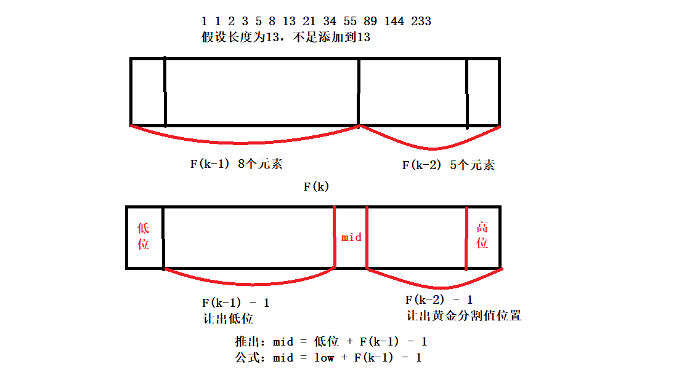
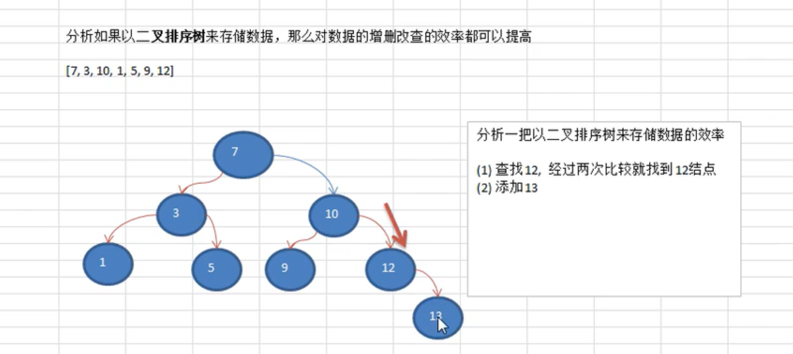
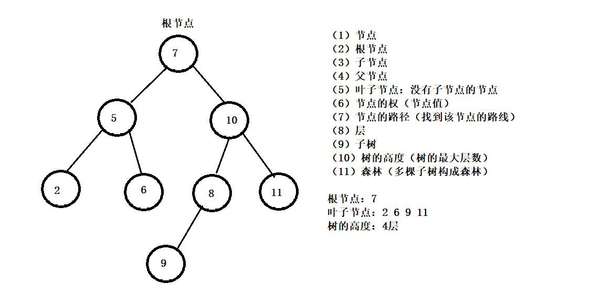
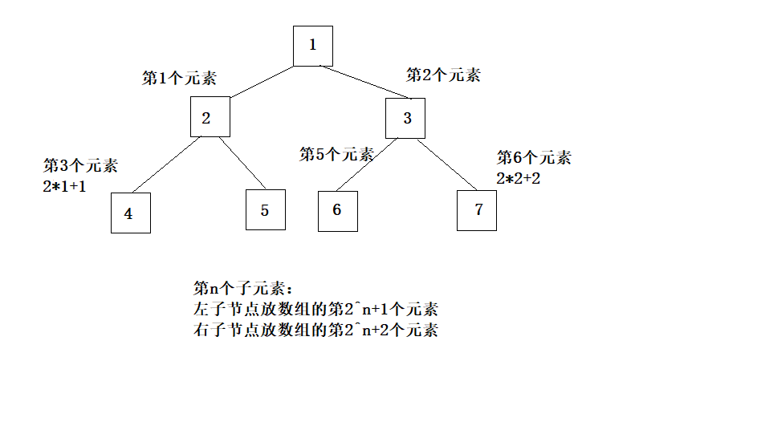

### 查找算法

<hr>


#### 1、查找算法介绍


##### 1、常用的查找算法

顺序查找（线性查找）

二分查找（折半查找）

插值查找

斐波那契查找


##### 2、线性查找算法

线性查找代码：

```java
//线性查找
public static seqSearch (int[] arr,int value){
    for(int i = 0; i < arr.length; i++){
        if(arr[i] == value){
            return i;
        }
    }
    return -1;
}
```


##### 3、二分查找算法

先将数组变为有序数组，然后进行查找


思路分析：

（1）首先确定该数组的中间下标

（2）然后让需要查找的数据与中间值比较，然后根据比较进行递归，决定向哪边递归，如果相等就返回

（3）结束递归条件：找到结束递归，找不到也结束递归


简单二分查找

```java
 //未优化二分查找法
public static int binarySearchOne (int[] arr,int left,int right,int value){
        //当左比右大，返回-1表示没找到
        if(left > right){
            return -1;
        }
        int mid = (left+right)/2;
        int midValue = arr[mid];
        if(value < midValue){
            //没找到mid-1会到-1
            return binarySearchOne(arr,left,mid - 1,value);
        }else if(value > midValue){
            //没找到会mid+1会到arr.length这个数
            return binarySearchOne(arr,mid+1,right,value);
        }else{
            return mid;
        }
    }
}

//不需要递归的二分查找
public class BinarySearch {

    public static int binarySearch (int[] arr,int value){
        int mid = 0;
        int left = 0;
        int right = arr.length - 1;
        //小于等于，只有一个数时需要判断
        while(left <= right){
            //直接left + right更容易越界
            mid = left + (right - left) / 2;
            if(arr[mid] > value){
                right = mid - 1;
            }else if(arr[mid] < value){
                left = mid + 1;
            }else if(arr[mid] == value){
                return mid;
            }
        }
        return -1;
    }

    public static void main(String[] args) {
        //测试代码
        int[] arr = {1,3,5,12,15,19};
        System.out.println(binarySearch(arr,1));
    }
}
```


二分查找升级处理

思路分析：

1.找到mid值不要立即返回，向

2.向mid索引值得左边扫描，将所有满足得元素得下标放入到集合

3.2.向mid索引值得右边扫描，将所有满足得元素得下标放入到集合

```java
 //优化二分查找法，找到所有相同值
public static ArrayList<Integer> binarySearchAll (int[] arr,int left,int right,int value){
        //当左比右大，返回空的集合表示没找到
        if(left > right){
            return new ArrayList<Integer>();
        }
        int mid = (left+right)/2;
        int midValue = arr[mid];
        if(value < midValue){
            //没找到mid-1会到-1
            return binarySearchAll(arr,left,mid - 1,value);
        }else if(value > midValue){
            //没找到会mid+1会到arr.length这个数
            return binarySearchAll(arr,mid+1,right,value);
        }else{
            List<Integer> resIndexList = new ArrayList<>();
            //从左边进行查找
            int temp = mid - 1;
            while(true){
                //因为是有序的，所以相同值只会连续出现
                if(temp < 0 || arr[temp] != value){
                    break;
                }
                resIndexList.add(arr[temp]);
                temp--;
            }
            //从右边进行查找
            int temp = mid + 1;
            while(true){
                //因为是有序的，所以相同值只会连续出现
                if(temp > arr.length - 1 || arr[temp] != value){
                    break;
                }
                resIndexList.add(arr[temp]);
                temp++;
            }
            return resIndexList;
        }
    }
}
```


##### 4、插值查找算法

原理：插值查找算法类似于二分查找，不同的是插值查找每次从自适应mid处开始查找，将二分查找的求mid公式

（1）left表示左边索引，right表示右边索引，value为查找值

（2）mid = arr[left] + (right -  left) *(value - arr[left]) /  (arr[right] - a[left])


插值查找的使用场景：

对于数据量较大，关键字分布较均匀得查找表来说，采用插值查找较快；关键字分布不均匀，且数据跳动较大，不一定比二分查找好


插值查找算法代码

```java
public static void insertSearch (int[] arr,left,right,value){
    //防止mid值过大，数组越界，判断必须有
    if(left > right || value < arr[0] || value > arr[arr.length-1]){
        return -1;
    }
    //预估索引
    int mid = (value - arr[left])/(arr[right]-arr[left])*(right-left);
    int midValue = arr[mid];
    if(value > midValue){
        return insertSearch(arr,mid+1,right,value);
    }else if(value < midValue){
        return insertSearch(arr,left,mid-1,value);
    }else{
        return mid;
    }
}
```


##### 5、斐波那契查找算法

斐波那契查找算法，也叫黄金分割算法

原理与前两种相似，仅仅改变了中间节点的位置，中间值不再是中值或差值得到，而是位于黄金分割点附近

`mid = left + F(k-1) - 1`


F(k-1) - 1的理解：

（1）由斐波那契数列F(k) - 1 = (F(k-2) - 1) + (F(k-1) - 1) + 1，该式说明，只要顺序表的长度为F(k) - 1，则可以将该表分成长度为F(k-2) - 1和F(k-1) - 1两段，从而中间位置是mid = low + F(k-1) - 1

（2）类似的每一个子段可以采用相同方式分割

（3）但顺序表长度n不一定刚好等于F(k) - 1，这里k值只要能使得F(k)-1恰好大于或等于n即可，由以下代码得到，顺序表长度增加后，新增的位置（从n+1到F(k)-1位置），都赋值为n位置的值即可


公式推导图：




斐波那契查找

```java
public static fibonacciSearch (int[] arr,int value){
    int low = 0;
    int high = a.length - 1;
    int k = 0;//斐波那契分割数值下标
    int mid = 0;//存放分割点处的值
    int[] fiboArr = getFibonacciArray(20);
    
    //获取分割数值下标
    while(high > fiboArr[k] - 1){
        k++;
    }
    
    //创建临时数组
    int[] temp = Arrays.copyOf(arr,fiboArr[k]);
    
    //f[k]的值最后会大于等于数组长度，多余的地方会补0
    //将多余部分进行处理，让数组始终保持有序
    for(int i = high + 1;i < temp.length;i++){
        temp[i] = a[high];
    }
    
    //使用while循环，找到我们要查找的value值
    while(low <= high){
        mid = low + fiboArr[k-1] - 1;
        //向左查找
        if(value < temp[mid]){
            high = mid - 1;
            k--;
        }else if(value > temp[mid]){
            low = mid + 1;
            //因为后面的初始长度是f[k-2],从f[k-2]为分割点
            k -= 2;
        }else{
            //根据大小决定返回索引
            return mid <= high ? mid : high;
        }
    }
    return -1;
}

//创建一个斐波那契数列
public static int[] getFibonacciArray (int maxSize){
    int[] fArr = new int[maxSize];
    f[0] = 1;
    f[1] = 1;
    for(int i = 2;i < maxSize;i++){
        arr[i] = arr[i-1] + arr[i-2];
    }
    return arr;
}
```


#### 2、哈希表（散列表）

哈希表

哈希表也叫散列表，根据关键码值而直接进行访问的数据结构，通过将关键码值映射到表中一个位置来访问记录，以加快查找速度。使用的映射函数我们叫做散列函数，存放记录的数组叫做散列表。


实际中使用缓存层将常用数据存到缓存，能到缓存中读取，就不去读取数据库数据。

缓存层产品：Redis、Memcache（主要就是通过下面两种数据结构实现的）

（1）哈希表（数组+链表） 

（2）数组+二叉树


哈希表主要作用就是做缓存


谷歌上机题：

实际需求：每天当所有员工来报道时，要求将该员工的信息加入（id，性别，年龄，住址），当输入该员工的id时，要求查找到该员工所有信息。

要求：不适用数据库，尽量节省内存，速度越快越好

思路分析：使用哈希表来管理雇员信息


雇员类

```java
class Emp {
    private int id;
    private String name;
    private String address;
    Emp next;
    public Emp (int id,String name,String address){
        this.id = id;
        this.name = name;
        this.address = address;
    }
}
```

散列表

```java
public class HashTableDemo {
    //用来管理多条链表
    private EmpLinketList[] empListArray;
    private int size;
    
    //初始化数组
    public HashTableDemo (int size){
        this.size = size;
        empListArray = new EmpLinketList[size];
        for(int i = 0; i < size; i++){
            empListArray[i] = new EmpLinkedList();
        }
    }
    //添加雇员
    public void add (Emp emp) {
        int hash = getHash(emp.getId());
        empListArray[hash].add(emp);
    }
    
    //遍历散列表
    public void list () {
        for(int i = 0; i < size; i++){
            empListArray[i].list();
        }
    }
    
    //根据id获取哈希
    public int getHash (int id){
        return id % size;
    }
}

class EmpLinkedList {
    private Emp head;
    
    //添加
    public void add (Emp emp){
        if(head == null){
            head = emp;
            return;
        }
        Emp tempEmp = head;
        while(tempEmp.next != null){
            tempEmp = tempEmp.next;
        }
        tempEmp.next = emp;
    }
    
    //遍历
    public void list (){
        if(head == null){
            System.out.println("list is empty.");
            return;
        }
        Emp tempEmp = head;
        while(true){
            System.out.printf("id=%d,name=%s\n",tempEmp.getId(),tempEmp.getName());
            if(tempEmp.next == null){
             	break;   
            }
            tempEmp = tempEmp.next;
        }
    }
}
class Emp {}//省略
```


#### 3、树结构

##### 1、为什么需要树这种数据结构

+ 数组
  - 优点：访问元素速度快，查找元素可以通过查找算法提升查找效率，遍历效率高
  - 缺点：查找具体值时，或者插入值，效率较低

+ 链式存储
  - 优点：适合插入，删除效率也很好
  - 缺点：查找效率低

+ 树的存储方式
  - 优点：提高数据存储，读取效率，比如二叉排序树，既可以保证数据查找速度，同时可以保证数据的插入、删除、修改速度


二叉排序树原理图：




##### 2、树的常用术语


###### 1、树的属于介绍

（1）节点

（2）根节点

（3）子节点

（4）父节点

（5）叶子节点：没有子节点的节点

（6）节点的权（节点值）

（7）节点的路径（找到该节点的路线）

（8）层

（9）子树

（10）树的高度（树的最大层数）

（11）森林（多棵子树构成森林）

节点术语理解图：




##### 3、二叉树的概念

（1）每个节点做多只能有两个子节点的一种形式的树

（2）二叉树的节点分为**左节点**和**右节点**

（3）如果二叉树的所有叶子节点都在最后一层（n），并且总节点数为`2^n-1`，我们称之为**满二叉树**

（4）如果二叉树的所有叶子节点都在最后一层，或者倒数第二层，，而且最后一层的叶子节点在左边连续，倒数第二层的叶子节点在右边连续，我们称之为**完全二叉树**


二叉树的遍历：

（1）前序遍历

（2）中序遍历

（3）后序遍历

根据根节点的输出位置判断是哪一种遍历方法


二叉树遍历的分析：

（1）建立一棵二叉树

（2）前序遍历：先输出当前节点，如果左子节点不为空，则递归继续前序遍历；如果右子节点不为空，则递归继续前序遍历

（3）中序遍历：如果当前节点的左子节点不为空，则递归中序遍历；输出当前节点；如果当前的右子节点不为空，则递归中序遍历

（4）后序遍历：如果当前节点的左子节点不为空，则递归后序遍历；如果当前节点的右子节点不为空，则递归后序遍历；输出当前节点


###### 1、前序遍历

先输出父节点，在遍历左子树和右子树

```java
public class BinaryTree {
    private PersonNode root;
    
    public void setRoot(PersonNode root){
        this.root = root;
    }
    
    //前序遍历
    public void preOrder () {
        if(this.root != null){
            this.root.preOrder();
        }else{
            System.out.println("tree is empty.");
        }
    }
    
    //中序遍历
    public void infixOrder {
        if(this.root != null){
            this.root.infixOrder();
        }else{
            System.out.println("tree is empty.");
        }
    }
    
    //后序遍历
    public void postOrder (){
        if(this.root != null){
            this.root.postOrder();
        }else{
            System.out.println("tree is empty.");
        }
    }   
}

class PersonNode {
    private int no;
    private String name;
    private PersonNode left;
    private PersonNode right;
    
    public PersonNode (int no,String name){
        this.no = no;
        this.name = name;
    }
    
    //getter,setter,toString
    public void setLeft(){}
    public void setRight(){}
    
    //前序遍历
    public void preOrder (){
        System.out.println(this);
        //递归向左子树前序遍历
        if(this.left != null){
            this.left.preOrder();
        }
        //递归向右子树遍历
        if(this.right != null){
            this.right.preOrder();
        }
    }
    
    //中序遍历
    public void infixOrder (){
        //向左子树中序遍历
        if(this.left != null){
            this.left.infixOrder();
        }
        //输出父节点
        System.out.println(this);
        //向右子树中序遍历
        if(this.right != null){
            this.right.infixOrder();
        }
    }
    
    //后序遍历
    public void postOrder () {
         //向左子树中序遍历
        if(this.left != null){
            this.left.postOrder();
        }
        //向右子树中序遍历
        if(this.right != null){
            this.right.postOrder();
        }
        //输出父节点
        System.out.println(this);
    }
}
```


###### 2、中序遍历

先遍历左子树，在输出父节点，在遍历右子树（代码上）


###### 3、后序遍历

先遍历左子树，在遍历右子树，最后输出父节点（代码上）


###### 4、二叉树查找节点

（1）前序查找

思路分析：

+ 先判断当前节点的no是否等于查找的，如果相等，返回当前节点

+ 否则判断左子节点是否为空，不为空，则递归前序查找
+ 左子节点没有找到相等的，则从右节点开始前序查找

```java
public PersonNode preOrderSearch (int no){
    //当前节点比较
    if(this.no == no){
        return this;
    }
    PersonNode temp = null;
    
    //左子树前序遍历
    if(this.left != null){
        temp = this.left.preOrderSearch(no);
    }
    if(temp != null){
        return temp;
    }
    
    //右子树前序遍历
    if(this.right != null){
        temp = this.right.preOrderSearch(no);
    }
    if(temp != null){
        return temp;
    }
    
    return temp;
}
```


（2）中序查找

思路分析：

+ 判断当前左子节点是否为空，否则向左递归中序查找
+ 如果没有找到与当前节点比较，没找到，继续向右中序查找

```java
public infixOrderSearch (int no) {
    //左子树中序遍历
    PersonNode temp = null;
    if(this.left != null){
        temp = this.left.infixOrderSearch(no);
    }
    if(temp != null){
        return temp;
    }
    
    //当前节点比较
    if(this.no == no){
        return this;
    }
    
    //右子树中序遍历
    if(this.right != null){
        temp = this.right.infixOrderSearch(no);
    }
    if(temp != null){
        return temp;
    }
    
    return temp;
}
```


（3）后序查找

思路分析：

+ 判断当前节点左子节点是否为空，如果不为空，向左递归后续查找
+ 左边没找到，继续从右边递归后序查找，还是没找到
+ 与根节点比较

```java
public PersonNode postOrderSearch(int no){
    PersonNode temp = null;
    //左子树后序遍历
    if(this.left != null){
        temp = this.left.postOrderSearch(no);
    }
    if(temp != null){
        return temp;
    }
    
    //右子树后序遍历
    if(this.right != null){
        temp = this.right.postOrderSearch(no);
    }
    if(temp != null){
        return temp;
    }
    
    //当前节点比较
    if(this.no == no){
        return this;
    }
    
    return temp;
}
```


###### 5、二叉树删除节点

无规则二叉树删除节点

规定：

（1）如果删除的是叶子节点，则删除该节点

（2）如果删除的节点是非叶子节点，则删除该子树

思路：

（1）因为二叉树是单向的，所以我们比较的当前的节点的左子节点或右子节点

（2）如果root节点不为空，且值就和查找值相等，二叉树置空

（3）否则root节点执行自身的删除方法

（4）自身删除方法先找左子节点来与查找值判断，如果相等，终止方法

（5）左边不等，找右子节点判断值，如果相等，终止方法

（6）都不等，如果左子节点不为空，执行左子节点的删除方法

（7）还是没找到，如果右子节点不为空，执行右子节点的删除方法

（8）一直没找到，就输出


递归删除节点

```java
//PersonNode删除方法
public PersonNode delete (int num){
        //注意当前节点的判断是通过父节点进行比较的，所以不用考虑
        PersonNode result = null;

        //判断左子节点值是否相等
        if(this.left != null && this.left.getNum() == num){
            result = this.left;
            this.left = null;
            return result;
        }

        //判断右子节点值是否相等
        if(this.right != null && this.right.getNum() == num){
            result = this.right;
            this.right = null;
            return result;
        }

        //递归左子节点删除操作
        if(this.left != null){
            result = this.left.delete(num);
            if(result != null)return result;
        }

        //递归右子节点删除操作
        if(this.right != null){
            result = this.right.delete(num);
            if(result != null)return result;
        }
        return result;
}

//BinaryTree删除方法
public PersonNode delete (int num){
        PersonNode res = null;
        if(this.root != null){
            if(this.root.getNum() == num){
                res = this.root;
                this.root = null;
            }else{
                res = this.root.delete(num);
            }
        }
        if(res == null){
            System.out.println("binary tree is empty.");
        }else{
            System.out.println("删除节点：" + res);
        }
        return res;
}
```


思考：将代码改成，如果找到该节点，删除该节点，如果左子节点不为空，就将左子节点放过来，如果为空，就判断右子节点是否为空，不为空就放右子节点


##### 4、顺序存储二叉树

基本说明：从数据存储来看，数组存储方式和树的存储方式可以相互转换，也就是树可以转化为数组，数组可以转化为树。


顺序存储二叉树的的特点：

（1）顺序二叉树通常只考虑完全二叉树

（2）第n个元素的左子节点放第2\*n + 1个元素，右子节点存放第2\*n + 2个元素

（3）第n个元素的父节点为(n - 1) / 2

（4）n表示二叉树的第n个元素

（5）只是规定存放顺序，和节点或数组里存放的值没有关系


顺序存储二叉树




顺序存储二叉树代码实现

```java
public class ArrayBinaryTree {
    public static void main (String[] args){
        int[] arr = {1,2,3,4,5,6,7};
    }
    
    private int[] arr;
    public ArrayBinaryTree (int[] arr){
        this.arr = arr;
    }
    
    public void preOrder () {
        this.preOrder(0);
    }
    
    //前序遍历传index=0
    public void preOrder (int index){
        if(arr = null || arr.length = 0){
            System.out.println("Array should not be null.");
            return;
        }
        System.out.println(arr[index]);
        if(index * 2 + 1 < arr.length){
            preOrder(2 * index + 1);
        }
        if(index * 2 + 2 < arr.length){
            preOrder(2*index + 2);
        }
    }
    
     //中序遍历
    public void infixOrderList (int index){
        //数组没有初始化，或传递空数组处理
        if(arr == null || arr.length == 0){
            System.out.println("Array should not be null.");
            return;
        }
        if(index*2 + 1 < arr.length){
            infixOrderList(index*2 + 1);
        }
        System.out.print(arr[index] + "\t");
        if(index*2 + 2 < arr.length){
            infixOrderList(index*2 + 2);
        }
    }

    //后序遍历
    public void postOrderList (int index){
        //数组没有初始化，或传递空数组处理
        if(arr == null || arr.length == 0){
            System.out.println("Array should not be null.");
            return;
        }
        if(index*2 + 1 < arr.length){
            postOrderList(index*2 + 1);
        }
        if(index*2 + 2 < arr.length){
            postOrderList(index*2 + 2);
        }
        System.out.print(arr[index] + "\t");
    }
}
```


使用场景：堆排序利用的数据结构就是顺序存储二叉树


##### 5、线索化二叉树

将数列{1，3，6，8，10，14}构建成一棵二叉树

二叉树：

```java
		1
 	3		6
  8	  10  14         
```

问题：对二叉树进行遍历时，6，8，10，14这几个节点的左右指针，并没有完全的利用上，如果我们想充分利用各个节点的左右指针，让各个节点指向自己的前后节点怎么办？


解决方案：线索化二叉树


线索化二叉树（Threaded Binary Tree）

（1）n个节点的二叉链表中含有n+1个空指针域（2n-（n-1）= n+1）。

***推导：***n个元素会产生2n个指针，两两相连产生的树需要n-1个指针连接，所以空指针数是`2n-(n-1)`个

（2）利用二叉链表的空指针域，存放指向该节点在某种遍历次序下的前驱和后继节点的指针，这种附加的指针称为**线索**。

不同的遍历方式空指针指向的节点不同

（3）加上线索的二叉链表成为**线索链表**，相应的二叉树成为**线索二叉树**。

（4）根据线索性质的不同，线索二叉树分为**前序线索二叉树**、**中序线索二叉树**、**后序线索二叉树**。

（5）一个节点的前一个结点，称为**前驱节点**，一个节点的后一个节点称为**后继节点**


应用案例：中序遍历结果--{8，3，10，1，14，6}

```java
	    1 
   3          6 
 8  10      14
//根据中序遍历结果来的
//8的右指针指向3，10的左指针指向3，右指向1
//14的左指针指向1，右指针指向6
```

说明：当线索化二叉树后，节点的属性left和right，有如下情况：

（1）left的指向是左子树，也可能是指向前驱节点，比如1节点根据中序遍历结果做指针指向10，实际指向3，右指针指向14，实际指向6，10节点左指针指向了前驱节点；

（2）right指向的是右子树，也可能是指向后继节点，比如1节点的right指向的是右子树，而10节点得到right指向的是后继节点。


线索二叉树代码实现：

<font color="red">注意最左的叶子节点左指针，和最右的叶子节点的右指针都是不会被设置上线索的</font>

```java
public class ThreadedBinaryTree {
    private HeroNode root;
    
    //递归进行线索化的时候，总是保留前驱节点
    private HeroNode prev = null;
    
    //二叉树添加中序线索化的方法
    public void threadedNodes (PersonNode node) {
        if(node == null){
            return;
        }
        //1.先线索化左子树
        threaded(node.getLeft());
        
        //2.线索化当前节点
        //2.1先处理当前节点的前驱节点
        if(node.getLeft() == null){
            node.setLeft(prev);
            node.setLeftType(false);
        }
        
        //2.2处理后继节点
        if(prev!= null && prev.getRight() == null){
            //让前驱节点的右指针指向当前节点
            prev.setRight(node);
            prev.setRight(false);
        }
        //每处理一个节点，让当前节点是下一个节点的前驱节点
        prev = node;
        
        //3.线索化右子树
        threaded(node.getRight());
    }
}
//在PersonNode中规定：
//leftType:true左子树，false前驱节点
//leftType:true右子树，false后继节点
```


遍历线索化二叉树

各个节点可以通过线性方式遍历，因此无需递归，提高了遍历效率，遍历次序应当和中序遍历一致

```java
//中序遍历
public void threadedList () {
    PersonNode temp = root;
    while(temp != null){
        while(temp.getLeftType()){
            temp = temp.getLeft();
        }
        //到最左节点并输出
        System.out.println(temp);
        //一直输出后继节点
        while(!temp.getRightType()){
            temp = temp.getRight();
            System.out.println(temp);
        }
        node = node.getRight();
    }
}
```


#### 4、数据结构和算法的应用

##### 1、堆排序介绍与实现

（1）堆排序是利用堆这种数据结构，堆排序是一种选择排序，它的最坏、最好、平均时间复杂度都是O(nlog n)，是不稳定排序

（2）堆是完全二叉树

+ 每个节点的值，都大于等于左右孩子节点的值，成为**大顶堆**
+ 没有要求左右孩子节点的值
+ 每个节点的值都小于或等于左右孩子节点的值，称为**小顶堆**

（3）升序采用大顶堆，降序采用小顶堆


堆排序思想

（1）将待排序序列结构构成一个大顶堆（不需要构建二叉树）

（2）此时整个序列的最大值就是堆顶的根节点

（3）将其与末尾元素进行交换，此时末尾就是最大值

（4）然后将剩余n-1个元素重新构成一个堆，这样会得到n个元素的次小值，如此反复执行，就能得到一个有序序列了。

可以看到构建大顶堆的过程中，元素的个数逐渐减少，最后得到一个有序序列。


堆排序基本思路

（1）将无须序列构成为一个堆（大顶堆或小顶堆）

（2）将堆顶元素和末尾元素交换，将大元素沉到数组末端

（3）重新调整结构，使其满足定义，然后继续交换堆顶元素与当前末尾元素，反复执行调整，交换，知道整个序列有序


堆排序代码实现

```java
public class HeapSort{
    public void heapSort (int[] arr){
       //根据非叶子节点自下而上完成最大值的上浮
        for(int i = arr.length/2 - 1; i >= 0; i--){
            adjustHeap(arr,i,arr.length);
        }
        //将上浮的值交换到数组后面
        int temp = 0;
        for(int j = arr.length-1;j>0;j--){
            temp = arr[j];
            arr[j] = arr[0];
            arr[0] = temp;
            adjustHeap(arr,0,j);
        }
    }
    
    //注意非叶子节点i是自下而上的
    //数组为待调整数组，i表示非叶子节点数组中索引
    //length堆多少个元素进行调整，length在逐渐减少
    //功能：完成将非叶子节点的树调整成大顶堆
    public void addjustHeap (int[] arr,int i,int length){
        int temp = arr[i];
        for(int k = i*2 + 1; k < length; k = k*2 +1){
            //如果左子节点比右子节点小，切到右子节点
            if(k + 1 < length && arr[k] < arr[k+1]){
                k++;//指向右子节点
            }
            //找到子节点中比较大的与当前非叶子节点比较
            if(arr[k] > temp){
                //如果子节点大于父节点，把较大的值赋值给当前节点，让i指向k
                arr[i] = arr[k];
                //切换到当前节点的下一个节点继续循环比较
                i = k;
            }else{
                break;//
            }
        }
        //当循环结束后，已经将i为父节点的树的最大值，放在了最顶上
        //将找到的非叶子节点值赋值过去，完成交换
        arr[i] = temp;
    }
}
```


堆排序速度特别快，不是递归而是迭代，所以强


##### 2、赫夫曼树

基本介绍

（1）给定n个权值作为n个叶子节点，构造一棵二叉树，如果该树的带权路径长度达到最小，称这样的树为最优二叉树

（2）**赫夫曼树是带权路径长度最短的树**，权值较大的节点离根较近,

?		WPL最小的数


赫夫曼树重要概念

（1）在一棵树，从一个节点往下达到孩子或孙子节点之间的通路，称为**路径**，通路中分支的数目称为**路径长度**。若规定层数为L，则到L层的路径长度为L-1.

（2）若将树中节点赋给一个有着某种含义的数值，则这个数值称为该节点的**权**。

（3）**节点的带权路径长度**：从根节点到该节点之间的路径长度与该节点的权的乘积（如路径长度是2，目标节点权值为5，带权路径长度为10）

（4）**树的带权路径长度**：树的带权路径长度规定为所有叶子节点的带权路径之和，记为WPL（weighted path length）

（5）WPL最小的就是**赫夫曼树**


赫夫曼树创建思路：

（1）先将数组从小到大进行排序，每一个数据都是一个节点，每个节点可以看成是一棵最简单的二叉树

（2）取出节点权值最小的两棵二叉树

（3）组成一棵新的二叉树，该新的二叉树的根节点的权值是前面两棵二叉树根节点权值的和

（4）将这棵新的二叉树，以根节点的权值大小再次排序，不断重复，直到数列中，所有数据都被处理，就得到一棵赫夫曼树


java实现赫夫曼树

```java
public class HuffmanTree {
    public static void main(String[] args){
        int[] arr = {13,7,8,3,29,6,1};
        createHuffmanTree(arr);
    }
    
    //遍历数组，将数组的每一个元素构建成一个Node放入到ArrayList中
    public static void createHuffmanTree (int[] arr){
        List<Node> nodes = new ArrayList<>();
        for(int value : arr){
            nodes.add(new Node(value));
        }
        
        while(nodes.size > 1){
            //从小到大排序,java自带的排序法
        	Collections.sort(nodes);
        	Node leftNode = nodes.get(0);
            Node rightNode = nodes.get(1);
      Node parentNode = new Node(leftNode.value+rightNode.value);
            parentNode.left = leftNode;
            parentNode.right = rightNode;
            nodes.remove(leftNode);
            nodes.remove(rightNode);
            nodes.add(parentNode);
            Collections.sort(nodes);
        }
    }
    
    //前序遍历
    public static void preOrder(Node root){
        if(this.root != null){
            this.root.preOrder();
        }else{
            System.out.println("root is null.");
        }
    }
}
//为了让Node能持续排序，实现Comparable接口
class Node implements Comparable<Node> {
    int value;
    Node left;
    Node right;
    
    public void preOrder () {
        System.out.println(this);
        if(this.left != null){
            this.left.preOrder();
        }
        if(this.right != null){
            this.right != null;
        }
    }
    
    public Node (int value){
        this.value = value;
    }
    
    public int compareTo (Node target){
        //从小到大排序
        return this.value - target.value;
    }
}
```


##### 3、赫夫曼编码

基本介绍

（1）赫夫曼编码是一种编码方式，属于一种程序算法

（2）赫夫曼编码是赫夫曼树在通信当面的经典应用之一

（3）赫夫曼编码广泛用于数据文件压缩，压缩率通常在20%-90%之间

（4）赫夫曼编码是可变长编码，Huffman于1952年提出的编码方法，称之为最佳编码


原理分析

通信领域中的信息处理方式---定长编码

> 字符串：`i like java i like java a`
> ASCII码： `105(i),32(空格),108(l),105,107,101,32,106,97,118,97...`
>
> 1.定长编码就是将这些字符的二进制都保存，然后进行传输
>
> 二进制：`01101001(i),etc...`数据量比较大！
>
> 2.可变长编码
> （1）统计次数
> 	`i:4 l,k,e,v,j:2 a:5 空格:6`
> 原则上，按照各个字符出现的次数进行编码，出现次数越多的，编码越小
> （2）二进制表示字符
>
> `空格:0 a:1 i:10 e:11 j:100 k:101 l:110 v:111 `
> （3）根据上面规则可变长编码为
> `10(i) 0(空格) 110(l) 10(i) 101(k) 11(e) 0 100 1 111 1...`
>
> 前缀编码：字符的编码不能是其它字符编码的前缀，即不能匹配到重复的编码
>
> 存在问题：不是前缀编码，容易存在多义性，比如`i(10)`是`k(101)`的前缀


赫夫曼编码

通信领域的第三种编码方式

> 1、字符串`i like java i like java a`
>
> 2、统计字符出现次数`i:4 l,k,e,v,j:2 a:5 空格:6`
>
> 3、按照上面字符出现的次数构建一棵赫夫曼树，出现次数作为权
>
> 4、将数据按照规则构建成一棵赫夫曼树
>
> 5、根据赫夫曼树，向左为0，向右为1，找到节点的路径就是该树的赫夫曼编码
>
> 构建的编码就是前缀编码，即每一个字符的编码都不会是另一个字符编码的前缀原因：因为都是叶子节点表示一个字符，二叉树中到叶子节点的路径是唯一的
>
> 6、最后得到的编码就是霍夫曼编码（无损压缩）
>
> 7、**注意：**赫夫曼树重复数据出现的时候，是有可能出现不同的赫夫曼树，所以编码也会出现不同的编码结果，但是压缩后的长度是一样的，都是无损压缩


赫夫曼编码---数据压缩

思路分析：

（1）Node节点，保存数据、权重、左节点、右节点

（2）将得到的字符串放到对应的byte[]数组，将准备构建赫夫曼树的Node节点放到List

（3）通过List构建对应的赫夫曼树


创建赫夫曼编码树

```java
public class HuffmanCode {
    public static void main (String[] args){
        String str = "I like java do you like java really";
        byte[] bytes = str.getBytes();
    }
    
    public static List<Node> getNodeList (byte[] bytes) {
        //用一个List存放所有节点
        ArrayList<Node> nodes = new ArrayList<>();
        //用一个Map用来统计字节出现的次数
        Map<Byte,Integer> counts = new HashMap<>();
        for(byte b : bytes){
            Integer count = counts.get(b);
            if(count == null){
                counts.put(b,1);
            }else{
                //覆盖
                counts.put(b,count++);
            }
        }
        //遍历Map将节点放到List集合中
        for(Map.entry<Byte,Integer> entry : counts.entrySet()){
            nodes.add(new Node(entry.getKey(),entry.getValue()));
        }
        return nodes;
    }
    
    //创建赫夫曼树并返回根节点
    public static Node createHuffmanTree (byte[] bytes) {
        List<Node> nodes = getNodeList(bytes);
        while(nodes.size() > 1){
            Collections.sort(nodes);
            Node leftNode = nodes.get(0);
            Node rightNode = nodes.get(1);
            Node parent = new Node(null,leftNode.getWeight()+rightNode.getWeight());
            parent.setLeft(leftNode);
            parent.setRight(rightNode);
            nodes.remove(leftNode);
            nodes.remove(rightNode);
            nodes.add(parent);
        }
        return nodes.get(0);
    }
}

class Node {
    //存放数据
    private Byte data;
    //表示字符出现次数
    private int weight;
    private Node left;
    private Node right;
    
    public Node (Byte data,int weight){
        this.data = data;
        this.weight = weight;
    }
    
    public int compareTo (Node o){
        return this.weight - o.weight;
    }
    
    public void toString (){
        return "Node[data=" + data + ",weight=" + weight + "]"; 
    }
    
    public void preOrder () {
        System.out.println(this);
        if(this.getLeft() != null){
            this.getLeft().preOrder();
        }
        if(this.getRight() != null){
            this.getRight().preOrder();
        }
    }
}
```


获得赫夫曼编码

课程代码

```java
private static HashMap<Byte,String> byteToCodeMap = new HashMap<>();
public static void getCodes (Node node,String code,StringBuilder sb) {
    StringBuilder sb2 = new StringBuilder(sb);
    sb2.append(code);
    if(node != null){
       if(node.getData() == null){
           getCodes(node.getLeft(),"0",sb2);
           getCodes(node.getRight(),"1",sb2);
       }else{
           byteToCodeMap.put(node.getData(),sb2.toString());
       }
    }
}
```

自己代码：

```java
//规定向左的路径为0，向右的路径为1
    public static void getHuffmanCode (Node node,Map<Byte,String> byteToCodeMap,StringBuilder str) {
        if(node.getLeft() == null && node.getRight() == null){
            byteToCodeMap.put(node.getData(),str.toString());
            return;
        }
       if(node.getLeft() != null){
           str.append("0");
           getHuffmanCode(node.getLeft(),byteToCodeMap,str);
           //递归回父级节点删除左支添加的字符
           str = str.deleteCharAt(str.length()-1);
       }
       if(node.getRight() != null){
           str.append("1");
           getHuffmanCode(node.getRight(),byteToCodeMap,str);
           //递归回父级节点删除又支添加的字符
           str = str.deleteCharAt(str.length()-1);
        }
    }
```


获取赫夫曼编码后的字节数组

```java
//bytes 原始字符串对应的字节数组  
//Map 赫夫曼编码Map
//返回值，处理后赫夫曼字节数组
//注意生成的赫夫曼编码是补码，-1获得反码，符号位不变，按位取反获得原码
private static byte[] zip(byte[] bytes,Map<Byte,String huffmanCodeMap){
    StringBuilder sb = new StringBuilder("");
    for(byte b : bytes){
        sb.append(huffmanCodeMap.get(b));
    }
    //将对应字符串转为byte数组
    //统计返回赫夫曼编码长度
    //因为每个字节都是8位，所以不足要补0
    int len = (sb.length() + 7) / 8;
    //等价于len = sb.length() % 8 == 0 ? sb.length % 8 : sb.length() % 8 + 1;
    //创建存储压缩后的byte数组，大小为len
    byte[] newByteArr = new byte[len];
    int index = 0;
    for(int i = 0; i < sb.length(); i+=8){
        String temp = "";
        //防止越界，最后一位会在强转的时候补0
        if(i + 8 > sb.length()){
            temp = sb.substring(i);
        }else{
            temp = sb.substring(i,i + 8);
        }
        newByteArr[index++] = (byte)Integer.parseInt(temp,2);
    }
    return newByteArr;
}
```


赫夫曼字节数组解码

```java
//完成数据解压
//1.将字节转化成二进制
//2.将编码对应的二进制字符串对照赫夫曼Map转化为字符串
//3.flag标识整数
//4.返回值是字节对应的二进制字符串
public static String byteToBitString (byte b,boolean flag) {
     int temp = b;//将b转成int类型
        
     //如果是正数存在补高位
     if(flag){
        //比如1获取二进制字符串是1
        // 256|1: 1 0000 0000 | 0000 0001 100000001
        temp |= 256;
     }
        
     //获取字节对应的补码但是整数是去了无用0的
      //4: 100,所以需要上面的操作补0
      String str = Integer.toBinaryString(temp);
      if(flag){
         //长度为9，需要把第一个干掉
         return str.substring(str.length()-8);
      }else{
         //最后一个字节是不需要补高位的
         //返回后可以通过Integer的方法转Int类型
         return str;
      }
}
    
//完成对压缩数据的解码
public static byte[] decode (Map<Byte,String> huffmanCodeMap,byte[] huffmanBytes){
    StringBuilder sb = new StringBuilder("");
    //将byte数组转成二进制字符串
    for(int i = 0; i < huffmanBytes.length;i++){
        boolean flag = (i!=huffmanBytes.length-1);
        sb.append(byteToBitString(huffmanBytes[i],flag));
    }
    //将原来的Map反转，方便通过字符串获取字节
    Map<String,Byte> reverseMap = new HashMap<String,byte>;
    for(Map.Entry<Byte,String> entry : byteToCodeMap){
        reverseMap.put(entry.getValue(),entry.getKey());
    }
    //将二进制字符串对应的字节取出放到集合里
    List<Byte> list = new ArrayList<>();
    for(int i = 0; i < sb.length();){
        int count = 1;
        boolean flag = true;
        Byte b = null;
        while(flag){
            String key = sb.substring(i,i+count);
            b = map.get(key);
            if(b == null){
                count++;
            }else{
                flag = false;
            }
        }
        list.add(b);
        i += count;
    }
}
```


通过哈夫曼编码方法对文件进行压缩

```java
//srcFile：源文件路径  outFile：输出文件路径
public static void zipFile (String srcFile,String outFile){
    FileInputStream fis = null;
    FileOutputStream fos = null;
    ObjectOutputStream oos = null;
    try{
        fis = new FileInputStream(srcFile);
        byte[] b = new byte[fis.available];
        fis.read(b);
        //获取压缩后的数组
        byte[] zipBytes = zip(b);
        fos = new FileOutputStream(outFile);
        //创建对象输出流，为了以后回复源文件使用
        oos = new ObjectOutputStream(fos);
        oos.writeObject(zipBytes);
        //将byte和String的映射关系写进文件
        oos.writeObject(byteToCodeMap);
        oos.flush();
    }catch(Exception e){
        e.printStackTrace();
    }finally{
        try{
            fis.close();
            fos.close();
            oos.close();
        }catch(Exception e){
            e.printStackTrace();
        }
    }
}
```


赫夫曼压缩文件解压

```java
public static void unZipFile (String src,String out) {
    //定义文件的输入流
    FileInputStream fis = null;
    ObjectInputStream ois = null;
    FileOutputStream fos = null;
    try{
        fis = new FileInputStream(src);
        ois = new ObjectInputStream(fis);
        byte[] huffmanBytes = (byte[])ois.readObject();
        Map<Byte,String> map = (Map<Byte,String>)ois.readObject();
        decode();
    }catch(Exception e){
        e.printStackTrace();
    }
}
```


赫夫曼压缩文件注意事项

（1）如果文件本身就是经过压缩处理的，再使用赫夫曼编码压缩压缩效率不会有明显变化，比如视频、ppt等文件，本身就是经过压缩的文件

（2）赫夫曼编码是按照字节处理的，所以可以无损压缩所有的文件

（3）如果一个文件中重复的数据不多，压缩效果也不明显


#### 5、二叉排序树

二叉排序树介绍：BST（Binary sort tree），对于二叉树的任何一个非叶子节点，要求左子节点的值比当前节点值小，右子节点的值比当前节点的值大


二叉排序树添加和遍历方法代码

```java
public class BinarySortTree {
    Node root;
    
    public BinarySortTree (){}
    
    public void add(Node node){
        if(root == null){
            root = node;
        }else{
            root.add(node);
        }
    }
    
    public void infixOrder () {
        if(root != null){
            root.infixOrder();
        }else{
            System.out.println("tree is null.");
        }
    }
}

class Node {
    int value;
    Node left;
    Node right;
    
    public Node (int value){
        this.value = value;
    }
    
    //添加节点
    public void add(Node node){
        if(node == null){
            return;
        }
        //添加节点值与当前节点值进行大小比较
        if(node.value < this.value){
            if(this.left == null){
                this.left = node;
            }else{
                this.left.add(node);
            }
        }else{
            if(this.right == null){
                this.right = node;
            }else{
                this.right.add(node);
            }
        }
    }
    
    //中序遍历，二叉排序树会正好升序排列
    public void infixOrder () {
        if(this.left != null){
            this.left.infixOrder();
        }
        System.out.println(this);
        if(this.right != null){
            this.right.infixOrder();
        }
    }
}
```


删除方法：

（1）删除叶子节点

+ 没有父节点情况

+ 找到要删除的节点和父节点，根据是左是有，进行指针的置空

（2）删除只有一棵子树的节点

+ 找到要删除的节点和父节点
+ 确定是左子节点还是右子节点
+ 如果删除的是父节点的左子节点

（3）删除有两棵子树的节点

找右子树的最左叶子节点，删除当前节点，然后连接


二叉排序树删除节点方法

```java
class Node {
    int value;
    Node left;
    Node right;
    
    //查找要删除节点的值
    public Node search (int value){
        if(value == this.value)return this;
        if(value < this.value){
            //从左边继续查找
            if(this.left == null)return null;
            return this.left.search(value);
        }else{
            //从右边继续查找
            if(this.right == null)return null;
            return this.right.search(value);
        }
    }
    
    //查找要删除节点的父节点的值
    public Node searchParent (int value){
        if((this.left != null && this.left.value == value) || (this.right != null && this.right.value == value)){
            return this;
        }else{
            //如果查找的值小于当前节点的值，并且当前节点的左子节点不为空
            if(value < this.left.value && this.left != null){
                return this.left.searchParent(value);
            }else if(this.right != null){
                //注意实际情况中要避免相同值的情况
                return this.right.searchParent(value);
            }else{
                //都不满足，数明就是根节点，根节点没有父节点
                return null;
            }
        }
    }
}

class BinarySortTree {
    private Node root;
    
    //查找要删除节点
    public Node search (int value){
        if(root == null){
            return null;
        }else{
            return root.search(value);
        }
    } 
    
    //查找父节点
    public Node searchParent (int value){
        if(root == null){
            return null;
        }else{
            return root.searchParent(value);
        }
    }
    
    //找到节点的最左叶子节点并删除这个节点
    public int deleteRightTreeMini (Node node){
        Node target = node;
        while(target.left != null){
            target = target.left;
        }
        deleteNode(target.value);
        return target.value;
    }
    
    //删除节点
    public void deleteNode (int value){
        if(root == null){
            return;
        }else{
            Node target = search(value);
            //没找到要删除节点
            if(target == null)return;
            
            //如果找到的是root节点，从右子树找最小节点删除
            //根节点判断
            if(target == root){
                if(target.right != null){
                    int val = deleteRightTreeMini(target.right);
                    root.value = val;
                    return;
                }else if(target.left != null){
                    root = target.left;
                    return;
                }else{
                    root = null;
                    return;
                }
            }
            
            //target找到，找父节点
            Node parent = searchParent(value);
            
            //2、target是叶子节点
            if(target.left == null && target.right == null){
                //判断是左叶子节点还是右叶子节点
                if(parent.left != null && target.left.value == value){
                    parent.left = null;
                }else if(parent.right != null && parent.right.value == value){
                   parent.right = null; 
                }
            }else if(target.left != null && target.right != null){
                //3、删除有两棵子树的节点，找到右子树最小节点，或左子树最大节点
                int minVal = deleteRightTreeMini(target.right);
                targetNode.value = minVal;
            }else{
                //4、target只有一棵子树情况
                if(target.left != null){
                    //4.1 target有左子树
                    //判断target是parent的左子节点还是右子节点进行悬挂
                    if(parent.left.value == value){
                        parent.left = target.left;
                    }else{
                        parent.right = target.left;
                    }
                }else{
                    //4.2 target有右子树
                    //判断target是parent的左子节点还是右子节点进行悬挂
                    if(parent.left.value == value){
                        parent.left = target.right;
                    }else{
                        parent.right = target.right;
                    }
                }
            }
        }
    }
}
```


自己测试代码（修改课程中判断不严谨的地方）

```java
public class BinarySortTree {
    private static Node root;

    public static void add (Node node) {
        if(root == null){
            root = node;
        }else{
            root.add(node);
        }
    }

    //寻找节点
    public static Node findNode (int value){
        if(root == null){
            return null;
        }else{
            return root.findNode(value);
        }
    }

    //寻找节点的父节点
    public static Node findParent (int value) {
        if(root == null)return null;
        return root.findParent(value);
    }

    //中序遍历
    public static void infixOrder (){
        if(root == null){
            System.out.println("tree is empty.");
        }else{
            root.infixOrder();
        }
    }

    //删除右子树最左的节点
    public static Node delRightTreeMin (Node node){
        Node temp = node;
        Node parent = node;
        while(temp.getLeft() != null){
            temp = temp.getLeft();
        }
        delete(temp.getValue());
        return temp;
    }

    //删除节点
    /*
     * 1、删除叶子节点
     * 2、删除节点只有一棵子树
     * 3、删除节点有两棵子树
     * 3.1、找左子树最右节点
     * 3.2、找右子树最左节点顶替
     * 4、删除节点是父亲节点
     * */
    public static void delete (int value){
        if(root == null)return;
        //找到要删除节点
        Node target = findNode(value);
        if(target == null)return;

        //删除根节点处理
        if(target == root){
            //找右子树最小值替换
            if(target.getRight() != null){
                root.setValue(delRightTreeMin(target.getRight()).getValue());
            }else if(target.getLeft() != null){
                root = root.getLeft();
            }else{
                root = null;
            }
            return;
        }

        //删除根节点以外节点
        Node parent = findParent(value);
        //删除叶子节点
        if(target.getLeft() == null && target.getRight() == null){
            if(parent.getLeft() != null && parent.getLeft().getValue() == value){
                parent.setLeft(null);
            }else if(parent.getRight() != null && parent.getRight().getValue() == value){
                parent.setRight(null);
            }
        }else if(target.getLeft() != null && target.getRight() != null){
            //删除有两棵子树节点
            int rightMiniVal =  delRightTreeMin(target.getRight()).getValue();
            target.setValue(rightMiniVal);
        }else{
            //删除只有一棵子树的节点
            if(target.getLeft() != null){
                //将左子树挂到parent上
                if(parent.getLeft() != null && parent.getLeft().getValue() == value){
                    parent.setLeft(target.getLeft());
                }else{
                    parent.setRight(target.getLeft());
                }
            }else{
                //将右子树挂到parent上
                if(parent.getLeft().getValue() == value){
                    parent.setLeft(target.getRight());
                }else{
                    parent.setRight(target.getRight());
                }
            }
        }
    }
}

class Node {
    private int value;
    private Node left;
    private Node right;

   //getter,setter...

    public Node (int value){
        this.value = value;
    }

    //增加节点的方法
    public void add (Node node) {
        if(node == null)return;
        if(node.getValue() < this.getValue()){
            if(this.getLeft() != null){
                this.getLeft().add(node);
            }else{
                this.setLeft(node);
            }
        }else{
            if(this.getRight() != null){
                this.getRight().add(node);
            }else{
                this.setRight(node);
            }
        }
    }

    public Node findNode (int value) {
        //如果当前节点值等于查找值，返回
        if(value == this.getValue())return this;
        //如果比当前节点值小，先从左边查找，如果左子节点为空
        //如果比当前节点值大，从右边查找，如果右子节点为空
        if(value < this.getValue()){
            if(this.getLeft() == null)return null;
            return this.getLeft().findNode(value);
        }else{
            if(this.getRight() == null)return null;
            return this.getRight().findNode(value);
        }
    }

    public Node findParent (int value){
        //找到后终止递归条件，左子节点或右子节点值等于查找节点值
        if(( this.getLeft() != null && this.getLeft().getValue() == value ) || (this.getRight() != null && this.getRight().getValue() == value)){
            return this;
        }else{
            //value和当前节点值的比较进入下一个分支的比较
            if(this.getLeft() != null && this.getValue() > value){
               return this.getLeft().findParent(value);
            }else if(this.getRight() != null && this.getValue() <= value){
                return this.getRight().findParent(value);
            }else{
                return null;
            }
        }
    }

    //中序遍历
    public void infixOrder (){
        if(this.getLeft() != null){
            this.getLeft().infixOrder();
        }
        System.out.println(this);
        if(this.getRight() != null){
            this.getRight().infixOrder();
        }
    }

    @Override
    public String toString() {
        return "Node{" +
                "value=" + value +
                '}';
    }
}
```


#### 6、二叉平衡树