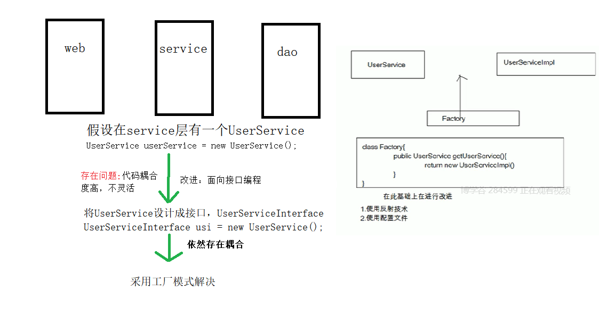

### Spring

<hr>


#### 1、Spring介绍

Spring是一个开源的、**一站式**的分层的轻量级框架，致力于解决管理用户要管理的对象

Spring核心容器：不仅可以管理Dao层对象，还可以管理service层对象，Spring可以与其他框架进行集成，促进好的编程习惯

轻量级：性能，堆内存消耗比较少


Spring体系结构

（1）核心容器

+ beans与core：它们提供了Spring的基础功能，提供IOC和依赖注入特性
+ context：框架的上下文对象，基于beans和core之上
+ Expression Language：Spring提供的表达式语言，简化开发


（2）Data access/Integration：数据访问/集成

+ JDBC
+ ORM
+ OXM
+ JMS
+ Transactions


（3）Web

+ Spring本身提供SpringMVC


（4）AOP：面向切面编程

本质：大部分情况使用动态代理实现


（5）Test

+ 提供对JUnits和TestNG的测试


Spring的优点

+ 方便解耦，简化开发
+ AOP编程的支持
+ 声明式事务的支持
+ 方便程序的测试
+ 方便集成各种优秀框架
+ 降低Java API的使用难度


#### 2、Spring的使用

##### 2.1 Spring的jar包下载

在Spring3.0.2以后不在提供依赖的jar包，我们项目需要依赖的jar包需要自己下载

Spring jar包的目录结构：

+ docs：存放API和规范文档
+ libs：开发的jar包
+ schema：开发过程中需要的XML的schema约束


Spring的jar包下载

> 1、因为Spring放到了Gihub上
>
> https://github.com/spring-projects/spring-framework/wiki/Spring-Artifactory在这个网址找`libs-release-local`
>
> 或者直接：https://repo.spring.io/libs-release-local/
>
> 更方便：https://repo.spring.io/libs-release-local/org/springframework/spring/
>
> 选择需要的版本：https://repo.spring.io/libs-release-local/org/springframework/spring/4.3.2.RELEASE/根据版本号改网址就可以了
>
> 2、先下载4.3.2和5.1.9
>
> Spring版本升级的主要趋向如下：
> 1.兼容新的Java标准
> 2.支持更高的Java版本
> 3.支持更多的周边框架
> 4.简化Spring的设定


##### 2.2 Spring开发环境搭建

Spring开发中，需要根据业务来导入不同的jar包

当前关于IOC和DI进行讲解，只需要Spring的核心功能

+ Spring-beans-XXX.RELEASE.jar
+ Spring-context-XXX.RELEASE.jar
+ Spring-core-XXX.RELEASE.jar
+ Spring-expression-XXX.RELEASE.jar

<font color="blue">注意：commons-logging-1.2.jar也需要先加载</font>


需要在src文件夹下创建一个applicationContext.xml

+ 在...dist/docs/spring-framework-references/html/xsd-configuration.html

里面规定了不同项目类型需要的不同类型的约束

当前只需要Basic Configuration


IOC快速入门

IOC：inversion of controller控制反转

解决方案发展：




IOC实现的原理：XML配置文件+反射+工厂模式，就是原来由我们实例化对象交给Spring容器来初始化，这就是控制反转


IOC体会：

```java
public interface ServiceInterface {
    void sayHello();
}

class UserService implements ServiceInterface {
    private String info;
    @Override
    public void sayHello () {
        System.out.println("hello spring");
    }
    public void setInfo (String info){
        this.info = info;
    }
    public String getInfo (){
        return this.info;
    }
}

class Test {
    public void Test () {
        //以前我们这么使用
        ServiceInterface si = new UserService();
        
        //Spring中这么用
        ApplicationContext ac = new ClassPathXmlApplicationContext("applicationContext.xml");
        //ClassNotDef Exception,需要common-logging.xxx.jar
        UserService us = (UserService)ac.getBean("userService");
        us.sayHello();
        us.getInfo();//chen
    }
}
```

ApplicationContext是BeanFactory的一个子接口，实现类是ClassPathXmlApplicationContext.


Spring中：

```xml
<!--id是唯一的，name可以不唯一-->
<bean id="userService" class="service.UserService">
	<property name="info" value="chen"></property>
</bean>
```


DI体会

DI：dependency injection依赖注入

在Spring框架负责Bean对象的时候，动态将依赖对象注入到Bean组件里


面试：IOC和DI的区别

IOC：控制反转，是指实例化对象由spring容器来管理

DI：在spring创建对象的过程中，对象所依赖的属性通过配置注入到对象中


##### 2.3 Bean的实例化


###### 2.3.1 不同接口加载原理

ApplicationContext是接口，并实现了BeanFactory接口，下面有两个具体实现类，FileSystemXmlApplicationContext和ClassPathXmlApplicationContext两个具体实现类

BeanFactory：采用是延迟加载机制

ApplicationContext：扩展了BeanFactory接口，配置文件加载时就会初始化Bean，并且提供了不同的应用层Context实现（web开发中有WebApplicationContext）


###### 2.3.2 id和name的区别

+ id遵循XML规范，名称不能包含特殊符号
+ name为了更好的扩展，可以包含特殊符号，`-`等


Bean的获取

```java
public class BeanTest {
    public void test1 () {
        //有中划线，Deprecated注解标记的过时方法
        BeanFactory factory = new XMLBeanFactory(new ClassPathResource("applicationContext.xml"));
        //加载XM了的时候并没有创建，此时才创建Bean对象
        Bean bean1 = (Bean)factory.getBean("bean1");
        bean1.show();
        
        //加载了XML后，此时bean已经被创建了
        ApplicationContext ac = new ClassPathXmlApplicationContext("applicationContext.xml");
        Bean bean2 = (Bean)ac.getBean("bean2");
        bean2.show();
        
        //根据文件路径加载配置文件并同时加载Bean对象
        ApplicationContext ac = new FileSystemXmlApplicationContext("src/applicationContext.xml");
        Bean bean3 = (Bean)ac.getBean("bean3");
        bean3.show();
    }
}

class Bean {
    public Bean () {
        System.out.println("bean is created.");
    }
    public void show () {
        System.out.println("bean's show function.");
    }
}
```

xml文件：

```xml
<bean name="bean1" class="service.Bean"></bean>
```


###### 2.3.3 Bean的实例化方式

+ 无参构造：注意Bean类必须提供无参构造
+ 静态工厂方法：需要创建一个工厂类
+ 实例工厂方法


静态工厂方法

需要创建一个工厂类，并提供一个static返回bean对象的方法

XML配置：
```xml
<!--设置工厂类和获取对象方法-->
```

Java实现工厂类和实例类：
```java
class Bean2 {
    public void show {
        System.out.prinln("bean2's show function.");
    }
}

class Bean2Factory {
    public static Bean2 createBean2 () {
        return new Bean2();
    }
}
```


实例工厂方法

需要创建一个工厂类，在工厂类提供一个非static的创建bean对象的方法，配置文件中需要将工厂类，和创建bean的方法配置进去

XML配置：
```xml
<bean name="bean3" factory-bean="Bean3Factory" factory-method="createBean3"></bean>
```


Java工厂类和实例类：

```java
public class Bean3Factory {
    public Bean3 createBean3 () {
        return new Bean3();
    }
}

class Bean3 {
    public void show (){
        System.out.prinln("bean3's show function.");
    }
}
```


###### 2.3.4 Bean的作用域

```xml
<!--scope取值：（常用标**）
	**1、singleton单例，默认单例
	2、request用在web开发中，将bean对象通过setAttibute方法在存储request域中
	3、session用在web开发中，将bean对象通过setAttibute方法在存储request域中
	**4、prototype多例，每次从容器中取获取对象都会返回新得实例
-->

<!--设置自定义初始化和销毁方法-->
<bean name="bean4" class="service.Bean4" scope="" init-method="myInit" destroy-method="myDestroy">
	<property name="chen" value="xiang"></property>
</bean>
<!--设置Bean对象处理后的操作方法，将这个实现接口的方法纳入Spring的管理中，整个生命周期中只要使用了配置文件的bean对象，MyBeanPostProcessor的前后处理方法都会执行-->
<bean class="MyBeanPostProcessor"></bean>
```


###### 2.3.5 Bean的生命周期

测试

```java
public class BeanLifeCircle implements BeanNameAware,ApplicationContextAware,InitializingBean,DisposableBean {
    private String name;
    
    public BeanLifeCircle () {
        System.out.println("first");
    }
    
    public void setName (String name){
        System.out.println("second:get "+ name);
        this.name = name;
    }
    
    @Override
    public void setBeanName (String name){
        System.out.println("third:get "+ name);
    } 
   
    @Override
    public void setApplicationContext (ApplicationContext ac) throws BeansException {
        System.out.println("fourth:"+ ac);
    }
    
    @Override
    public void afterPropertiesSet () {
        System.out.println("sixth");
    }
    
    public void myInit () {
        System.out.println("seventh");
    }
    
    //自定义方法
    public void add () {
        System.out.println("ninth");
    }
    
    @Override
    public void destroy () throws Exception {
        System.out.println("tenth");
    }
    
    public void myDestroy () {
        System.out.println("eleventh");
    }
}

class MyBeanPostProcessor implements BeanPostProcessor  {
    @Override
    public Object postProcessBeforeInitialization (Object bean,String beanName) throws BeansException {
        System.out.println("fifth:excute before");
        return bean;
    }
    
    @Override
    public Object postProcessAfterInitialization (Object bean,String beanName) throws BeansException{
        System.out.println("eighth");
        return bean;
    }
}

class Test {
    public static void main (String[] args){
        //注意ApplicationContext接口没有Close方法，所以必须用具体实现类来销毁
        ClassPathXmlApplicationContext cpxac = new ClassPathXmlApplicationContext("applicationContext.xml");
        Bean4 = bean4 = (Bean4)cpxac.getBean("bean4");
        //执行close方法就会调用销毁对象的方法
        cpxac.close();
    }
}
```


Bean的生命周期方法作用解析

第三步和第四步让Bean对象了解spring容器

第五步和第八步可以通过动态代理，针对指定的Bean方法进行功能增强

第六步和第十步通过实现指定的接口来完成init和destroy操作


<font color="blue">注意：</font>

+ 开发中不使用6和10步，因为7和11初始化与销毁无耦合
+ 增强Bean功能可以使用后处理Bean，实现BeanPostProcessor接口，并增强
+ 需要初始化和销毁功能可以设置自己初始化和销毁方法
+ destroy-method只对`scope="singleton"`单例的有效，只有单例才能管理销毁


###### 2.3.6 Bean的属性注入

Spring中bean的属性注入有两种：

+ 构造器注入
+ Setter方法注入


构造器注入（使用较少）

```xml
<bean id="car" class="domain.Car">
    <!--构造方法中的参数对映索引值-->
	<constructor-arg index="0" type="java.lang.String" value="chen"></constructor-arg>
    <constructor-arg index="1" type="double" value="10000"></constructor-arg>
</bean>
```

Java代码

```java
public class Car {
    private String name;
    private double price;
    public Car (){}
    public Car (String name,double price){
        this.name = name;
        this.price = price;
    }
    public void sayName () {
        System.out.println("name:"+name);
    }
}

class Test {
    public static void main (String[] args){
        ApplicationContext ac = new ClassPathXmlApplicationContext("applicationContext.xml");
        Car car = (Car)ac.getBean("Car");
        car.sayName();
    }
}
```


**Setter方法注入（使用较多）**

```xml
<bean name="car1" class="domain.Car">
	<property name="name" value="benz"></property>
    <property name="price" value="1000"></property>
</bean>

<bean name="person" class="domain.Person">
	<property name="name" value="chen"></property>
    <!--使用ref来引用另一个类对象做实例-->
    <property name="car" ref="car1"></property>
</bean>
```

Java

```java
public class Person {
    private String name;
    private Car car;
    public Person () {}
    public void setName (String name){
        this.name = name;
    }
    public String getName (String name){
        return this.name;
    }
    public void setCar (Car car){
        this.car = car;
    }
    public Car getCar (){
        return this.car;
    }
}
```


集合属性的注入

spring中对于集合属性，可以使用专门标签完成注入：list、set、map、properties，属性是数组也可以使用list

```xml
<bean id="collectionDemo" class="domain.CollectionDemo">
	<!--list和数组的属性赋值-->
    <property name="list">
        <list>
        	<value>chenxiang</value>
            <value>20</value>
            <ref bean="car"/>
        </list>
    </property>
    
    <!--set集合的属性赋值-->
    <property name="set">
        <set>
        	<value>zhuminmin</value>
            <value>18</value>
            <!--对象赋值，和标签中的ref属性类似-->
            <ref bean="person"/>
        </set>
    </property>
    
     <!--map的属性赋值-->
    <property name="map">
        <map>
            <!--普通赋值-->
        	<entry key="username" value="minmin"></entry>
            <!--对象赋值-->
            <entry key-ref="person" value-ref="car"></entry>
        </map>
    </property>
    
    <!--properties赋值-->
    <property name="prop">
    	<props>
        	<prop key="salary">10000</prop>
            <prop key="gender">female</prop>
        </props>
    </property>
</bean>
```

Java

```java
public class CollectionDemo {
    private List list;
    private Set set;
    private Map map;
    private Properties prop;
    public void setList (List list) {
        this.list = list;
    }
    public List getList () {
        return this.list;
    }
    public void setMap (Map map) {
        this.map = map;
    }
    public Map getMap () {
        return this.map;
    }
    public void setProp (Properties prop) {
        this.prop = prop;
    }
    public Properties getList () {
        return this.prop;
    }
}
```


名称空间

Spring以后提供了xml命名空间：不是真正的命名空间，是虚拟的

p名称空间：可以解决我们setter注入时`<property>`简化

c名称空间：解决构造器注入时`<constructor-arg>`的简化


之前的XML

```xml
<bean name="dog1" class="domain.Dog">
	<property name="name" value="beats"></property>
    <property name="color" value="red" />
</bean>
```

使用p名称空间

```xml
<?xml version="1.0" encoding="UTF-8"?>
<!--引入p名称约束：xmlns:p="http://www.springframework.org/schema/p"-->
<beans xmlns="http://www.springframework.org/schema/beans"
       xmlns:xsi="http://www.w3.org/2001/XMLSchema-instance"
       xmlns:p="http://www.springframework.org/schema/p"
       xsi:schemaLocation="
        http://www.springframework.org/schema/beans http://www.springframework.org/schema/beans/spring-beans.xsd">

<!-- bean definitions here -->
	<bean name="user2" class="domain.Person" p:name="minmin" p:age="18" p:pet-ref="dogOfMinMin"></bean>
    <bean name="dogOfMinMin" class="domain.Dog" p:type="hashiqi" p:color="pink"></bean>
</beans>
```

使用c命名空间是一样的


SPEL

Spring Expression Language	Spring表达式语言，类似于EL表达式语言

可以直接使用spring管理的bean对象的

```xml
<!--spel-->
<bean name="user1" class="domain.Person">
	<property name="chen" age="20" dog="#{user2.getDog()}"></property>
</bean>
<bean name="user2" class="domain.Person" p:name="minmin" p:age="18" p:pet-ref="dogOfMinMin"></bean>
<bean name="dogOfMinMin" class="domain.Dog" p:type="hashiqi" p:color="pink"></bean>
```


#### 3、Spring注解开发

在Spring中使用注解，我们必须在applicationContext.xml文件中添加标签`<context:annotation-config />`，作用是让Spring中常用的注解生效


##### 3.1 注解开发准备工作

> 1、找到约束
>
> `xsd-configuration.html`中找到`41.2.8 the context schema`
>
> 2、添加约束规则：
>
> ```xml
> <?xml version="1.0" encoding="UTF-8"?>
> <beans xmlns="http://www.springframework.org/schema/beans"
>     xmlns:xsi="http://www.w3.org/2001/XMLSchema-instance"
>   xmlns:context="http://www.springframework.org/schema/context" xsi:schemaLocation="
>         http://www.springframework.org/schema/beans http://www.springframework.org/schema/beans/spring-beans.xsd
>         http://www.springframework.org/schema/context http://www.springframework.org/schema/context/spring-context.xsd"> <!-- bean definitions here -->
> 
> </beans>
> ```
>
> 或者直接在原文件中添加
>
> `xmlns:context="http://www.springframework.org/schema/context"`
>
> 3、使用标签
>
> `<context:annotation-config />`允许使用注解注册Bean对象
>
> ```java
> @Component("userService")
> //相当于<bean id="userService" class="domain.UserService"></bean>
> public class UserService {
>     public void add () {
>         System.out.println("userservice's add function");
>     }
> }
> ```
>
> 4、Spring 4.xxxx版本需要依赖jar包
>
> `spring-aop-4.3.2-release.jar`
>
> **导入jar包后还是报错**：
>
> 因为applicationContext.xml使用了`<context:annotation-config />`标签，表示可以使用注解，但是类中加载的注解Spring不知道位置
>
> **解决**：
>
> 添加标签：`<context:cpmponent-scan base-package="domain.Service"/>`进行包扫描，可以不需要`<context:annotation-config />`标签
>
> Spring2.5以后新增注解：`@Service`，`@Controller`，`@Repository`


##### 3.2 属性依赖注入

简单注入


XML配置

```xml
<?xml version="1.0" encoding="UTF-8"?>
<beans xmlns="http://www.springframework.org/schema/beans"
       xmlns:xsi="http://www.w3.org/2001/XMLSchema-instance"
       xmlns:p="http://www.springframework.org/schema/p"      xmlns:context="http://www.springframework.org/schema/context"
       xmlns:aop="http://www.springframework.org/schema/aop"
       xsi:schemaLocation="
        http://www.springframework.org/schema/beans
        http://www.springframework.org/schema/beans/spring-beans.xsd
        http://www.springframework.org/schema/context
        http://www.springframework.org/schema/context/spring-context-4.2.xsd">
    <!--定义扫描的范围-->
    <context:component-scan base-package="domain,testdi,dao" />
</beans>


```


Java代码

```java
@Service("userService")
public class UserService {
    //简单注入,将注解写在set方法上作用一样
    @value("chen")
    private String name;
    
    //复杂属性注入
    @Autowired
    private UserDao userDao;
    
    @Override
    public void serve () {
        System.out.println("provide service to customers.");
        System.out.println(userDao.getOne());
    }
}

@Service("userDao")
class UserDao {
    public void getOne () {
        return "you get one";
    }
}

```


<font color="blue">注意：`@Value @Autowired`可以修饰属性，也可以修饰setter方法，如果写在属性上，就不用提供setter方法</font>


`@Autowired`自动注入，根据当前的属性的class去对象容器中匹配，实现注入

```java
//根据名称进行属性注入
@Autowired
@Qualifier("userDao")
private UserDao userDao;
			||
        	||	等价于
        	||
@Resource(name="userDao")
private UserDao userDao;
```


```java
@Autowired
@Scope("prototype")
/*相当于:
*<Bean name="userService" class="service.userService" *scope="prototype">
*	<property name="userDao" ref="dao.UserDao"></property>
*</Bean>
*/
private UserDao userDao;

//前提scope是singleton
@PostConstruct
//相当于init-mehtod=""
public void myInit(){}

@PreDestroy
//相当于destroy-method=""
public void myDestroy(){}
```


#### 4、Spring Web开发

需要导入`spring-web-xxx.jar`包


##### 4.1 配置web.xml文件

```xml
<listener>
    <listener-class>org.springframework.web.context.ContextLoaderListener</listener-class>
</listener>
```


（2）服务器启动的时候，将ApplicationContext通过WebApplicationContext

```java
public class ServiceServlet extends HttpServlet {
    public void doGet () {
        ApplicationContext ac = (ApplicationContext)this.getServletContext().getAttribute(WebApplicationContext.ROOT_WEB_APPLICATION_CONTEXT_ATTRIBUTE);
        
    }
}
```


（3）在web.xml文件中配置applicationContext.xml文件的位置

Tomcat默认会在WEB-INF下查找applicationContext.xml查找

如果配置文件在其它路径，就需要下面的配置让Tomcat在全局查找配置文件

```xml
<context-param>
    <param-name>contextConfigLocation</param-name>
    <param-value>classpath:applicationContext.xml</param-value>
</context-param>
```


##### 4.2 Spring整合JUNIT4

导入`spring-test-xxx.jar`

```java
@RunWith(SpringJUnit4ClassRunner.class)//spring整合JUnit4
@ContextConfiguration(locations="classpath:applicationContext.xml")//指定配置文件位置
public class Demo {
    @Autowired
    private UserDao userDao;
    public void test () {
        userService.serve();
    }
}
```


#### 5、Spring AOP

AOP：Aspects oriented programming面向切面编程

目的：将日志记录、安全检查、时间起点、时间结束从代码中抽离出来，让用户只关注业务代码


AOP相关概念

目标对象：需要增强的对象

连接点：类中可能被增强的方法

切入点：具体需要增强的方法

通知：增强的代码

引介：一种特殊的通知，可以在运行期为类动态地添加一些属性和方法

切面：切入点和通知的结合


##### 5.1 AOP底层实现

AOP分为静态AOP和动态AOP，静态AOP是指AspectJ实现的AOP，将切面代码直接编译到Java类文件中。动态AOP是指将切面代码进行动态织入实现的AOP。Spring的AOP为动态AOP，实现的技术是动态代理技术和CGLIB（动态字节码增强技术）


##### 5.2 JDK动态代理

运行时，在JVM内部动态生成class字节码对象（Class对象），JDK动态代理只针对于接口操作

```java
public interface ServiceInterface {
    void login();
    void register();
}

class UserService implements ServiceInterface {
    public void login () {
        System.out.println("login...");
    }
    public void register () {
        System.out.println("register a account.");
    }
}

//创建一个使用JDK的proxy完成动态代理的工具类
abstract class JDKProxyFactory implements InvocationHandler {
    private Object target;
    public JDKProxyFactory (Object obj){
        this.target = target;
    }
    //创建代理对象
    public Object createProxy () {
        //使用Proxy完成对象创建
        ClassLoader loader = target.getClass().getClassLoader();
        Class[] interfaces = target.getClass().getInterfaces();
        return Proxy.newProxyInstance(loader,interfaces,this);
    }
    
    public abstract Object invoke (Object proxy,Method method,Object[] args);
}
```


自己手写的方便增强工具

```java
public abstract class ProxyUtil implements InvocationHandler {
    private Object target;

    //重写子类必须调用此方法来传递方法需要增强的对象
    public void setTarget (Object target){
        this.target = target;
    }

    //创建代理对象
    public Object createProxy () {
        ClassLoader loader = target.getClass().getClassLoader();
        Class[] interfaces = target.getClass().getInterfaces();
        return Proxy.newProxyInstance(loader,interfaces,this);
    }

    @Override
    public Object invoke(Object proxy, Method method, Object[] args) throws Throwable {
        return enhance(proxy,method,args);
    }

    //子类需要实现的增强功能
    public abstract Object enhance (Object proxy, Method method, Object[] args) throws Throwable;
}

class EnhanceUtil extends ProxyUtil {
    private Object target;

    public EnhanceUtil (Object obj) {
        super.setTarget(obj);
        this.target = obj;
    }

    @Override
    public Object enhance(Object proxy, Method method, Object[] args) throws Throwable {
        String method_name = method.getName();
        if(method_name.equals("login") || method_name.equals("register")){
            System.out.println("your needed function here.");
            Object obj = method.invoke(target,args);
            return obj;
        }
        return method.invoke(target,args);
    }
}
```


##### 5.3 CGLIB动态代理

开源项目，强大的，高性能的，高质量的Code生成类库，它可以在运行期扩展Java类与实现Java接口。底层是通过使用字节码处理框架ASM，来转换字节码并生成新的类（可以为无接口的实现类做代理）


单独使用CGLIB，需要cglib的jar包还需要asm相关的jar包，Spring核心jar包中集成了这些jar包（可以在`spring-core-xxx.RELEASE.jar`）

可以为没有实现接口的类做代理

```java
public class CglibProxy implements MethodInterceptor {
    private Object target;
    public CglibProxy (Object target){
        this.target = target;
    }
    //创建代理对象
    public Object createProxy () {
        //1.创建enhancer
        Enhancer enhance = new Enhancer();
        //2.传递目标对象的Class
        enhance.setSuperclass(target.getClass());
        //3.设置回调操作
        enhance.setCallBack(this);
        return enhance.create();
    }
    
    @Override
    public Object intercept (Object proxy,Method method,Object[] args,MethodProxy methodProxy){
        System.out.println("enhance code here");
        return method.invoke(target,args);
        //也可以写为：
        //return methodProxy.invokeSuper(proxy,args);
    }
}
```


##### 5.4 使用选择情况

目标对象实现了接口，优先使用JDK动态代理

目标没有实现接口，优先使用CGLIB


AOP开发需要得jar包

+ bean
+ core
+ context
+ expression
+ aop
+ aop联盟依赖的jar包
  - `com.springsource.org.aopalliance-xxx.jr`


传统AOP开发（了解）

+ 前置通知（`org.springframework.aop.MethodBeforeAdvice`）
+ 后置通知（`org.springframework.aop.AfterReturningAdvice`）
+ 后置通知
+ 环绕通知（`org.apoalliance.intercept.MethodInterceptor`）
+ 异常抛出通知（`org.springframwork.aop.ThorowsAdvice`）
+ 引介通知

```java
//注意这些是aopalliance下的jar包
public class Demo implements MethodBeforeAdvice,MethodAfterReturningAdvice,MethodInterceptor {
    @Override
    public void before (Method method,Object[] args,Object target) throws Throwable{
        System.out.println("前置增强");
    }
    
    @Override
    public void afterReturning(Object returnValue,Method method,Object[] args,Object target) throws Throwable{
        System.out.println("后置增强");
    }
    
    @Override
    public Object invoke(MethodInvocation mi) throws Throwable{
        System.out.prinln("环绕前");
        Object value = mi.proceed();
        System.out.prinln("环绕后");
        return value;
    }    
}
```

配置XML文件

```xml
<?xml version="1.0" encoding="UTF-8"?>
<beans xmlns="http://www.springframework.org/schema/beans"
       xmlns:xsi="http://www.w3.org/2001/XMLSchema-instance"
       xmlns:p="http://www.springframework.org/schema/p"
       xmlns:context="http://www.springframework.org/schema/context"
       xmlns:aop="http://www.springframework.org/schema/aop"
       xsi:schemaLocation="
        http://www.springframework.org/schema/beans
        http://www.springframework.org/schema/beans/spring-beans.xsd
        http://www.springframework.org/schema/context
        http://www.springframework.org/schema/context/spring-context-4.2.xsd">
    <!--注册实体类-->
    <bean id="orderService" class="domain.OrderService"></bean>
    <!--注册增强操作类-->
    <bean id="orderServiceAdvice" class="domian.OrderHelper"></bean>
    <!--切入点-->
    <bean id="orderServicePointcut" class="org.springframework.sopsupport.NameMatchMethodPointcut">
        <property name="mappedNames">
            <list>
                <!--需要增强的方法-->
            	<value>add</value>
                <value>update</value>
            </list>
        </property>
    </bean>
    <!--切面aspect = pointcut + advice-->
    <bean id="orderServiceAspect" class="org.springframework.aop.support.DefaultPointcutAdvisor">
    	<property name="advice" ref="orderServiceAdvice">
        <property name="pointcut" ref="orderServicePointcut"></property>
    </bean>
    <!--代理proxy-->
        <bean id="orderServiceProxy" class="org.springframework.ProxyFactoryBean">
        	<property name="target" ref="orderService"></property>
            <property name="interceptorNames" value="orderServiceAspect"></property>
            <property name="proxyInterfaces" ref="domian.OrderServiceInterface"></property>
        </bean>
</beans>
```

spring配置文件是可以拆分的

```xml
//将aop的配置文件导入，所有aop相关的配置放在aop1.xml文件中
<import resource="./aop1.xml"></import>
```


配置文件太麻烦，此时需要aspectJ

需要导入`com.spring.org.aspectj.weaver-xxx.jar`用于解析expression

```xml
<?xml version="1.0" encoding="UTF-8"?>
<beans xmlns="http://www.springframework.org/schema/beans"
       xmlns:xsi="http://www.w3.org/2001/XMLSchema-instance"
       xmlns:p="http://www.springframework.org/schema/p"
      xmlns:context="http://www.springframework.org/schema/context"
       xmlns:aop="http://www.springframework.org/schema/aop"
       xsi:schemaLocation="
        http://www.springframework.org/schema/beans
        http://www.springframework.org/schema/beans/spring-beans.xsd
        //导入aop相关的约束
        http://www.springframework.org/schema/aop
        http://www.springframework.org/schema/aop/spring-aop.xsd
        http://www.springframework.org/schema/context
        http://www.springframework.org/schema/context/spring-context-4.2.xsd">
    <!--注册实体类-->
    <bean id="orderService" class="domain.OrderService"></bean>
    <!--注册增强操作类-->
    <bean id="orderServiceAdvice" class="domian.OrderHelper">
    </bean>
    <!--简化之前的一大堆配置-->
    <aop:config>
        <!--针对所有方法进行增强，包名.接口.方法名-->
    	<aop:pointcut expression="execution(* domain.OrderServiceInterface.*)" id="mypoincut"></aop:pointcut>
        <aop:advisor advice-ref="orderServiceAdvice" pointcut-ref="mypointcut"></aop:advisor>
    </aop:config>
    
</beans>
```


#### 6、Spring注解开发

##### 6.1 容器注册组件方式

+ 包扫描 + 组件标记组件（@Controller @Service @Repository @Component），局限是只能给我们写的类进行注册，第三方依赖没法注册

+ @Bean（导入第三方包里的组件）

+ @Import（导入组件new的方式比较麻烦）

+ - 实现ImportSelector接口的类自定义注册规则（<font color="blue">SpringBoot使用最多</font>）

+ - 实现ImportBeanDefinitionRegistrar自定义注册信息和id


##### 6.2 注解开发相关注解

```java
//告诉Spring这是一个配置类
@Configuration

//指定要扫描的包
@ComponentScan(value = {},excludeFilters = {
        //指定扫描包下的哪些类不扫描
        /*
         *ANNOTATION:按照class方式排除
         * REGEX:正则
         * ASPECTJ:按照aspectj表达式
         * CUSTOM:自定义规则
        */
        @Filter(type = FilterType.ASSIGNABLE_TYPE,classes={})
},includeFilters = {
        //要包含的类
        @Filter(type = FilterType.ASSIGNABLE_TYPE,classes = {})

}, useDefaultFilters = false)//将Spring默认扫描所有包关掉

//@Conditional放在配置类上表示只有满足条件这个配置类注册的bean才会生效
//作用：类中组件统一设置
@Conditional(WindowsCondition.class)

//导入第三方组件，默认id是类全名,util.BeanUtil,util.ContextUtil
//MyImportSelector是实现ImportSelector接口的类，里面也可以自定义规则导入第三方组件
//MyImportBeanDefinitionRegister是实现ImportBeanDefinitionRegistrar接口的类，可以自定义注册和指定id名
@Import({MyImportSelector.class,
         MyImportBeanDefinitionRegister.class
})


public class SpringMainConfig {
    //给容器注册一个Bean，id默认是方法名
    //@Bean("deptService22")可以通过给bean传值，指定它的id
    @Bean
    //Scope调整作用域，prototype调用时才创建，singleton容器启动就会创建对象放进容器
    //@Lazy懒加载，第一次使用的时候才创建
    @Lazy
    @Scope("prototype")
    public DeptService deptService (){
        return new DeptService();
    }

    @Bean
    public TeacherService teacherService () {
        return new TeacherService();
    }

    @Bean
    @Lazy
    public DeptController deptController () {
        return new DeptController();
    }

    /*
    * 条件：
    * 如果操作系统式windows，打印Bill Gates
    * 如果操作系统式Linux，打印Linus
    * */
    @Bean("person01")
    //Spring4.0+提供的注解，SpringBoot大量使用这个注解
    //按照一定条件进行判断是否给容器注册Bean
    @Conditional(WindowsCondition.class)
    public Person person01 () {
        return new Person(1,"Bill Gates",null);
    }

    @Bean("person02")
    @Conditional(LinuxCondition.class)
    public Person person02 () {
        return new Person(1,"Linus",null);
    }
    
    @Bean
    //注册工厂
    public ColorFactoryBean colorFactoryBean () {
        return new ColorFactoryBean();
    }

    public static void main(String[] args) {
        //获取环境变量中的操作系统名称
        ApplicationContext ctx = ContextUtil.getContext();
        ConfigurableEnvironment env = (ConfigurableEnvironment) ctx.getEnvironment();
        String osName = env.getProperty("os.name");
        System.out.println("Current Operating System:" + osName);
        //获取所有Bean定义的id名称
        String[] names = ContextUtil.getContext().getBeanDefinitionNames();
        for (String name : names) {
            System.out.println("bean name:" + name);
        }
        //获取的是Color.class
        System.out.println("获取工厂实例的class：" + ctx.getBean("colorFactoryBean").getClass());
        //通过&也可以获取工厂,ColorFactoryBean.class
        System.out.println("获取工厂的class：" + ctx.getBean("&colorFactoryBean").getClass());
    }
}

//自定义注册实例
public class MyImportBeanDefinitionRegister implements ImportBeanDefinitionRegistrar {
    @Override
    //通过BeanDefinitionRegistry注册我们需要的组件
    public void registerBeanDefinitions(AnnotationMetadata importingClassMetadata, BeanDefinitionRegistry registry, BeanNameGenerator importBeanNameGenerator) {
        boolean flag1 = registry.containsBeanDefinition("condition.springAnnoConfig.Blue");
        boolean flag2 = registry.containsBeanDefinition("condition.springAnnoConfig.Red");
        if(flag1 && flag2){
            //指定bean的定义信息
            RootBeanDefinition rainbowDef = new RootBeanDefinition(Rainbow.class);
            //指定bean的id
            registry.registerBeanDefinition("rainbow",rainbowDef);
        }
    }
}

//根据数组类全名创建实例
public class MyImportSelector implements ImportSelector {
    @Override
    //AnnotationMetadata：可以获取配置类注解（SpringMainConfig）的所有注解信息
    public String[] selectImports(AnnotationMetadata annotationMetadata) {
        //写我们需要导入组件符合的规则
        Set<String> clazzSet = annotationMetadata.getAnnotationTypes();
        for (String s : clazzSet) {
            System.out.println("class of annotations:" + s);
        }
        //不能返回null
        return new String[]{
                "condition.springAnnoConfig.Blue",
                "condition.springAnnoConfig.Red"
        };
    }
}

//根据工厂来创建实例
public class ColorFactoryBean implements FactoryBean<Color> {
    //是否单例，true：单例，false：每次使用重新创建
    @Override
    public boolean isSingleton() {
        return false;
    }

    @Override
    public Color getObject() throws Exception {
        System.out.println("color is created.");
        return new Color();
    }

    @Override
    public Class<?> getObjectType() {
        return Color.class;
    }
}
```


##### 6.3 Bean的生命周期

###### 6.3.1 @Bean注解初始化，销毁

以前方法：在spring-config.xml中给bean指定`init-method`和 `destroy-method`方法


+ 注解方式定义初始化和销毁方法：

```java
@NoArgsConstructor
@Getter
@Setter
//在SpringMainConfig里配置bean
public class Car {
    public void init () {
        System.out.println("car is created.");
    }
    
    public void destroy () {
        System.out.println("color is destroyed.");
    }
}

@Configuration
class SpringMainConfig {
    @Bean(initMethod = "init",destryMethod="destroy")
    public Car car () {
        return new Car();
    }
}
```


单实例：在每次容器启动的时候创建对象

多实例：每次获取的时候创建对象


初始化和销毁方法调用时机：

单例情况下，Spring通过无参构造创建实例，创建好后执行指定的init方法，容器关闭的时候执行销毁方法。

多实例情况下，获取bean的时候会执行初始化方法，不执行销毁方法，容器不管理多实例bean，我们手动销毁


###### 6.3.2 实现接口方式实现初始化和销毁

```java
@Getter
@Setter
@AllArgsConstructor
public class Car  implements InitializingBean, DisposableBean {
    private float price;

    public Car () {
        System.out.println("Car is creating...");
    }

    //销毁方法
    @Override
    public void destroy() throws Exception {
        System.out.println("Car instance is destroyed.");
    }

    //初始化方法
    @Override
    public void afterPropertiesSet() throws Exception {
        System.out.println("Car instance is created, excute the init method.");
    }
    
    public static void main (String[] args) {
        AnnotationConfigApplicationContext ctx = ContextUtil.getContext();
        Car car = (Car)ctx.getBean("car");
        ctx.close();
        /*
        * Car is creating...
        * Car instance is created, excute the init method.
        * Car instance is destroyed.
        */
    }
}
```


###### 6.3.3 JSR250

使用Java规范的注解进行初始化、销毁操作

```java
@Getter
@Setter
@Component("dog")
public class Dog {
    public Dog () {
        System.out.println("dog constructor.");
    }

    @PostConstruct
    //构造方法执行后执行
    public void init () {
        System.out.println("dog postConstruct");
    }

    @PreDestroy
    //对象销毁前执行
    public void destroy () {
        System.out.println("dog preDestroy");
    }
}
```


###### 6.3.4 BeanPostProcessor接口

所有Spring管理的实例初始化方法执行之前、之后执行接口方法

```java
public class MyPostProcessor implements BeanPostProcessor {
    @Override
    //Bean初始化之前执行
    public Object postProcessBeforeInitialization(Object bean, String beanName) throws BeansException {
        return null;
    }

    @Override
    //Bean初始化后执行
    public Object postProcessAfterInitialization(Object bean, String beanName) throws BeansException {
        return null;
    }
}
```


###### 6.3.5 生命周期测试

```java
@Getter
@Setter
@AllArgsConstructor
public class Car  implements InitializingBean, DisposableBean {
    private float price;

    public Car () {
        System.out.println("Car的构造方法执行");
    }

    //销毁方法
    @Override
    public void destroy() throws Exception {
        System.out.println("实现DisposableBean接口的destroy方法执行。");
    }

    //初始化方法
    @Override
    public void afterPropertiesSet() throws Exception {
        System.out.println("实现InitializingBean接口的afterPropertiesSet方法执行。");
    }

    public void init () {
        System.out.println("Car配置类@Bean中注册的init方法执行");
    }

    public void destroy2 () {
        System.out.println("Car中注册的destroy方法执行");
    }

    @PostConstruct
    public void init2 () {
        System.out.println("Car中JSR250中@PostConstruct注解标记的init方法");
    }

    @PreDestroy
    public void destroy3 () {
        System.out.println("Car中JSR250中@PostConstruct注解标记的destroy方法");
    }
}

//注册car省略
//实现BeanPostProcessor接口
@Component
public class MyPostProcessor implements BeanPostProcessor {
    @Override
    public Object postProcessBeforeInitialization(Object bean, String beanName) throws BeansException {
        System.out.println(beanName + "---postProcessBeforeInitialization.");
        return bean;
    }

    @Override
    public Object postProcessAfterInitialization(Object bean, String beanName) throws BeansException {
        System.out.println(beanName + "---postProcessAfterInitialization.");
        return null;
    }
}
```

生命周期测试结果

> （1）Car的构造方法执行
> （2）实现BeanPostProcessor接口postProcessBeforeInitialization方法执行
> （3）Car中JSR250定义的@PostConstruct注解标记的init方法执行
> （4）实现InitializingBean接口的afterPropertiesSet方法执行
> （5）@Bean注解中注册的init方法执行
> （6）Car---postProcessAfterInitialization.
> （7）Car中JSR250定义的@PreDestroy注解标记的destroy方法
> （8）实现DisposableBean接口的destroy方法执行。
> （9）@Bean注解中注册的destroy方法执行
>
> <font color="red">JSR250 > Spring接口方法 > @Bean中注册的初始化和销毁方法</font>


##### 6.4 属性赋值

```java
public class Person {
    @Value("Bill")
    private String name;
    
    //支持SPEL表达式
    @Value("#{20 - 2}")
    private int age;
    
    //获取配置文件中的值,配置文件中的值都可以通过ConfigurableEnvironment获取到
    @Value("${person.nickName}")
    private String sex;
}

//指定使用类路径下的配置文件，并且使用UTF-8编码
//可重复使用的注解，也可以使用PropertySources配置多个PropertySource
@PropertySource(value={"classpath:/person.properties"},encoding="UTF-8")
@Configuration
public class SpringMainConfig {
    @Bean
    public Person person () {
        return new Person();
    }
    
    public static void main (String[] args){
        //获取注解的上下文变量
        //注意不能用ApplicationContext接口接收(没有这些方法)
        AnnotationConfigApplicationContext ctx = ContextUtil.getContext();
        ConfigurableEnvironment env = (ConfigurableEnvironment) ctx.getEnvironment();

        //获取配置文件中所有变量信息
        Map<String,Object> systemVariable = env.getSystemProperties();
        for(Map.Entry<String,Object> item : systemVariable.entrySet()){
            System.out.println("item key:" + item.getKey() + "----item value:" + item.getValue());
        }

        //获取配置文件中键值
        System.out.println("nickName----" + env.getProperty("nickName"));
        //获取文件的编码格式，注意读取流的格式Spring默认不是UTF-8
        System.out.println("file encoding----" + env.getProperty("file.encoding"));
    }
}
```

person.properties

```mysql
person.nickName=Bull
person.chineseName=逍遥
```


##### 6.6 自动装配


###### 6.6.1 Spring自动装配注解

> @Autowired
> *	（1）默认优先根据类型寻找对应的组件
> *	（2）如果找到多个相同类型的组件，根据属性名称作为id查找
> *	（3）@Qualifier("id")，指定需要装配的组件id
> *	（4）自动装配的注解一旦使用，就一定要找到，否则报错
> *	（5）@Autowired(required = false)可以找到就装配，找不到就不装配（不报错）
> *	（6）@Primary 让注册的实例变为首选装配的，如果有Qualifier则根据Qualifier中id寻找
>


###### 6.6.2 支持使用JSR250和JSR330的注解

> （1）@Resource可以和@Autowired一样自动装配，默认是按照组件名称进行装配的（JSR250规范的注解）
>
> @Resource(name = "id")，缺点是不支持设置required属性和@Primary注解
>
> （2）@Inject需要导入javax.inject包（JSR330规范的注解）