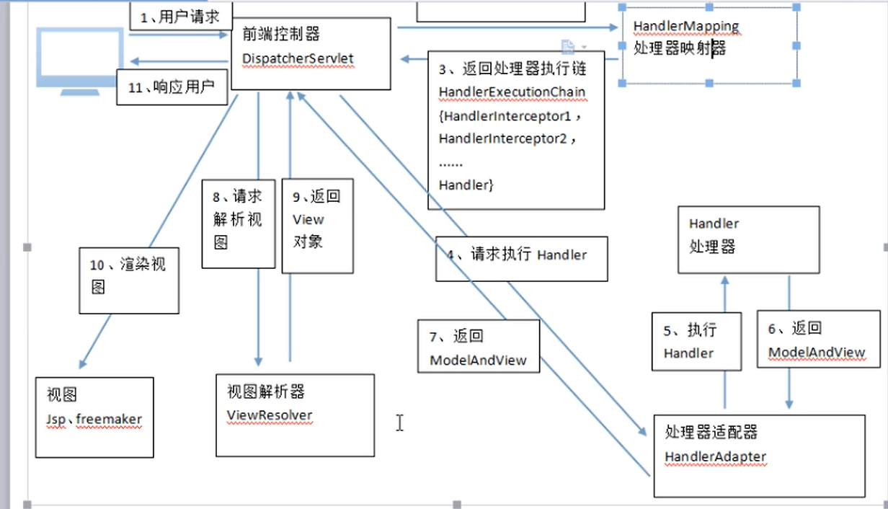

### SpringMVC学习

<hr>


#### 1、SpringMVC处理流程

```java
@Controller
public class ItemController {
    
    //.action可以省略
    @RequestMapping("/itemList.action")
    public ModelAndView itemList () {
        //查询商品列表
        List<Item> itemList = new ArrayList<>();
        itemList.add(new Item(1,"huawei1",10000,new Date(),"pc"));
        itemList.add(new Item(2,"huawei2",12000,new Date(),"pc"));
        itemList.add(new Item(3,"huawei3",14000,new Date(),"pc"));
        //创建模型视图对象
        ModelAndView model = new ModelAndView();
        //将对象放入容器
        model.addObject("itemList",itemList);
        model.setViewName("/WEB_INF/jsp/itemList.jsp");
        return model;
    }
}
//pojo: plain ordinary java object 简单java对象
@Setter
@Getter
@ToString
@NoArgsConstructor
@AllArgsConstructor
class Item {
    private int id;
    private String name;
    private Double price;
    private Date createTime;
    private String detail;
}
```

web.xml配置

```xml
<servlet>
    <servlet-name>testSpringMVC</servlet-name>
    <servlet-class>org.springframework.web.servlet.DispatcherServlet</servlet-class>
    <!--指定配置文件路径，默认为/WEB-INF/${servlet-name}-servlet.xml-->
    <init-param>
    	<param-name>contextConfigLocaion</param-name>
        <param-value>classpath:springmvc.xml</param-value>
    </init-param>
</servlet>

<servlet-mapping>
	<servlet-name>testSpringMVC</servlet-name>
    <url-pattern>*.action</url-pattern>
</servlet-mapping>
```


SpringMVC流程图：



文字描述：

> 1、浏览器发送request.action的请求
>
> 2、Tomcat拦截`*.action`的请求，并交给MVC框架的`DispatcherServlet`分发器
>
> 3、`HandlerMapping`映射器根据解析出请求名，并扫描所有项目下的类（如果指定扫描包可以提升映射性能），找到匹配的带`Controller`注解下的方法，并
>
> 4、返回处理器执行链（`HandleExecutionChain`）给`DispatcherServlet`前端控制器。`HandleExecutionChain`由`Handler`处理器和`HandleInterceptor`处理拦截器两部分组成。
>
> 5、将拿到的`HandleExecutionChain`找到对应的`HandlerAdapter`适配器，返回`ModelAndView`对象给`DispatcherServlet`
>
> 6、根据`ModelView`找到`ViewResolver`解析视图，返回view对象
>
> 7、为什么这些类都没配置，直接就可以使用？
>
> 答：因为Spring的jar包中有默认的`DispatcherServlet.properties`配置文件。
>
> 8、view视图：springmvc框架提供了jstlView、freemarkerView、pdfView等视图类型，最常用的视图就是jsp。
>
> 9、SpringMVC三大件：处理映射器（HandlerMapping）、处理适配器（HandlerAdapter）、视图解析器（ViewResolver）

手动配置：

```xml
<mvc:annotation-driven/>
<!--配置视图解析器-->
<bean class="org.springframework.web.servlet.view.InternalResourceViewResolver">
	<property name="prefix" value="/WEB-INF/jsp/" />
    <property name="suffix" value=".jsp" />
</bean>
```

java代码：

```java
model.setViewName("itemList");
return model;
```


#### 2、SpringMVC整合MyBatis

所需jar包：

+ spring
+ springmvc
+ mybatis


整合思路：

DAO层------SqlMapConfig.xml