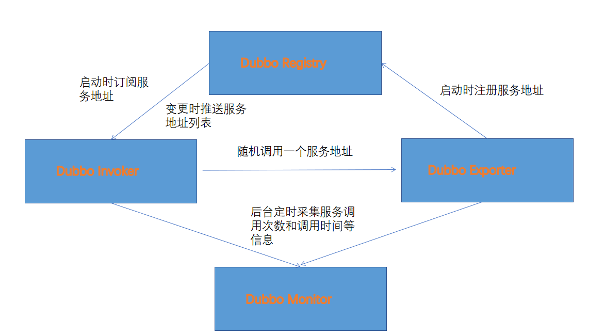

### 品优购项目

<hr>


#### 1、功能分布

（1）品牌列表（后端）：dubbox

（2）品牌列表分页

+ 列表分页：angularJS
+ 新增品牌：pageHelper
+ 修改品牌：前端分页组件
+ 删除品牌

（3）项目改造（前端MVC）

+ 项目改造-前端MVC：angularJS的service
+ 项目改造-继承：angularJS的继承
+ 代码生成器：select2下拉列表组件
+ 规格管理
+ 模板管理

（4）商家相关

+ 商家入驻申请：Spring Security
+ 商家审核
+ 商家登录
+ 运营商后台登录

（5）商品录入1

+ KindEditor
+ SPU SKU
+ FastDFS
+ angularJS上传

（6）商品录入2

（7）商品修改和审核

（8）首页、广告管理

+ Spring Data Redis（操作redis的框架，封装了jetty）

（9）商品详细页

+ Freemarker网也静态化解决方案

（10）商品详情页异步生成

+ ActiveMQ

（11）用户注册和短信发送

+ 阿里大于
+ Spring Boot

（12）用户登录

+ 开源单点登录系统CAS

（13）购物车

+ Cookies、Redis京东购物车解决方案

（14）提交订单

（15）订单支付：调用微信扫码支付接口

（16）商品搜索：SpringDataSolr

（17）集群搭建

+ Zookeeper集群
+ SolrCloud集群
+ redis集群

（18）负载均衡

+ Nginx实现负载均衡
+ Mysql分片

（19）容器技术

+ Docker


#### 2、分布式框架Dubbox

##### 2.1 电商行业分析

电商行业最有钱，但是电商的技术要求也高。

+ 天猫双11，一分钟几十亿的交易额


##### 2.2 电商技术特点

+ 技术新
+ 技术范围广
  + OA系统，企业内部使用，使用人数少，并发少，技术要求较低
+ 分布式
  + 分布式：将一个项目功能拆分为多个模块，分担服务器压力
+ 高并发
+ 集群
  + 解决高并发方案
+ 负载均衡
  + 解决高并发方案
+ 高可用
  + 高并发情况下可使用
+ 海量数据
  + 用户多，数据量大
  + 数据库分片
+ 业务复杂
+ 系统安全


##### 2.3 主要电商模式

2.3.1 B2B

企业对企业（business to business），企业卖东西（原材料，数据，服务等）给企业。聚合数据。


2.3.2 C2C

个人对个人（customer to customer），消费者个人之间的电子商务行为。淘宝属于C2C模式。

2.3.3 B2C

企业对个人（business to customer），最常见的模式。唯品会就属于这种模式。


2.3.4 C2B

个人把需求提供给企业，企业根据业务需求进行生产和开发。定制的一种模式。


2.3.5 O2O

线上到线下（online to offline），将线下的商务机会与互联网结合。美团、饿了么、快递。


2.3.6 F2C

F2C（factory to customer），从厂商到客户的商务模式。没有中间商赚差价。


2.3.7 B2B2C

第一个B是商品或服务的供应商（商家），第二个B是从事电子商务的企业（提供电商平台），C指消费者。天猫、京东。


##### 2.4 B2B2C商城项目简介

结构：网站前台、运营商后台、商家管理后台。


###### 2.4.1 系统架构

SOA架构：service-oriented architecture面向服务的架构样示。


网站前台

+ 品优购门户、商品搜索、商品详情页、用户中心、单点登录、购物车、订单系统、支付系统、秒杀频道

管理后台

+ 商家管理系统、运营商管理系统

Dubbox ====>  服务层

+ 商家商品服务、广告服务、用户中心服务、购物车服务、订单服务、支付服务、会员服务、评论服务、搜索服务、秒杀服务

数据访问层

+ MyCat数据库分片

Redis集群

+ redis集群

ActiveMQ消息中间件

+ 通用支撑系统
  + 短信发送系统：阿里大于
  + 邮件发送
  + 静态页生成系统

Solr集群

+ Solr集群


###### 2.4.2 数据库表结构

数据库表：

| 表名                    | 含义                     |
| ----------------------- | ------------------------ |
| tb_brand                | 品牌                     |
| tb_specification        | 规格                     |
| tb_specification_option | 规格选项                 |
| tb_type_template        | 类型模板：关联品牌和规格 |
| tb_item_cat             | 商品分类                 |
| tb_seller               | 商家                     |
| tb_goods                | 商品                     |
| tb_goods_desc           | 商品详情                 |
| tb_item                 | 商品明细                 |
| tb_content              | 内容（广告）             |
| tb_content_category | 内容（广告）类型 |
| tb_user | 用户 |
| tb_order | 订单 |
| tb_order_item | 订单明细 |
| tb_pay_log | 支付日志 |


###### 2.4.3 框架组合

后端采用Spring、SpringMVC、MyBatis、Dubbox，前端angularJS、Bootstrap


#### 3、Dubbox框架

##### 3.1  Dubbox简介

​		Dubbox是一个分布式服务框架，前身是阿里巴巴开源项目Dubbo，后期阿里停止了维护，当当网在Dubbo基础上进行优化并继续维护，为了区分取名为Dubbox。


##### 3.2 Dubbox流程图


###### 3.2.1 流程图



Provider：暴露服务的提供方（Exporter）

Consumer：调用远程服务的服务消费方（Invoker）

Registry：服务注册与发现的注册中心

Monitor：统计服务的调用次数和时间的监控钟信

Containner：服务运行容器


###### 3.2.2 Zookeeper

（1）dubbo推荐注册中心Zookeeper

+ 安装JDK
+ 将服务器改为
  + NAT：虚拟机共享主机网络
  + 集群主机：与主机共享的专用网络
    + 注意要将网段改为192.168.25.0，为了连FastDNF


（2）maven配置

pom.xml（Spring、dubbo、zookeeper）

```xml
<dependency>
	<groupId>com.alibaba</groupId>
    <artifactId>dubbo</artifactId>
    <version>2.8.4</version>
    
    <groupId>org.apache.zookeeper</groupId>
    <artifactId>zookeeper</artifactId>
    <version>3.4.6</version>
    
    <groupId>com.github.sgroschupf</groupId>
    <artifactId>zkcilent</artifactId>
    <version>3.11.0.GA</version>
</dependency>
```


Tomcat插件

```xml
<plugin>
	<groupId>org.apache.tomcat.maven</groupId>
    <artifactId>tomcat8-maven-plugin</artifactId>
    <configuration>
        <!--指定端口-->
        <port>8081</port>
        <!--请求路径-->
        <path>/</path>
    </configuration>
</plugin>
```


spring-config.xml

```xml
<!--当前应用名称，一般与工程名一致，注册中心识别名称-->
<dubbo:application name="dubboxdemo-service"/>
<!--注册中心地址，虚拟机地址-->
<dubbo:registry address="zookeeper://192.168.25.135:2181" />
<!--用dubbo的包扫描-->
<dubbo:annotation package="com.itheima.demo.service.impl">
```

注意服务的service注解使用阿里巴巴的service注解


（3）dubbo服务管理中心

可以查看注册的服务，就是一个服务的管理程序

+ 在cmd命令行，从源代码中编译出来

```mysql
# 打包跳过测试阶段，在dubbo-admin目录下进行打包
# 注意不能测试，会进行环境测试，无法通过
mvn package -Dmaven.skip.test=true
```

+ 将war包和Tomcat服务容器传到我们的远程Linux服务器

SecureSRT上传命令：

```mysql
put d:/setup/dubbo-admin.war
put d:/setup/apache-tomcat-8.0.5.tar.gz
```

服务器命令：

+ 将Tomcat包解压，然后将dubbo的war包移动到Tomcat下的webapps文件下

+ 启动Tomcat的bin下的`start.sh`，启动Tomcat

登录管理中心：

此时启动web程序，`url + :8080/dubbo-admin`，输入用户名`root`，密码`root`就能登录服务管理页面，看到我们注册的服务，并可以进行管理


###### 3.3.3 工程结构

