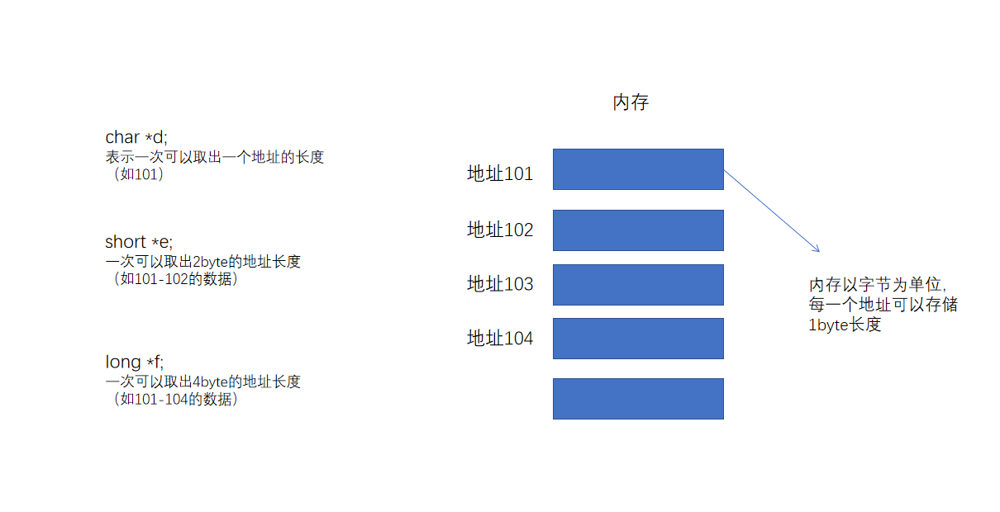

### 如何运行一个程序？

<hr>

#### 1、CPU内部结构解析

##### 1.1 C语言运行流程示例

（1）程序员用高级开发语言编写的程序

（2）程序编译后转换成机器语言

（3）程序运行时，在内存中生成可执行文件的副本

（4）CPU解释并执行程序的内容


CPU的内部由寄存器、控制器、运算器和时钟组成

> 1、寄存器：暂存指令、数据等处理对象，可以看作内存的一种
>
> 2、控制器：负责将内存上的指令、数据读到寄存器
>
> 3、运算器：负责运算从内存中读入寄存器的数据
>
> 4、时钟：负责发出CPU开始计时的时钟信号


内存：通常指计算机的主存储器（main memory），通过控制芯片等与CPU相连，主要负责存储指令和数据。


##### 1.2 CPU是寄存器的集合体

1.2.1 概念：程序是把寄存器作为对象进行描述的。（机器语言级别的程序是通过寄存器来处理的）


1.2.2 汇编语言：采用注记符（`memonic`）编写程序，如`mov`（`move`）和`add`（`addtion`），执行数据的存储和相加操作。汇编语言和机器语言是一一对应的。


1.2.3 不同类型的CPU，内部寄存器的数量、种类以及寄存器存储的数值范围都是不同的。

寄存器主要种类和功能

| 种类 | 功能 |
| ---- | ---- |
| 累加寄存器（accumulator register） | 存储执行运算的数据，和运算后的数据 |
| 标志寄存器（flag register） | 存储运算处理后的CPU状态 |
| 程序计数器（program counter） | 存储下一条指令所在的地址 |
| 基址寄存器（base register） | 存储数据内存的起始地址 |
| 变址寄存器（index register） | 存储基址寄存器的相对地址 |
| 通用寄存器（general purpose register） | 存储任意数据 |
| 指令寄存器（instructor register） | 存储指令，CPU内部使用（程序员无法对该寄存器进行独写操作） |
| 栈寄存器（stack register） | 存储栈区域的起始地址 |


##### 1.3 决定程序流程的程序计数器

程序启动时内存内容模型：

> 1、启动程序时，操作系统会将存储在硬盘上的文件内容加载（复制）到内存
>
> 2、程序都加载到内存后，会将程序计数器初始化为0100（程序运行开始位置），每执行一个或多个指令，累加相应的数值
>
> 3、程序控制器在每执行完一条指令后，根据程序计数器的值继续读取内存中的指令并执行
>
> 4、程序计数器决定了程序的执行流程


##### 1.4 CPU处理

机器语言指令的主要类型和功能

| 类型            | 功能                                                         |
| --------------- | ------------------------------------------------------------ |
| 数据转送指令    | 寄存器和内存，内存和内存，寄存器和外围设备之间的数据读写操作 |
| 运算指令        | 用累加器执行算术运算，逻辑运算，比较运算，和移位运算         |
| 跳转指令        | 实现条件分支、循环、强制跳转                                 |
| call/return指令 | 函数的调用/返回调用前的地址                                  |


####  2、计算机运行小数运算

##### 2.1  将0.1累加100次得不到10

JavaScript演示：

```js
var i = 0.1;
for(var j = 0; j < 100;j++)i+=i;
console.log(i);
//结果：1.2676506002282295e+29
```


##### 2.2 二进制数表示小数

> 1.二进制表示小数11.1875 ----> 1101.0011
>
> 2^3+2^1+2^0+2^-3+2^-4 = 1101.0011
>
> 2.因为0.1怎么也无法用二进制表示

二进制数转化成10进制数出错原因：

<font color="blue">有一些10进制小数无法转化成二进制数</font>


##### 2.2 浮点数

浮点数由符号、尾数、基数和指数四部分组成。

> （1）浮点数表示：
>
> (符号位) m * n ^ e （n为基数2）,m表示尾数部分结果，n为2，e为指数部分值减去EXCESS中间值
>
> double：1位 符号位，11位指数部分，52位尾数部分
>
> float：1位 符号位，8位指数部分，23位尾数部分
>
> （2）float
>
> 符号位：与整型表示一致，1表示负，0表示正（1bit）
>
> 尾数部分：将小数点前面的值固定为1的正则表达式（23bit）
>
> + 11.1875  ---->  二进制： 1011.0011
>
> + 右移使指数部分的第一位变为1：确保小数点以后的长度是23位（1.0110011 0000 0000 0000补16个0）
> + 省略第一位：0110011 0000 0000 0000
>
> 指数部分：EXECESS系统表现（8bit）
>
> + 将指数部分中间值设为0，当指数部分是11111111（255）的时候，中间值255/2=127（01111111）表示0，这样负数就不需要符号表示，可以表示范围更大
> + 上例为例，11111111实际值是255-127=128，8位情况下表示范围是-127~128
>
> 0.75的浮点数表示：0-01111110-1 0000 0000 0000 0000 0000 0
>
> 符号位：+，指数部分-1（126-127=-1），尾数部分：1.1...(22个0)，值为1.5
>
> 最后的值：+ 1.5 * 2^-1 = 0.75


##### 2.3 如何避免计算机出错

计算机出错的原因，采用浮点数处理小数（位溢出也有造成计算错误的情况）

如何回避错误：

（1）微小误差采用近似值不会造成问题

（2）小数转换成整数来计算（不超过可处理的数值范围）

> 财务计算不允许出现错误情况下：
>
> （方式一）0.1累加100次，将0.1变为1（不超过整型范围情况下计算）
>
> 0.1 ---> 1累加100次的结果除以10
>
> ```java
> public static void main (String[] args){
>     int sum = 0;
>     int x = 1;
>     for(int i = 0; i < 100; i++){
>         sum += i;
>     }
>     float res = (float)sum / 10;
>     System.out.prinln(res);
> }
> ```
>
> （方式二）BCD（binary coded decimal二进制化10进制数），就是4位表示十进制0-9中的数字
>
> 11.1875  -->   1011.0011   --> BCD：1 0001.0001 1000 0111 0101


#### 3、内存介绍

##### 3.1 指针

指针也是一种变量，它表示的不是数据的值，而是存储着数据的内存的地址，通过指针可以对任意指定地址的数据进行读写。

Windows计算机上的程序通常是32位的内存地址（4byte）

```c
char *d;
short *e;
long *f;
//d,e,f都是用来存储32位的地址的变量
```

**指针的数据类型**表示一次可以读写内存中数据的长度


##### 3.2 指针示意图



#### 4、内存和磁盘

##### 4.1 思考

（1）存储程序方式指的是什么？

答：在存储装置中保存程序，并逐一运行的方式。

（2）使用内存来提高磁盘访问速度的机制称为什么？

答：Disk Cache磁盘缓存。

（3）把磁盘一部分作为假想内存来使用机制是什么？

答：虚拟内存（virtual memory）。

（4）在EXE程序文件中，静态加载函数的方式称为什么？

答：静态链接。

（5）在windows中，存储着动态加载调用的函数和数据的文件称为什么？

答：DLL文件。


计算机5大部件：存储器、运算器、控制器、输入装置和输出装置。


##### 4.2 内存和磁盘

内存和磁盘的相同点：

从存储程序命令和数据，内存和磁盘的功能是相同的，内存和磁盘都被归为存储部件。

内存和磁盘的不同点：

内存是利用电流来实现存储的内存，磁盘是利用磁效应的内存。内存高速高价，磁盘低速廉价。


启动程序流程

>1.将存储程序的硬盘文件加载到内存
>
>2.CPU初始化程序计数器，并从内存中加载指令进行执行


磁盘缓存加快磁盘访问速度机制（很少了）

（1）某程序访问数据时，刚开始从磁盘中读取数据

（2）与此同时，内存也读取磁盘数据

（3）程序再访问数据的时候，从内存中获取数据


##### 4.3 节约内存的编程方法

以GUI（graphic user interface）用户图形化界面的windows为例

应用操作卡顿主要还是内存不足导致的问题，解决内存不足的问题主要有两种方式：

（1）增加内存容量

（2）尽量将运行的应用文件变小


将运行的应用文件变小的两种方式：

（1）通过DLL文件实现函数共有

DLL（dynamic link library）文件，是指在程序运行时可以动态加载Library的文件（函数和数据的集合），多个应用可以共有同一个DLL文件，通过共有DLL文件可以打到节约内存的效果。DLL文件在运行时可以被多个应用共有。

（2）通过调用`_stdcall`（标准调用）来减小程序文件的大小

C语言默认的调用不是标准调用，因为C语言函数传入的参数个数是可变的，标准调用要求参数个数是固定的，便于清理栈。放在DLL文件的函数参数是固定的，就可以使用标准调用。

如果一个函数多次调用，每次清理都是不同的，就造成了内存的标记浪费，标准调用的清除处理是一样的，所以可以提升性能。


#### 5、程序运行环境

##### 5.1 运行环境和本地代码

（1）运行环境 = 操作系统 + 硬件

CPU只能解释其自身固有的机器语言，不同的CPU能解释的机器语言的种类也是不同的。例如CPU有x86、MIPS、SPARC、PowerPC等，他们各自的机器语言完全不同。


（2）本地代码：机器语言的程序称为本地代码。

程序员用C语言编写的程序，在编写的阶段仅仅是文本文件。文本文件在任何环境下都能显示和编辑，我们称之为**源代码**。通过对源代码的编译，就可以得到**本地代码**。


CPU负责解析并运行从源代码编译而来的本地代码


##### 5.2 操作系统相关

（1）windows克服了CPU以外的硬件差异

windows的应用软件中，键盘输入、显示器输出并不是直接向硬件发送指令的，而是通过向windows发送指令间接完成的，因此程序员就不用关心，内存和I/O地址的不同。MS-DOS应用大多都是不经过操作系统而直接控制硬件的，而windows应用都是由windows来完成对硬件的控制。


（2）不同的操作系统的API不同

`API`：application programming interface应用程序接口。CPU类型的不同，使用的机器语言是不同的，操作系统的不同，应用程序向操作系统传递的指令也是不同的。


（5）FreeBSD Port轻松使用源代码

FreeBSD 存在一种Ports的机制，该机制能够结合当前运行的硬件环境来编译应用的源代码，进而得到可以运行的本地代码系统。如果目标应用的源代码没有在硬件上的话，Ports就会自动使用FTP连接到相关站点来下载代码。


（3）BIOS和引导

`BIOS`：Basic Input/Output  System 标准输入输出系统。

BIOS存储在ROM中，是预先内置在计算机主机内部的程序。BIOS除了键盘、磁盘、显卡外，还有**引导程序**，引导程序存储在启动驱动器起始区域的小程序，操作系统的启动驱动器一般是硬盘，有时也可以是CD-ROM或软盘。

开机后，BIOS会确认硬件是否正常运行，没有问题的话就会启动引导程序。**引导程序的功能**是把在硬盘上记录的OS（操作系统）加载到内存中运行，然后操作系统启动后，各个基于操作系统开发的程序，可以基于操作系统进行启动。


Bootstrap：拔鞋带，BIOS中的引导程序就是拔携带的功能，可以启动操作系统。


#### 6、程序加载时会生成栈和堆

##### 6.1 堆和栈

栈：用来存储函数内部临时变量，以及函数调用时所有参数的内存区域。

堆：用来存储程序运行时的任意数据及对象的内存领域。


EXE文件内容分为再配置信息、变量组和函数组。当程序加载到内存后，还会额外产生两个组，就是栈和堆。

EXE文件并不存在堆和栈，但是加载到内存开始运行时会得到分配


**内存中的程序**：由用于变量的内存空间、函数的内存空间、栈的内存空间、堆的内存空间。


C和C++中：栈中对数据进行存储和舍弃的代码，由编译器自动生成，使用栈的数据的内存空间，会在函数被调用时都会得到申请和分配，函数处理完毕后，自动释放。堆的内存空间，需要程序员编写的程序，来明确申请分配和释放。


##### 6.2 不同语言堆内存申请释放区别

编程语言不同，堆内存空间的申请分配和释放时不一样的：

+ C中通过`malloc()`函数进行申请分配，`free()`函数来释放
+ C++中通过`new`来申请空间，`delete`运算符来释放
+ java中通过`new`来申请内存空间，由`GC`释放空间


内存泄漏：如果程序中没有明确释放堆内存空间，这个空间会一致残留，造成内存泄漏。（C和C++头疼的bug）


##### 6.3 有难度的问题

（1）编译器和解释器区别？

答：编译器是在运行前对所有源代码进行解释处理的。解释器则是在运行时，对源代码内容一行一行的进行解释处理的。

（2）分割编译指的是什么？

答：将整个程序分为多个源代码来编写，然后分别进行编译，最后链接成一个EXE文件，这样每个源代码相对变短，容易管理维护。

（3）不链接导入库就无法调用DLL文件中的函数吗？

答：通过`LoadLibrary()`和`GetProcAddress()`这些API也可以在程序运行时导入库，调用库中函数，但是没有导入库简单。


