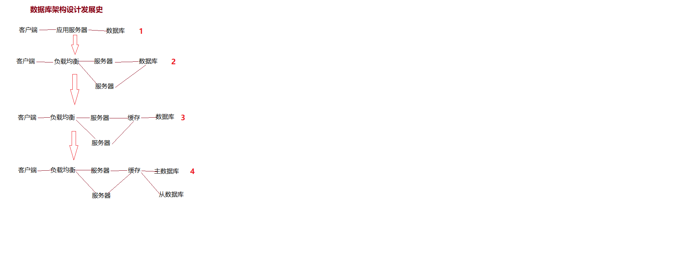
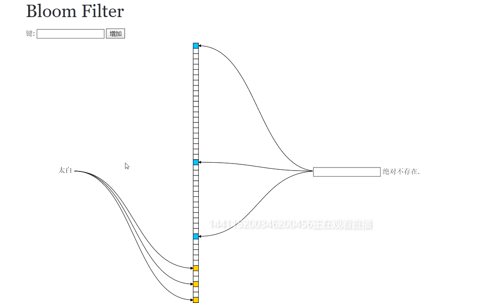

## Redis


### 1、Redis介绍

#### 1.1 背景

##### 1.1.1 数据库架构设计的核心问题

核心问题：传统数据库的扩展性差（需要复杂的技术是想），大数据IO压力大，表结构更改困难


##### 1.1.2 数据库架构设计的发展

+ 单库（随着访问量增加出现性能问题）
+ 缓存（通过缓存，缓解数据库的压力，优化数据结构和索引）
+ 读写分离（数据写入的压力增加，主从复制和读写分离方案被提出）
+ 分库分表（主库的写压力过高，开始使用InnoDB引擎以及分库分表技术）





分库分表

+ 垂直拆分：为了各个业务模块互不影响，我们把应用层进行垂直拆分，不同模块都单独作为一个应用系统，分别进行读写分离的数据库服务器。
+ 水平拆分：MyCat作为数据库中间件，可以帮我们解决多个数据库不好管理的问题。只需要统一对外提供一个地址，而MyCat则帮这些项目联系所有后端的MySQL数据库。


##### 1.1.3 非关系型数据库

Nosql = Non-Relational Sql

+ 特点：去掉关系数据库的关系型特性，数据之间无关系，易于扩展。
+ 大数据、高性能：具有非常高的读写性能，尤其在大数据量下，得益于它数据库的结构简单
+ 灵活的数据类型：无需事先为要存储的数据建立字段，随时可以存储自定义的数据格式
+ 高可用：在不影响性能的情况下，可以方便实现高可用的框架

MySQL使用query cache，每次表更新cache就会失效，是一种大粒度的cache，性能不高

NoSql的cache是记录级的，细粒度的cache，性能高很多


##### 1.1.4 主从复制和读写分离

<font color="blue">主从复制：是一种数据备份的方案。</font>

简单来说，是使用两个或两个以上相同的数据库，将一个数据库当做**主数据库**，而另一个数据库当做**从数据库。**在**主数据库**中进行相应操作时，**从数据库**记录下所有主数据库的操作，使其二者一模一样。


<font color="blue">读写分离：是一种让数据库更稳定的的使用数据库的方法。</font>

是在有**从数据库**的情况下使用，当**主数据库**进行对数据的增删改也就是写操作时，将查询的任务交给**从数据库**，数据库同时进行读写操作对数据库压力太大。


redis

```java
public R selectOrderById (int id){
    
}
```


### 缓存3大问题

#### （1）缓存穿透问题

多次查询无效数据，缓存中没有，数据库中也没有，浪费性能


解决方案：

+ 缓存空对象，缺点是大量空数据会占用缓存，而且过期时间到了，最后数据库压力还是很大，治标不治本
+ 布隆过滤器


手写分布式布隆过滤器

引入guava依赖

```java
public class MyBloomFilter {
    //位数组，只能保存0和1
    private static size = 10000;
    private static BloomFilter filter = BloomFilter.create(Funnels.integerFunnel,size,0.001);
    
    public static void main (String[] args){
        for(int i = 0; i < size; i++){
            filter.put(i);
        }
        List list = new ArrayList<>(10000);
        //肯定不存在
        for(int i = size + 1; i < size + 10000; i++){
            if(filter.mightContains(i)){
                list.add(i);
            }
        }
        //出现误判次数
        System.out.println(list.size());
    }
}
```

原理图：



每添加一个数据，就有3个格子改为1

对key进行哈希，通过3个函数哈希一定会有3个1，如果哈希得到的不是3个1，就肯定不存在

但是有可能不同的数据3个正好改为1的数据相同，判断是可能存在，优势是占用内存小

容错率与函数的个数和数组长度


为何不用谷歌的布隆过滤器

谷歌位数组长度：21亿 JVM内存

Redis：42亿 Resis内存（底层保存方式就是位数组）


setbit都是直接更改位数组的位，超过扩容补0

布隆过滤器优点：

解决内存穿透，即使有些哈希碰撞了，还是能过滤大部分请求，误判率是可以接受的

缺点：难以维护，不能删除数据，其它数据也可能指向该位，所以不能删除，删除很多要重建布隆过滤器


Redis位图

点赞功能使用Redis，不能保存数据


#### （2）缓存击穿

缓存中没有数据，数据库中存在数据，高并发情况下，或者这个数据失效时同时并发访问了


解决

+ 分布式锁，查询缓存后查询数据库，再次查询数据库


#### （3）雪崩

添加100万条数据，90万同时失效，或者服务器宕机

解决：

+ 搭建高可用集群redis cluster
+ 过期时间错开
+ 熔断


（4）缓存

