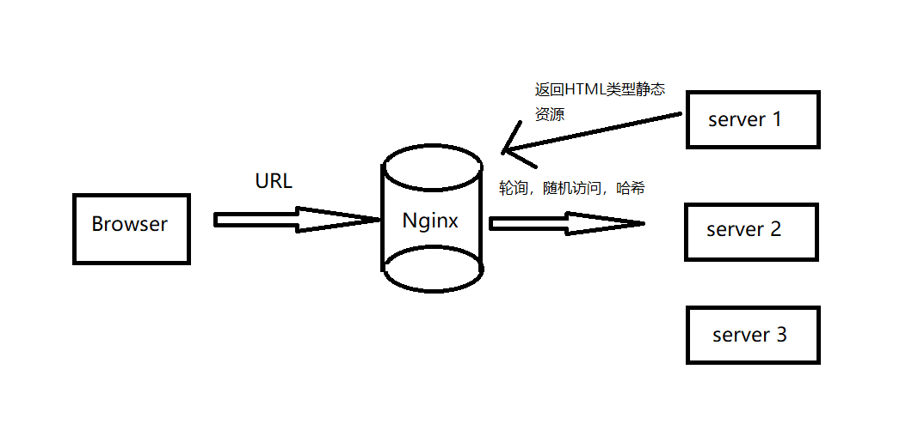

### **SpringBoot**

<hr>


#### 1、SpringBoot介绍

##### 1.1 java web的发展史

###### 1.1.1 web的产生，B/S兴起

静态资源的发布媒介，原理图：




###### 1.1.12 CGI

CGI是一种协议，标准，把参数写进环境变量，启动CGI的程序获取参数后返回动态的结果，一个请求，就需要启动一个CGI程序，耗费资源。

腾讯用C++写服务端，php写前端页面，用CGI方式实现很多业务


###### 1.1.3 java的解决方案

+ applet：本质是浏览器插件，把服务端传过来的java代码在插件中解释执行（客户端执行代码），但是代码不能太多，不能业务太复杂，因为服务端有内存消耗限制
+ servlet：server + applet，服务端解决方法，html标签放到servlet类中，去输出

```java
out.prinln("<html><title>");
out.prinln("hello world</title>");
out.prinln("</html>");
```

+ jsp：java server page，解决样板代码的问题，但是要求开发人员对前端和后端都会
+ MVC分层思想
  - model：java bean 数据层
  - view：JSP展示层
  - controller：业务控制类，控制层，接受请求，调用业务层获取数据，然后返回数据给浏览器

+ 2005，谷歌推出ajax技术，部分渲染页面


###### 1.1.14 Spring

解决EJB的束缚，spring框架使用IOC、AOP解决

IOC、DI本质：构建对象的技术

AOP：面向切面编程，系统有多个模块，模块A和模块B都需要日志打印，异常获取，事务管理等，各个模块关注交叉点，非核心业务逻辑，通用处理方式来解决，解决代码冗余问题，存在问题是配置越来越繁杂，项目依赖越来越多，越来越难管理


###### 1.1.5 SpringBoot

2014年发布1.0版本，2017年重大更新，2018年革命性更新，2019发布稳定版2.1.18

引导更好的使用SpringBoot，主要针对Spring配置越来越繁杂的问题


###### 1.1.6 Spring Cloud

简化分布式系统的开发，帮助解决配置管理，服务注册，服务追踪等

与Spring Boot配合，能更轻松的开发出基于云服务的应用程序


###### 1.1.7 微服务

微服务是一种分布式系统架构，是一种思想和设计原则

通过SpringBoot创建服务，Spring Cloud是关注全局的服务治理框架


###### 1.1.8 未来

netty通过异步解决IO阻塞，异步化趋势，Spring5，响应式编程


##### 1.2 SpringBoot简介

###### 1.2.1 特性

创建标准、独立的Spring应用

内嵌Tomcat/jetty/Undertown容器，无需部署jar包

提供starter依赖，简化构造配置

尽可能自动化spring配置和第三方库

提供生产环境的特性，如指标、健康检查和外化配置

不需要代码生成和xml配置


###### 1.2.2 优势

编码更加简单（遵循约定优于配置原则，使用默认配置）

测试更加简单（内置7种测试框架JUnit、SpringBoot Test、JsonPath、AssertJ等）

部署更加简单（内嵌容器，集成jenkins，支持容器化）

监控更加简单（Actuator监控应用健康情况，SpringBoot Admin集群监控工具）


#### 2、SpringBoot

环境搭建：maven3.2  jdk1.8 SpringBoot2.1.8 Git


##### 2.1 maven基础

```mysql
# 1 maven的常用标签介绍
<scope></scope>用于管理依赖的部署，用来控制依赖在那些classpath下可以使用，哪一个依赖包含在哪一个应用里。

scope的5个值
* compile适用于所有阶段，随着项目一起分布
* provided，只有在当JDK或者一个容器已提供该依赖之后使用
* runtime，只在运行时使用，如jdbc驱动，使用运行和测试阶段
* test，只在测试时使用，用于编译和运行测试代码，不随项目发布
* system，类似provided，需要显示提供包含的jar，maven不在仓库中查找它，不推荐使用

# 2 maven的依赖关系
maven的依赖关系是有传递性的。如A依赖B，B依赖C，但是A是可以不依赖B的，因此需要在项目A中排除对C的依赖。
maven对依赖进行管理，分别是可选依赖和依赖排除

2.1 <optional>true</optional>可选依赖
编译项目A依赖项目B，项目X依赖项目A，此时X需要项目B的功能，那么就需要在pom.xml中重新配置对项目B的依赖

2.2 排除依赖
<exclusions>
	<exclusion></exclusion>
</exclusions>
当一个项目A依赖项目B，项目B同时依赖项目C，A不需要C，可以排除依赖C

# 3 导入lombok插件

```


##### 2.1 SpringBoot简单demo

###### 2.1.1 Lombok的注解使用

> （1）**@Getter**、**@Sette**r生成get和set方法
>
> （2）**@Data** 生成**getter**和**setter**，无参构造，**toString**，**hashcode**等方法
>
> （3）**@Builder**可以进行Builder方式初始化
>
> （4）**@Slf4j** 等同于`private final logger = LoggerFactoty.getLogger(xxx.class);`

**Tip：**

Alt + 7：查看类的内部结构


###### 2.1.2 Lombok原理

（1）java的编译原理

javac命令：编译器

编译：将一种语言规范转化成另一种语言规范的的过程

javac：将人能理解的java语言，转化成JVM可以解释执行的二进制字节


javac的编译步骤：

+ 词法分析：分析关键字，规范化的token流
+ 语法分析：把检查出来的关键字（一个个代码块）查看是否符合语言规范
+ 语义分析：把检查出来的关键字查看是否符合语言的规范，分析结果-->注解的抽象语法树
+ 字节码生成：遍历语法树，生成符合JVM规范的二进制代码

Lombok：主要是通过抽象语法树，编译处理后，匹配到有其他注解的类，那么注解编译器就会自动匹配项目中的注解对应到lombok语法树中的注解文件，并经过自动编译匹配来生成对应类的getter和setter方法


#### 3、SpringBoot  demo流程

##### 3.1 起步

###### 3.1.1 pom.xml

```xml
<?xml version="1.0" encoding="UTF-8"?>

<project xmlns="http://maven.apache.org/POM/4.0.0" xmlns:xsi="http://www.w3.org/2001/XMLSchema-instance"
  xsi:schemaLocation="http://maven.apache.org/POM/4.0.0 http://maven.apache.org/xsd/maven-4.0.0.xsd">
  <modelVersion>4.0.0</modelVersion>

  <groupId>org.example</groupId>
  <artifactId>MyFirstBoot</artifactId>
  <version>1.0-SNAPSHOT</version>
  <packaging>war</packaging>

  <name>MyFirstBoot Maven Webapp</name>
  <!-- FIXME change it to the project's website -->
  <url>http://www.example.com</url>

  <!--继承默认SpringBoot配置-->
  <parent>
    <groupId>org.springframework.boot</groupId>
    <artifactId>spring-boot-starter-parent</artifactId>
    <version>2.2.3.RELEASE</version>
  </parent>


  <!-- SpringBoot的web启动器 -->
  <dependencies>
    <dependency>
    <groupId>org.springframework.boot</groupId>
    <artifactId>spring-boot-starter-web</artifactId>
    <version>2.2.3.RELEASE</version>
  </dependency></project>

```


###### 3.1.2 根包下配置入口类

比如com.feihong下有多个包，主类与子包同级

```java
package com.feihong;
@SpringBootApplication
public class MyBootEntrance {
    public static void main(String[] args) {
        SpringApplication.run(MyBootEntrance.class,args);
    }
}
```


###### 3.1.3 配置controller

```java
@Controller
public class TestController {

    @RequestMapping("/hello")
    @ResponseBody
    public String test () {
        return "hello word";
    }
}
```


###### 3.1.4 添加热部署

pom.xml

```xml
<!--开发工具，打到热部署效果-->
    <dependency>
      <groupId>org.springframework.boot</groupId>
      <artifactId>spring-boot-devtools</artifactId>
      <version>2.2.3.RELEASE</version>
    </dependency>
```


+ 勾选settings/../Compiler中的Build Proect automatically选项

+ ctrtl + shift + alt + /   选择registry的面板

+ 勾选compiler.automake.allow.when.app.running


###### 3.1.5 打包可执行jar

pom.xml

```xml
  <build>
      <plugins>
        <plugin>
          <groupId>org.springframework.boot</groupId>
          <artifactId>spring-boot-maven-plugin</artifactId>
        </plugin>
      </plugins>
  </build>
```


启动服务器的3种方式

（1）执行根包下配置主类（带有SpringBootApplication注解的主类）的main方法

（2）安装热部署插件后，双击maven/plugins/spring-boot:run

（3）打包项目后，到jar包所在目录，使用`java -jar xxx.jar`方式启动jar包


##### 3.2  自定义

###### 3.2.1 自定义banner

将banner.txt放在resources文件夹下，springboot会默认找到banner并打印

生成banner的网站：patorjk.com/software/taag


###### 3.2.2 自定义配置

（1）更改端口

+ resources下创建application.properties（默认配置文件名称）

```properties
server.port=8090
```

+ 外部配置使用

使用`java -jar xxx.jar --server.port=8090 `

相当于IDEA设置Program arguments

`-spring.config,location=D:/xxx.properties`

+ 使用JVM参数

`-Dspring.config,location=D:/xxx.properties`

相当于IDEA设置VM options


（2）返回json形式的controller

@RestController的作用

```java
//返回json形式的字符串，Controller+ResponseBody的组合
//还可以返回一个类
@RestController
public class JsonController {
    @RequestMapping("/json")
    public String json () {
        return "hello";
    }
    
    //会以json的形式返回这个类
    @RequestMapping("/food")
    public Food getFood () {
        return new Food("青椒肉丝");
    }
}

@Data
class Food{
    private String name;
}
```


（3）获取配置文件的值

application.properties

```properties
prop1=湘菜馆
prop2=100
# 配置文件也可以使用SPEL表达式
prop3=${prop1}${random.int}
```

Java代码

```java
@RestController
public RestController {
    //会自动获取配置文件中的值并进行注入
    @Value("${prop1}");
    private String name;
   
    //属性中出现中文会出现乱码
    @Value("${prop2}")
    private int corpId;
}
```

properties的编码是ASCII码，我们文件的编码都是UTF-8

解决：settings/file encoding，file-encoding都勾选UTF-8，.properties文件勾选transparent-native-to-ascii （用来默认将utf-8与ascii码转换）


（4）将类设置为配置文件类

+ pom.xml

```xml
 <!-- 允许类称为配置类，属性可以通过spel表达式获取 -->
    <dependency>
      <groupId>org.springframework.boot</groupId>
      <artifactId>spring-boot-configuration-processor</artifactId>
      <version>2.2.2.RELEASE</version>
    </dependency>
```

+ 主入口类

```java
@SpringBootApplication
//允许配置配置类
@EnableConfigurationProperties
//扫描配置类所在的包
@ConfigurationPropertiesScan(basePackages = {"com.feihong.config"})
public class MyBootEntrance {
    public static void main(String[] args) {
        SpringApplication.run(MyBootEntrance.class,args);
    }
}
```

+ application.properties

```properties
env.name=FeihongBootFirstEdition
env.id=101
```

- 配置类

```java
//前缀表示第几级目录
@ConfigurationProperties(prefix = "env")
@Data
public class EnvConfig {
    private String name;
    private int id;
}
```

+ 使用

```java
@Controller
public class Test {
    @Autowired
    private EnvConfig env;
    
    public static void main (String[] args){
        System.out.println(env.getName());
        System.out.println(env.getId());
    }
}
```

+ 注解作用

> **@Configuration**声明这是一个配置类，在Spring中可以替代xml文件
>
> **@ConfigurationProperties(prefix="XXX")**声明这是配置文件类，并声明前缀
>
> **@PropertySource**声明文件对应地址

+ application.properties

> 优先级：
>
> first ---项目根目录下config目录下application.properties
>
> second--项目根目录下application.properties
>
> third--项目第一个模块下resources下config下application.properties
>
> fourth--项目第一个模块下resources下application.properties
>
> 其它---按照模块创建顺序。。。。

引入外部配置文件：（**优先级最高**）

（1）Edit Configuration/Program arguments添加参数

`--spring.config.location=D:/xxx.properties`

（2）JVM添加参数

`-Dspring.config.location=D:/xxx.properties`


###### 3.2.3 配置敏感字段加密

加盐：加密方式是变化的，相同密码加不一样的盐，得到的加密结果不一样（可以有效防止用户密码过于简单且相同）

引入依赖：

```xml
<!--  加密插件 -->
<dependency>
   <groupId>com.github.ulisesbocchio</groupId>
   <artifactId>jasypt-spring-boot-starter</artifactId>
   <version>3.0.1</version>
</dependency>
```

使用：

```java
public class Test {
    public static void main (String[] args){
        BasicTextEncryptor encryptor = new BasicTextEncryptor();
        //加盐
        encryptor.setPassword("feihong@#$");
        String username = "chenxiang";
        String password = "fh920829";
        //加密用户名和密码
        String encyptUsername = encryptor.encrypt(username);
        String encryptPassword = encryptor.encrypt(password);
        //解密
        String decyptUsername = encryptor.decrypt(encyptUsername);
        String decryptPassword = encryptor.decrypt(encryptPassword);
    }
}
```


##### 3.3 yml文件

官方推荐配置文件格式

Linux = Linux is not Unix

yml = yaml ain't markup language


###### 3.3.1 语法规则

+ 大小写敏感
+ 使用缩进表示层级关系
+ 缩进不允许tab键，只允许使用空格
+ 缩进数目不重要，只要相同层级元素左对齐即可
+ #表示注释，这一行都会被解析器忽略


###### 3.3.2 yaml支持的数据结构

+ 对象：键值对的集合，又称为映射/哈希/字典
+ 数组：一组按次序排列的值，又称为序列/列表
+ 纯量：单个的，不可再分的值


**properties文件优先级高于yml文件**


###### 3.3.3 流式语法

```yaml
# 对象
food: {meat: beef,vegetable: potato}

food: 
	# 数组
	sauce:
		- curry
		- honey
		
# 多个文档

spring:
	profiles:
		active: prod

---
spring:
	profiles: dev
server:
	port: 8090
	
---
spring:
	profiles: prod
server:
	port: 8092
```


##### 3.4 web开发


###### 3.4.1 模板引擎发展

+ jsp：html+java，繁杂而不利于维护
+ **freemarker**：使用较多
+ velocity：性能比freemarker好，维护很慢，后期boot不支持，不用掌握
+ **thymeleaf**：SpringBoot官方推荐
+ beetl（国人开创）


###### 3.4.2 基于前后端分离

web服务器：解析静态资源，如nginx、apache

应用服务器：解析动态+静态资源，如Tomcat和jetty

nginx（前端代码） --- ajax请求api --- tomcat ，返回json数据格式


模板引擎：将显示和数据分离，本质是将模板文件和数据通过模板引擎生成最终的html文件

原理：普通字符 + 模板标识符


###### 3.4.3 整合freemarker

yml文件配置

```yaml
server:
 port: 8081
#1 
spring:
 mvc:
  view:
   # 视图层位置
   prefix:/templates
   # 文件后缀
   suffix:/.ftl
#2 1不好使使用这个配置freemarker   
spring:
  freemarker:
    template-loader-path: classpath:/templates
    cache: false
    charset: UTF-8
    check-template-location: true
    content-type: text/html
    suffix: .ftl
```

@RestController：返回json数据

@Controller：返回视图


传数据：

```java
@Controller
public class FTLController {
    @RequestMapping("/index")
    public String index (Model model) {
        model.addAttribute("now",new Date());
        return "index";
    }
}    
```

index.ftl文件放在templates文件夹下


###### 3.4.4 整合thymeleaf

thyme leaf：麝香叶

+ 能够直接在浏览器中正确展示页面，方便前后端联调
+ 模板语法不会破坏文档的结构，只会在运行期替换掉静态值
+ 自然模板，直接将自己的属性值替代掉标签的属性值


pom.xml

```xml
<dependency>
   <groupId>org.springframework.boot</groupId>
   <artifactId>spring-boot-starter-thymeleaf</artifactId>
   <version>2.2.4.RELEASE</version>
</dependency>

<!-- thymeleaf的布局依赖 -->
<dependency>
   <groupId>nz.net.ultraq.thymeleaf</groupId>
   <artifactId>thymeleaf-layout-dialect</artifactId>
   <version>2.4.1</version>
</dependency>
```


thymeleaf语法

> 简单表达式：
>
> + 变量表达式：${...}
> + 选择变量表达式：*{}
> + 链接URL表达式：@{}
> + 消息表达式：#{...}
> + 片段表达式：{...}


##### 3.5 Restful风格API

传统API与Restful风格API

> 1、传统API
>
> 请求资源：/guest/list 获取集合
>
> 跳转：/guest/toAddPage
>
> 添加：/guest/add?guest={param}
>
> 编辑：/guest/update?guest={param}
>
> 删除：/guest/delete?name={param}
>
> 2、Restful API
>
> 举例：
>
> GET /zoos：列出所有动物园
>
> POST /zoos：新建一个动物园
>
> GET /zoos/{ID}：获取某个指定动物园的信息
>
> PUT /zoos/{ID}：更新某个指定动物园的信息（提供该动物园的全部信息）
>
> PATCH /zoos/{ID}：更新某个指定动物园的信息（提供该动物园的部分信息）
>
> DELETE /zoos/{ID}：删除某个动物园
>
> GET /zoos/{ID}/animals：列出某个指定动物园的所有动物
>
> DELETE /zoos/ID/animals/{ID}：删除某个指定动物园的指定动物

对比

|        | 传统API   | RESTful API  |
| :----: | :-----: | :--: |
|跳转   |/guest/toAdd| /guest/toAdd   `GET` |
| 增     | /guest/add?guest={guest} | /guest                  `POST` |
| 删     | /guest/delete?name={name} | /guest/{name}   `DELETE` |
| 改     | /guest/update?guest={guest}   | /guest         `PUT` |
| 查     | /guest/list    | /guest                  `GET` |

GET：查	POST：增    PUT：改   DELETE：删


注意改和删除的操作（form表单没有put和delete请求）：

```html
<!--改，覆盖form的method方法-->
<input type="hidden" name="_method" value="put"/>
```


 删除操作

引入webjars：https://www.webjars.org/   下载maven形式的包含js的jar包，可以定制

使用：

```html
<script th:src="@{/webjars/jquery/3.4.1/jquery.js}"></script>
    

<button th:attr="del_url=${/guest/}+${guest.name}" name="del_button">删除</button>

<form method="post" id='del_form'>
	<input type="hidden" name="_method" value="delete"/>
</form>

<script>
	$(function(){
        $("button[name='del_button']").click(function(){
         //点击按钮获取按钮中的url设置到form的action中，然后发送
            $("#del_form").prop("action",$(this).attr("del_url")).submit();
        })
    });
</script>
```


##### 3.6 ORM框架

传统企业：主要是to B业务，用户量不大，使用不用写sql的Hibernate，发展到顶端就是Spring Data Jpa，根据方法名生成对应的sql

互联网企业：用户量较大，使用可以灵活调试sql的mybatis，发展到目前最先进的模式就是mybatis-springboot-starter


###### 3.6.1 Jpa整合

初始化引入Spring Data Jpa，单表查询省去了sql操作，提供方法进行CURD操作


pom.xml

```xml
<dependency>
	<groupId>org.springframework.boot</groupId>
    <artifactId>spring-boot-starter-data-jpa</artifactId>
</dependency>

<dependency>
	<groupId>mysql</groupId>
    <artifactId>mysql-connector-java</artifactId>
</dependency>
```


yml配置：

```yml
server:
 port:8080
 
spring:
 datasource:
  url: jdbc:mysql:///test
  username: root
  password: root
  # 可以不配置，springboot会自动添加
  driver-class-name: com.mysql.jdbc.Driver
  
  jpa:
   hibernate:
    # 自动创建|更新|验证数据库表结构
    ddl-auto: update
   
   # 设置数据库引擎为InnoDB
   database-platform: org.hibernate.dialect.MySQL5InnoDBDialect
   # 开启sql日志
   show-sql: true 
```


仓库与实体

```java
//仓库泛型：需要映射的实体，主键类型
public class GuestRepository extends JpaRepository<Guest,Long> {
    
}

@Entity
@Data @AllArgsConstructor
class Guest implements Serializable {
    
    @Id
    private Long id;
    @Column
    private String name;
    @Column
    private String role;
}

@Service
class GuestServiceImpl implements GuestService {
    @Autowired
    private GuestRepositoty repository;
    
    @Override
    public List<Guest> getGuest () {
        return repository.findAll();
    }
}

```


###### 3.6.2 MyBatis整合

Mybatis对复杂查询比较好，有运行速度又是，但是数据库移植性不好。

（1）依赖

```xml
<dependency>
	<groupId>org.springframework.boot</groupId>
    <artifactId>mybatis-spring-boot-starter</artifactId>
    <version>2.1.0</version>
</dependency>

<dependency>
	<groupId>mysql</groupId>
    <artifactId>mysql-connector-java</artifactId>
    <scope>runtime</scope>
</dependency>
```


（2）配置文件yml

```yaml
# 设置xml文件位置
mybatis:
 config-location: classpath: mybatis-config.xml
```


（3）配置mybatis-config.xml和mapper.xml

（4）dao

```java
@Repository
public class GuestDao {
    private List<Guest> list(){
        return null;
    }
}
```


去xml配置操作的yaml配置

```yaml
# 设置xml文件位置
mybatis:
 mapper-locations: classpath*:/mybatis/mapper/*.xml
 type-aliases-package: com.feihong.domain
```


