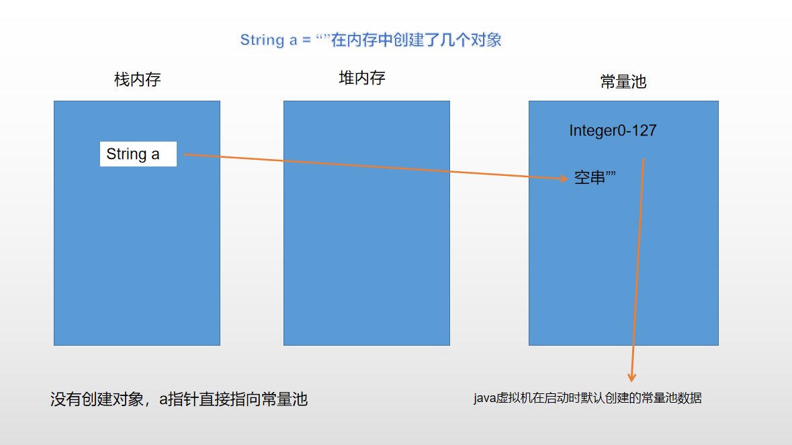
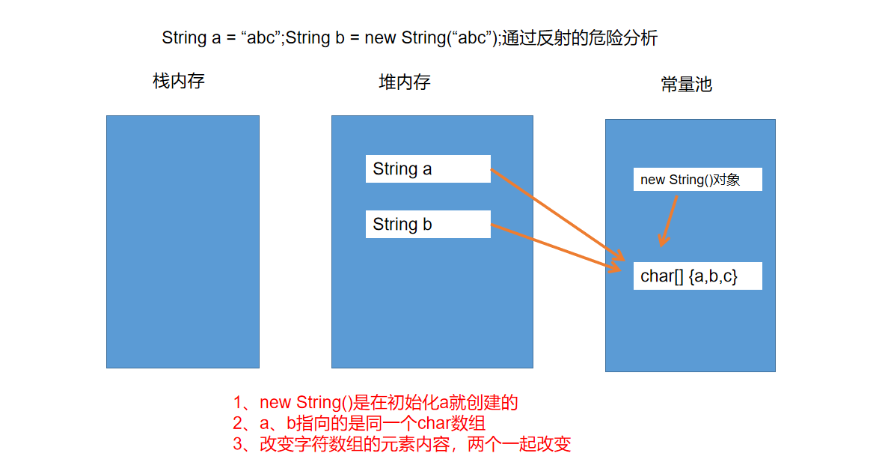
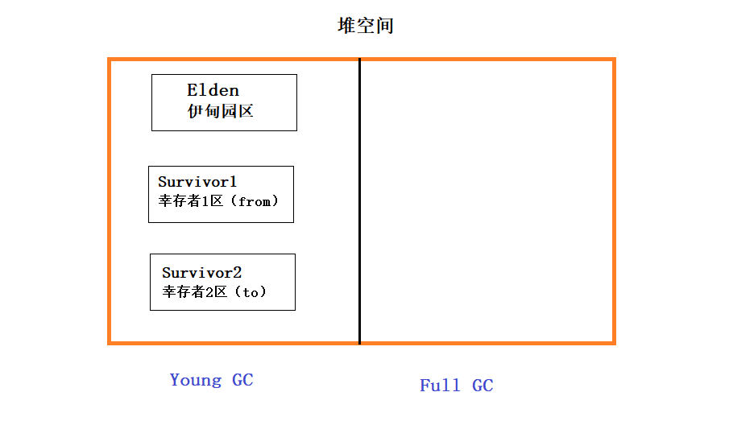

### Java拓展

<hr>


#### 1、classLoader

程序的起点：

（1）jvm就是一个运行在操作系统上的程序（java.exe）

A.java --> A.class --> 机器指令

`javac *.java`路径下的Java文件都会编译（这样编译带包名的Java文件也不会报错）


包文件下的Java不允许单独编译：

+ 现象：Java文件导入了包名（`import com.duyi;`），下面有多个Java源文件，此时使用javac编译某一个Java文件会报错
+ 一个包下有很多Java源文件，只单独编译A.java文件会报错，**所有带包文件路径的不允许单独编译。**


（2）如何把一个类加载到内存中？(Hello类)

首先JVM会将Java源文件编译成能操作内存的class源文件，然后由ClassLoader进行class文件的加载，然后操作内存执行我们的程序


（3）双亲委派模型

JRE在执行Java程序的时候，JVM会分配一个扩展路径，我们可以把扩展jar，放到扩展路径里，JVM就会自动加载


ClassLoader为空的时候都是由Bootstrap ClassLoader加载的

A.java文件是我们自己写的，系统会用App ClassLoader加载


三个classLoader：

- Class.forName("Hello");加载之后进行初始化
- ClassLoader.getSystemClassLoader().loadClass("Hello");加载之后不进行初始化
- Bootstrap Class Loader：加载器之王，Java自带的类都是由这个loader加载的。(JRE在执行Java程序得时候，JVM会分配一个扩展路径，用来加载系统自带类得，比如java.lang包)
- Extension Class Loader：扩展加载器（jre/lib/ext）（`javax`开头一般都是这个Loader加载的，和`ext`文件夹下的jar都是）
- App Class Loader也叫SystemClassLoader，我们写得程序都是这个加载器加载的


面试题

（1）我们写的类会怎么加载？

答：由AppClassLoader

（2）是直接加载的吗？

答：不是，因为双亲委派模型

（3）为什么要双亲委派？ 60

答：保证加载的类不能重复，防止漏掉，更加安全。（所有的类最后都会挂载到各个ClassLoader上）

（4）有几种方式可以将类加载到内存？

答：两种方式，Class.forName()和classLoader

（5）如何使用，有啥区别？ 70

答：ClassLoader加载之后，不进行初始化，Class.forName()加载之后，进行初始化。（是否加载静态属性，静态方法，静态块，执行静态块）

（6）ClassLoader能进行初始化吗？Class.forName()能不进行初始化吗？85

答：ClassLoader默认不进行初始化，可以通过反射调用传参true，让其初始化，Class.forName()默认的方法，进行初始化。

（7）如何加载非当前路径下的内容？（SpringMVC框架，Tomcat，有什么区别）90

答：当前路径可以加载.java文件，不同路径下需要加载.class文件

（8）我们用Class.forName()一般只加载一个类，为什么它能将引用的类也能被加载？100

答：我们加载的类，如果引用了其他的类，那么系统会自动调用当前类的Class Loader去加载其它类


两种加载方式

```java
//Java自带的
public class Test {
    static {
        System.out.println("haha");
    }
    public static void main (String[] args){
       Class.forName("Test");//会执行静态块，默认初始化
       //不初始化传参让其不可初始化
       Class.forName("Test",false,ClassLoader.getSystemClassLoader());
        
       //不会执行静态快，默认不初始化
       //ClassLoader.getSystemClassLoader()获取的是AppClassLoader
       ClassLoader.getSystemClassLoader().loadClass("Test");
       //不会输出“haha”
    }
}
```


加载非当前路径下文件

```java
public class Demo {
    public static void main (String[] args){
        File file = new File("C:/Users/desktop/A.java");
        URL url = file.toURL();
        URL[] urls = new URL[]{url};
        //不在项目里的文件必须是编译后的class文件才能进行加载
        //java文件是没法加载的
        //预加载，只读文件，什么也不干
        
        ClassLoader classLoader = new URLClassLoader(urls);
        
        //方式一
        Class clazz = classLoader.loadClass("com.duyi.Main");
        classLoader.loadClass();	
        
        //方式二
        Class.forName("com.duyi.Main",true,classLoader);
        
    }
}
```


#### 2、注解


```java
@Target(ElementTYPE.METHOD)
//运行时保存注解信息
@Retention(RetentionPolicy.RUNTIME)
public @interface SQL {
    String sql();
}

@Target(ElementTYPE.PARAMETER)
//运行时保存注解信息
@Retention(RetentionPolicy.RUNTIME)
public @interface SQL {
    int id;
}
```

动态代理

```java
public class DaoProxy {
    //dao类对象的助理
    //设计一个方法，获取代理对象
    public Object getClassInstance (Class clazz) {
        //提供一个代理对象newProxyInstance() 
        Proxy.newProxyInstance(clazz.getClassLoader(),new Class[]{clazz},new MethodProxy());
    }
    
    private class MethodProxy implements InvocationHandler {
        public Object invoke (Object proxy,Method method,Object[] args){
            return null;
        }
    }
}
```


#### 3、泛型

##### 3.1类泛型

##### 3.2方法泛型

```java
public class Animal {
    
}
class Dog extends Animal {
    
}
class Cat extends Animal {
    
}
//类泛型
//限制必须继承了Animal的类型才能
//上边界通配符
class Zoo<T extends Animal> {
    List<T> list;
    public void add
}

class Test {
    public static void main (String[] args){
        Zoo zoo = new Zoo<Dog>();
        //下边界，传没问题，但是取得时候只能用Object取
        List<? super Dog> list = new List<>();
        list.add(new Dog());
        Object obj = list.get(0);
    }
}
```


#### 4、线程安全

（1）线程不安全示例

```java
public class TestThread {
    private static int money = 0;
    public static void main (String[] args){
        Thread threadOne = new Thread(new Runnable(){
            public void run () {
                for(int i = 0; i < 1000; i++){
                    money++;
                }
            }
        });
        Thread threadTwo = new Thread(new Runnable(){
            public void run () {
                for(int i = 0; i < 1000; i++){
                    money--;
                }
            }
        });
        //按道理我们设想的结果是0，然而结果可能是正，也可能为负
        threadOne.start();
        threadTwo.start();
    }
}
```

为何出现线程不安全的分析：

（1）线程一：取出钱数money=10，放到寄存器，执行money++，将结果放到某个寄存器里，将结果赋值给money

（2）线程二：取出钱数，放到寄存器，执行money++，将结果放到某个寄存器里，将结果赋值给money

（3）将结果赋值给money

（4）将结果赋值给money

（5）赋值结果为11，因为两个寄存器里存放的都是11

（6）这就是线程不安全的原因


解决线程安全问题：

`synchronized`：加悲观锁，可以给方法、代码块加锁，加上`synchronized`锁`this`表示当前对象这个run方法不执行完，其它方法不能执行，锁`class`对象表示某个类里，它优先执行。

（1）悲观锁解决方法：

```java
public class TestThread {
    private static int money = 0;
    public static void main (String[] args){
        Thread threadOne = new Thread(new Runnable(){
            public void run () {
                for(int i = 0; i < 1000; i++){
                    //因为int就不是线程安全的，所以锁这个类
                    //TestThread这个类里我执行完才能执行其它方法
                    //性能差：所有使用这个变量的线程都要禁止使用这个变量
                    synchronized(Test.class){
                        money++;
                    }
                }
            }
        });
    }
}
```

（2）悲观锁可以解决问题，但是性能不好，所以引入乐观锁，乐观锁解决方法：

```java
public class Test {
    private static int num = 0;
    public static void main (String[] args){
        Lock lock = new ReentrantLock();
        Thread threadOne = new Thread(new Runnable(){
            public void run () {
                for(int i = 0; i < 1000; i++){
                   lock.lock();
                   num++;
                   lock.unlock();
                }
            }
        });
        //原理：当某一个线程lock方法执行时，会将原子变量设置为true，其它lock都是死循环（自旋），只有当前线程的的代码可以继续执行
        Thread threadTwo = new Thread(new Runnable(){
            public void run () {
                for(int i = 0; i < 1000; i++){
                    lock.lock();
                    money--;
                    lock.unlock();
                }
            }
        });
    }
}
//tryLock方法，尝试锁，如果传参，参数为时间和时间单位，表示过多久时间在尝试再锁
//Java语言本身无法实现原子锁（CAS），是操作系统配合硬件实现的，Java的原子锁是因为调用了操作系统的接口
```

（3）原子变量解决方法

```java
public class Test {
    private static AtomicInteger num = 0;
    public static void main (String[] args){
        Lock lock = new ReentrantLock();
        Thread threadOne = new Thread(new Runnable(){
            public void run () {
                for(int i = 0; i < 1000; i++){
                    //自增方法
                   num.addAndGet();
                }
            }
        });
        //当lock方法执行时，其它lock都是死循环（自旋）
        Thread threadTwo = new Thread(new Runnable(){
            public void run () {
                for(int i = 0; i < 1000; i++){
                    //自减方法
                    num.decrementAndGet();
                }
            }
        });
    }
}
```

`synchronized`和`ReentrantLock`底层都是乐观锁（CAS锁），Java语言本身无法实现原子锁，原子锁是硬件支持的，因为Java语言只能调用操作系统的接口，windows提供接口不支持原子锁（提供的是CAS锁），Linux提供接口支持。

（4）使用`volatile`关键字使内存透明解决

CPU一致性协议

```java
public class Test {
    //volatile关键字使得这个内存透明，线程之间使透明的，获取的时候就能保证一致性
    private static volatile int money = 0;
    public static void main (String[] args){
        Thread thread1 = new Thread(new Runnable(){
            public void run () {
                for(int i = 0; i < 100000; i++){
                    money--;
                }
            }
        });
        Thread thread2 = new Thread(new Runnable(){
            public void run () {
                for(int i = 0; i < 100000; i++){
                    money++;
                }
            }
        });
        thread1.start();
        thread2.start();
        System.out.println(money);//0
    }
}
```


CPU缓存一致性协议

`volatile`禁止CPU指令重排序

`volatile`的第一条语义是保证线程间变量的可见性，简单地说就是当线程A对变量X进行了修改后，在线程A后面执行的其他线程能看到变量X的变动，更详细地说是要符合以下两个规则：

- 线程对变量进行修改之后，要立刻回写到主内存。
- 线程对变量读取的时候，要从主内存中读，而不是缓存。

**<font color="red">Java创建对象过程：</font>**

（1）指令重排序

（2）划分空间

（3）创建引用

（4）初始化对象


标准单例写法：

```java
//懒汉式加载
public class Singleton {
    //防止指令重排序，可能出现空指针异常
    //线程一执行了分配空间操作，但是还没有初始化
    //线程二获得时间片，就没有初始化的实例返回了，造成空指针异常
    private static volatile Singleton instance;
    
    private Singleton (){}
    
    public static Singleton getInstance (){
        if(instance == null){
            synchronized(Singleton.class){
                if(instance == null){
                    instance = new Singleton();
                }
            }
        }
        return instance;
    }
}
```


#### 5、TCP协议

TCP协议：可靠传输协议，在网络底层，是用户无法看到的

UDP协议：非可靠传输协议


TCP报文格式

> 1、16位源端口号（from）					16位目的端口号（to）
>
> 端口号用两个字节表示
>
> 2、32位序列号，32位确认号
>
> 3、4位首部长度，保留6位状态位（URG，ACK，PSH，RST，SYN，FIN），16位窗口大小
>
> URG紧急指针，需要用的时候为1
>
> ACK确认指针，1表示收到，0表示没收到
>
> PSH表示报文是否可用，为1时表示可用
>
> RST表示重联，1表示刚刚断线，请求重连
>
> SYN同步位，网络连接刚刚建立设置为1
>
> FIN完成位，为1的时候，表示将要断开
>
> 4、16位窗口大小（数据大小根据对方电脑内存来定的，保证效率）
>
> 5、16位TCP校验位（校验和就是数据算出一个和如果缺损和是大概率不等的，数据缺损要求重发）
>
> 6、16位紧急指针
>
> 7、选项字段，可以自定义，可以发时间，数据总大小
>
> 8、时间大小，EOP结束字段
>
> 9、数据字段，发送的数据内容
>
> 10、3次握手，4次挥手
>
> **3次握手**
>
> 确认两个机器都能发送信息并且能够接收信息
>
> A、B对象
>
> 第一次握手，A发信息给B，证明A能发送信息
>
> 第二次握手，B给A发送消息，证明B既能收消息也能发消息
>
> 第三次握手，A给B发送消息（说明A能接收到），建立连接
>
> **4次挥手**
>
> 确认数据正常发送完毕
>
> 第一次挥手，A发信息给B，发送信息完毕
>
> 第二次挥手，B给A发送消息，知道发送完毕
>
> 第三次挥手，B给A发送消息，接收完毕
>
> 第四次挥手，A发信息给B，知道B接收完了，可以断开连接了


XShell测试

> 1、telnet www.baidu.com 80
>
> 发送信息：`GET / HTTP/1.1 `
>
> 2、五层网络模型
>
> 应用层（HTTP、HTTPS）
>
> 运输层（TCP、UDP）
>
> 网络层
>
> 数据链路层
>
> 物理层


#### 6、String类详解

String类高级用法和常见面试题

```java
public class Test {
    public static void main (String[] args){
        //1.创建对象的4种方式
        //new一个对象
        //利用反射创建一个对象
        //clone
        //反序列化
        
        //创建String的方式
        String a = "";
        String b = new String("");
        String c = String.class.newInstance();//反射
        //clone方式
        //反序列化方式
        
        //String在调用hashcode之后会发生什么
        
        //会创建出来几个对象（2个）
        String a = "abc";
        String b = new String("abc");
        
        //会创建出来几个对象（3个）
        String a = "abc";
        String b = new String("xyz");//xyz会创建在常量区
        
        //会创建出来几个对象(默认java编译器3个)
        //优化后的编译器只会创建2个对象
        //默认编译器会创建abc和xyz两个对象，以及拼接后的abcxyz对象
        //优化后的编译器，会在编译阶段将abcxyz变为一个，然后赋值给a创建一个
        String a = "abc" + "xyz";
        
        //以下代码创建几个对象（0个）
        //空串和Integer的0-127是一样的道理，都是在Java虚拟机启动的时候默认生成的
        //常量池缓存太多也会被回收
        String a = "";
        
        //以下代码创建几个对象（4个）
        //hashCode值不相同，就必定不是一个对象，值相同不一定是同一个对象
        //常量池abc对象，xyz对象，新产生的abcxyz对象，新的堆中指向abcxyz对象
        String b = new String("abc");
        //证明hash值初始为0
        Field field = String.class.getDeclaredField("hash");
        field.setAccessible(true);
        System.out.println(field.get(b));//0
        System.out.println(b.hashCode();//执行hashCode方法就会给hash赋值
        System.out.println(field.get(b));//96354
        b += "xyz";
        
		//String对象不要随便用反射，非常危险！！！
        String a = "abc";
        String b = new String("abc");
        Field field = String.class.getDeclaredField("value");
		field.setAccessible(true);
		char[] chars = (char[])field.get(a);
        chars[1] = "x";
		System.out.println(a);//axc
		System.out.println(b);//axc
        System.out.println(b.hashCode());//97036
		System.out.println(a.hashCode());//97036 
		
        //数组索引，内存地址偏移量
		int[] arr = {1,2,4,3};
		arr[2];//2表示内存地址偏移量，arr保存数组地址
    }
}
```


`String a = "";`创建几个对象的分析图：




通过反射改变相同串的危险原理图：

<font color="red">相同的String会指向常量池同一个字符数组！！！所以反射改串很危险，避免使用！</font>




#### 7、多线程与线程回调

面试题：

（1）创建线程有几种方式？

答：一种，只有`new Thread()`这一种方式。

（2）什么情况下用多线程？

答：创建线程需要消耗资源，切换线程也需要消耗资源，需要了解创建线程消耗的资源，如果多，串行快，如果少，并行快。

（3）继承Thread和实现Runnable接口构造创建线程有什么区别？

答：Java是单继承，继承比较宝贵，这样我们的类就不能继承其它类了，实现是可以多实现的，还可以继承其他类，更灵活，所以推荐使用实现接口方式创建线程。

（4）为什么多线程可以更快？

多核一定能同时运行多个线程，但是单核也可能同时运行多个线程

和CPU核数没有关系

答：可以获得更多的CPU计算时间，所以会更快一些

（5）多个线程单独计算一个和的情况下，要将多个线程的和在求和，怎么实现？

答：使用`FutureTask`配合`Callable`接口

（6）为什么实现了Callable接口就能拿到返回值？

答：本质是FutureTask实现了Runnable接口，重写了Run方法，并将线程执行完的值保存在类的属性里，并根据这个值是否为空判断线程是否执行完，执行完后，就返回。


```java
public class Main {
    public static void main (String[] args){
        //1、创建线程只有一种方式
        new Thread();
        
        MyThread my_thread = new MyThread();
        new Thread(my_thread).start();
        
        //get方法会阻塞其它线程，因为它要等拿到结果
        MyCall call1 = new MyCall(10);
        FutureTask<Long> future1 = new FutureTask<>(call1);
        Thread thread1 = new Thread(future1);
        thread1.start();
        long a = future1.get();
        
        MyCall call2 = new MyCall(10);
        
        //FutureTask实现了RunnableFuture接口，RunnableFuture实现了Runnable接口
        FutureTask<Long> future2 = new FutureTask<>(call2);
        Thread thread1 = new Thread(future2);
        thread1.start();
        long b = future2.get();
        
        MyCall call3 = new MyCall(10);
        FutureTask<Long> future3 = new FutureTask<>(call3);
        Thread thread1 = new Thread(future3);
        thread1.start();
        long c = future3.get();
        
        //最后一起拿结果就能提高性能
        
    }
}

class MyThread implements Runnable {
    private long target;
    public MyThread (int target){
        this.target = target;
    }
    public void run (){
        for(int i = 0; i < target; i++){
           target += i;
        }
        return target;
    }
}

//用callable才能拿到线程执行的返回结果
class MyCall implements Callable<Long>{
    private long target;
    public MyThread (long target){
        this.target = target;
    }
    
    public Long call throws Exception (){
        for(int i = 0; i < target; i++){
           target += i;
        }
        return target;
    }
}

//仿写一个FutureTask的代码
class MyFutureTask<T> implements Runnable {
    private Callable callable;
    private long outcome = null;
    
    public MyFutureTask (Callable<T> callable){
        this.callable = callable;
    }
    
    @Override
    public void run () {
        try{
            outcome = callable.call();
        }catch(Exception e){
            e.printStackTrace();
        }
    }
    
    public T get() {
        while(true){
            if(outcome != null){
                return (T)outcome;
            }
            try{
                //防止线程过于繁忙，消耗太多
            	Thread.sleep(10);
        	}catch(Exception e){
           	 	e.printStackTrace();
        	}
        }
    }
}
```


#### 8、接口和泛型

##### 8.1 泛型

（1）接口能不能继承接口？

答：能。

（2）接口能不能实现接口？

答：不能（因为实现是需要实例化的）。

（3）抽象类能不能实现接口？

答：能（抽象类可以不实例化方法）。

（4）接口中能否定义属性？

答：可以定义属性，但是必须初始化，接口中定义的属性默认是`public static final`修饰的。


```java
public interface A extends B {}

interface interface B {}
```


##### 8.2 接口

```java
//限制这个起码得是个动物类型的，不然传数字什么的还是动物园嘛
//上边界
public class Zoo <T extends Animal> {
    List<T> list;
    
    public Zoo (){
        this.list = new ArrayList();
    }
    
    public void add (T animal){
        list.add(animal);
    }
    
    public static void main (String[] args){
        //狗主题动物园
        Zoo<Dog> zoo = new Zoo<>();
        //不指定具体类型，至少传参得是animal
        Zoo zoo1 = new Zoo();
        zoo1.add(new Animal());
    }
}

class Animal {
	
}

class Dog extends Animal{
    
}
```


#### 9、cookie和session

（1）判断用户是否登录方式

早期都用session，后来才开始使用cookie

+ session
  - 反向代理，将用户IP通过反向代理哈希，确定访问唯一服务器（存在问题是服务器宕机很正常，用户体验不好）
  - 专门使用一台服务器作为session服务器，至今仍然很多公司使用，但是session服务比较消耗内存，比较昂贵，只有有钱的公司使用（问题：session服务器不好做集群，不容易扛太大的登录量）
  - 优点：安全，不容易被篡改
  - 缺点：服务器端一直存着session，用户量大的时候，session不易存储
+ cookie
  - 判断是否含有id字段，查询数据库，如果没有，跳转登录页面
  - 字段不合法，跳转登录页面，用户输入用户名和密码，执行登陆操作
  - 优点：cookie存放在客户端（浏览器端），不占用服务器资源
  - 缺点：不安全，容易被人获取，容易被人赋值。


使用session性价比低，session为了不能够不太占用访问的时间，尽量要使用缓存。如果我们不使用缓存，使用硬盘存储，降低用户体验换取性价比（硬盘读取速度慢，所有用户都受影响）。

使用Cookie安全性差，虽然cookie容易被获取，但是我们可以通过增加获取cookie的难度，提高安全性。使用黑客攻击手段的人毕竟是少数，被攻击的用户也是少数，所以综合来看，使用cookie效果更好。


获取其它用户浏览器cookie的方式：

（1）将电脑存放或借给别人，被人偷窥到Cookie。（使用加密字符串，可以让cookie变长，让人难以记忆）

（2）网吧，使用浏览器登录自己常用的网站，有人安装记录登录信息的程序，就容易被盗号。

（3）在不正规的网站下载浏览器软件，或者使用不正规的软件（可能浏览器被篡改，让用户的Cookie是透明的）

（4）XSS注入攻击

某某微博，发文章，你点击看文章时，文章中有获取cookie向第三方服务器发送用户的cookie的js代码。


防范cookie盗窃：

（1）既然js代码有风险，将js代码进行转义（后端会对发送的文章中的js代码进行转义）

（2）频繁更换cookie

（3）cookie加密

（4）设置cookie过期时间

（5）再设置一个token字段，来双重验证cookie

（6）验证IP地址位置


Cookie

> 1、每个Cookie都有对应的path，这个cookie就被种在当前域（域名+协议+端口）下
>
> 2、`setDomain(".baidu.com")`种cookie，这样`zhidao.baidu.com`和其它百度旗下满足一级域名下的网址都能获取到用户cookie
>
> 3、`setPath("/projectName/admin");`cookie种在当前的域名的`/admin`路径下


Filter拦截分为两种拦截：

（1）拦截页面（常用在管理系统）

如果没有登录，那么某些页面则不能展示

（2）拦截数据（常用在用户系统）

我们认为html中没有任何有价值的信息。所以如果用户没登陆，给用户看静态页面，但是不填充数据


抓包工具：wire shark


#### 10、HashMap

##### 10.1 HashMap基础问题

（1）问HashMap初始化桶的大小

答：32位操作系统：8；64位操作系统：16。

（2）HashMap查找效率一定比ArrayList高吗？

答：不是。

（3）在什么情况下，查找效率没有ArrayList高？

答：1、存储两个值以内（HashMap需要计算）

​		  2、存放的内容`hash`值一样且长度不超过8（因为长度超过8就会转化红黑树，转化过程性能变低）

​		  3、在高速并发写入的时候（HashMap会扩容或者将链表转化为红黑树）

（4）存储1000个数，初始化大小为多少？

答：假设都会存放在一个桶的最坏情况，那么实际大小`size *0.75=1000`，`size`大小为`1333.333..`，为了方便计算机运算我们的初始化大小应该为`2048`，一定要避免`HashMap`的扩容。

**（5）JDK1.8，单个桶后的长度达到8的时候，将这个桶的链表变为红黑树（二叉平衡排序树），会带来什么问题？**

答：在变为红黑树的时候，如果并发高，也可能产生死循环，数组扩容和转化红黑树都可能导致死循环，更加危险了。


阈值（负载因子）：0.75（默认负载因子`DEFAULT_LOAD_FACTOR`）

（1）老版本（JDK1.7之前）：`HashMap`中存放容量达到负载因子的时，扩容一倍

举例：当16个桶，有一个桶的数量超过12时进行扩容一倍（扩容就要重排，性能就特别差）

（2）新版本（JDK1.7之后版本）：存放数量达到桶长度的时候，扩容负载因子倍

举例：16个桶，存放长度超过16的时候，扩容`4/3`倍，为了减少扩容导致的空间浪费


##### 10.2 HashMap线程安全问题

问题1：`HashTable`和`HashMap`一个线程安全，一个不安全，那么我们使用`HashTable`？

答：不使用`HashTable`因为性能太差，基本没有公司使用。

问题2：`HashMap`使用要注意的问题？

答：`HashMap`并发情况下扩容的时候（两个线程都执行扩容的时候）容易出现死循环，所以使用应该根据具体业务需求进行初始化，防止扩容出现的死循环。

问题3：`HashMap`和`ConcurrentHashMap`区别？

答：线程不安全性能 > 乐观锁性能 > 悲观锁性能，`ConcurrentHashMap`底层使用了大量的悲观锁（`synchronized`），性能很差。公司常用方式就是使用乐观锁`ReentrantLock`来加锁，也可以使用`ThreadLocal`保存`map`

问题4：需要线程安全的HashMap怎么办？

答：

（1）ConcurrentHashMap（在HashMap中不安全操作地方加了synchronized悲观锁）

（2）自己封装HashMap，使用synchronized、Lock、CAS

（3）初始化容量（能解决全部问题）

（4）放在ThreadLocal中

问题5：hash值，对HashMap有什么影响？

答：有哈希值可以直接进行运算，没有哈希值，得在计算出一个哈希值


证明并发情况下同时扩容，HashMap会出现死循换

```java
//定义一个静态HashMap
private static HashMap<String, Integer> map = new HashMap<>(8);
//无实际意义的变量
private static Integer count = 0;
public static void main(String[] args) throws NoSuchMethodException {
        //证明hashMap同时扩容时会出现死循换
        //真的死循换报错了
        Class clazz = map.getClass();
        //获取resize方法
        Method m = clazz.getDeclaredMethod("resize");
        m.setAccessible(true);
    	//多次调用扩容方法，容易出现两个线程同时扩容情况
        Thread thread1 = new Thread(new Runnable() {
            @Override
            public void run() {
                for(int i = 0; i < 100; i++){
                    Object o = m.invoke(map);
                }
            }
        });
        Thread thread2 = new Thread(new Runnable() {
            @Override
            public void run() {
                for(int i = 0; i < 100; i++){
                    Object o = m.invoke(map);
                }
            }
        });
    	//开启线程
        thread1.start();
        thread2.start();
    }
```


#### 11、GET与POST的区别

- 基于前提是不适用任何规范：只考虑语法和理论上的HTTP协议，GET／POST没有任何区别，仅仅名字不一样
- 基于RFC规范：

​	理论上（Specification）：GET/POST具有相同的语法，但是又不同的语义，但是语义不同，GET用来获取数据，POST用来发送数据，其它方面没区别

​	实践上（Implementation）：各种浏览器是规范的实现者，常见的不同是web环境下才是我们常见的区别。

- web环境下GET与POST的区别：

​	1）GET的数据在URL是可见的，POST请求不显示在URL中

​	2）GET是对长度有限制的，POST长度是无限制的

​	３）GET请求的数据可以收藏为书签，POST请求的数据不能收藏为书签

​	4）GET请求后，后退，前进，刷新按钮无影响，POST数据会被重新提交

​	5）GET编码类型：application/x-www-form-url

​		POST编码类型：很多种，如encodeapplication/x-www-form-url等

​	6）GET的历史参数会被保留在浏览器里，POST不会保存在浏览器中

​	７）**GET只允许ASCII编码，POST没有编码限制，允许发二进制**

​	8）GET与POST相比，GET安全性较差，因为所发数据是URL的一部分


#### 12、JVM

##### （1）查看JVM大小

`jps` 显示所有Java程序的进程号和程序名，信息是程序的进程号，和程序名称。

`jps -l`显示Java的进程号，以及执行的路径名

`jsp -m`可以查看Java程序进程号，路径类名和传参

`jsp -v`java程序启动时，java虚拟机的参数


`java -XX:+PrintCommandLineFlags -version`查看Java的虚拟机的内存信息
-XX:InitialHeapSize=132681280 堆空间初始化值
-XX:MaxHeapSize=2122900480 堆空间最大值
-XX:+PrintCommandLineFlags
 -XX:+UseCompressedClassPointers
 -XX:+UseCompressedOops
 -XX:-UseLargePagesIndividualAllocation
 -XX:+UseParallelGC


`java -Xmx`Java堆空间最大值

`java -Xms`java堆空间初始化值

`java -Xmn`java堆空间年轻代大小

`java -Xss`Java每个线程的Stack大小（每个线程的存储空间大小）

设置这些空间：`java -Xmx512m -Xms64m -Xmn32m -Xss16m 类名`

线程的空间是从栈空间划分出去的


##### （2）垃圾回收

`jstat -gc 进程id 10s 1` 每10s查看1次该进程的GC情况

Java堆空间分为年轻代（Young GC）和老年代（Full GC）

```
S0C 幸存者1区大小
S1C 幸存者2区大小
S0U 幸存者1区使用大小
S1U 幸存者2区使用大小
EC 伊甸园区大小
EU 伊甸园区使用大小
OC 老年代大小
OU 老年代使用大小
YGC 年轻代回收次数
YGCT 年轻代回收消耗的时间
FGC  老年代回收次数
FGCT 老年代回收消耗时间
GCT  垃圾回收总耗时
```


1）为什么军事武器不使用java语言？

stop the world

年轻代：在不影响Java程序运行的时候，进行垃圾回收

老年代：停止所有运行中的程序，只进行垃圾回收，实际中一定要避免。

2）什么样的数据存入年轻代？什么样的数据存入老年代？

答：对象新创建时放在Eden区，当进行一次垃圾回收（之后清空Eden区），将不释放对象放进幸存者1区，再次进行垃圾回收时，会对Eden和幸存者一区进行回收（清空Eden和幸存者1区），不被回收的放在幸存者2区，然后清理Eden区和幸存者2区，不被释放的对象放入幸存者1区，多次回收不被释放的对象放进老年代，当老年代存满的时候，就会Stop the world。

3）划分两个幸存者区的好处？

答：删除性能好，不会产生空间碎片。（标记清除法，不断交换位置性能差）


堆空间示意图：




#### 13、贪心算法

买股票，记录每天的价格，计算最大收益的买与抛的和，比如7，1，5，3，6，4，收益1，5和3，6，结果应该是7

```java
public int maxProfit (int[] prices) {
    //记录最大盈利
    int total = 0;
    for(int i = 1; i < prices.length; i++){
        //如果当前元素比之前元素大，就记录这个盈利
        if(prices[i] - prices[i-1] > 0){
            total += prices[i] - prices[i-1];
        }
    }
    return total;
}
```


#### 14、约瑟夫环

有个将军叫约瑟夫，与罗马帝国的作战中兵败，带着副官和39名士兵躲到一个山洞，但是约瑟夫和副官准备投降，39名士兵要求殉国，然后约瑟夫就提出大家围成一个圈，数到3的人就自杀，请问约瑟夫和副官站在哪两个位置能活下来？

```java
public static int[] josephCircle (int count,int num,int lastCount){
        //标记出局人数
        int outNum = 0;
   		//标记计数到哪一个人
        int index = 0;
    	//标记每一个人的状态
        boolean[] markStatus = new boolean[count];
     	//记录要返回的最后几个数字的数组
        int[] lastArr = new int[lastCount];
    	//最后几个数的索引标志位
        int lastIndex = 0;
        while(outNum != count){
            for(int i = 0; i < count; i++){
                if(markStatus[i])continue;
                index++;
                if(index == num){
                    System.out.println((i+1)+"号出局");
                    markStatus[i] = true;
                    index = 0;
                    outNum++;
                    if(outNum >= count - lastCount + 1){
                        lastArr[lastIndex++] = i + 1;
                    }
                }
            }
        }
        return lastArr;
    }
```


#### 15、罗马数字转整数

一万小时定律：什么事情坚持10000小时，就能从平凡变成大师

罗马数字对应：

> I ： 1，II：2，III：3，IV：4，V：5，VI：6，VII：7，VIII：8，IX：9，X：10
>
> L：50，C：100，D：500，M：1000
>
> I只能放在V和X的左边，X只能放在L和C的左边，C只能放在D和M的左边
>
> ```java
> public static int romanToInt (String s){
>         //先用字典来存储
>         HashMap<String,Integer> map = new HashMap<>();
>         map.put("I",1);
>         map.put("V",5);
>         map.put("X",10);
>         map.put("L",50);
>         map.put("C",100);
>         map.put("D",500);
>         map.put("M",1000);
>         map.put("IV",4);
>         map.put("IX",9);
>         map.put("XL",40);
>         map.put("XC",90);
>         map.put("CD",400);
>         map.put("CM",900);
>         int sum = 0;
>         for(int i = 0; i < s.length();){
>             if(i + 1 <= s.length()){
>                 String str = i + 2 < s.length() ? s.substring(i,i+2) :  s.substring(i);
>                 if(map.containsKey(str)){
>                     sum += map.get(str);
>                     i += 2;
>                 }else{
>                     sum += map.get(str.substring(0,1));
>                     i++;
>                 }
>             }
>         }
>         return sum;
> }
> ```
>
> 


#### 16、java日期类

##### java7常用日期类

（1）Date

```sql
Thu  Feb  20     14:47:00    CST(china standard time)     2020
星期 二月  日期    时间        时区						年
```

（2）Calendar

缺点：非线程安全，设计导致使用复杂，时区处理麻烦

```java
public class DateRelated {
    Calendar cal = Calendar.getInstance();
    System.out.println(cal.getTime());
}
```


##### java8日期类

java8引入了time包

```java
public class TestTime {
    public static void main (String[] args){
        //只有日期，通过now快速获取当前日期
        LocalDate date = LocalDate.now();
        //通过of设置需要的时间
        LocalDate date1 = LocalDate.of(2020,1,1);
        //获取年月日
        System.out.printf("%d %d %d",date.getYear(),date.getMonthValue(),date.getDayOfMonth());
        //推迟一周
        date.plus(1,ChronoUnit.WEEKS);
        
        LocalTime time = LocalTime.now();
        //增加一个小时
        time.plusHours(1);
        
        LocalDateTime dateTime = LocalDateTime.now();
        System.out.println(dateTime);//2020-02-20T15:10:28.764
    }
}
```

