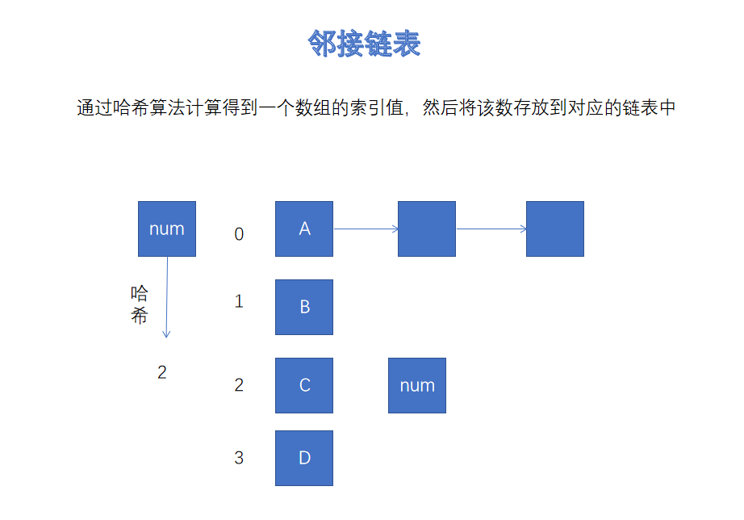
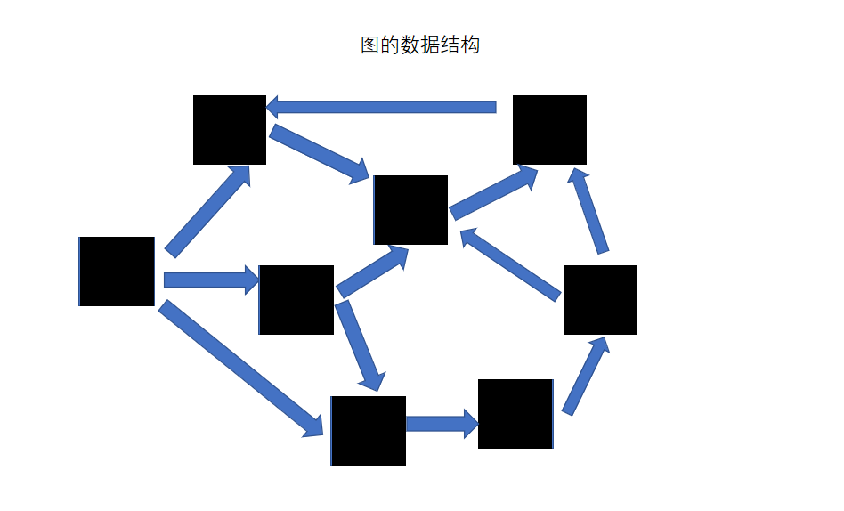
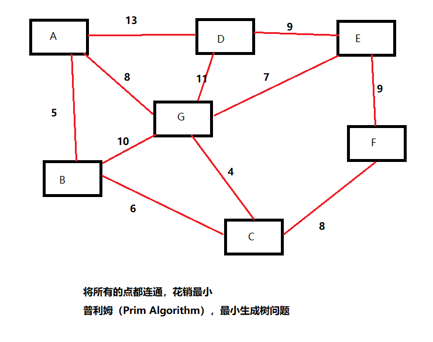

#### 1、贪心算法

买股票，记录每天的价格，计算最大收益的买与抛的和，比如7，1，5，3，6，4，收益1，5和3，6，结果应该是7

```java
public int maxProfit (int[] prices) {
    //记录最大盈利
    int total = 0;
    for(int i = 1; i < prices.length; i++){
        //如果当前元素比之前元素大，就记录这个盈利
        if(prices[i] - prices[i-1] > 0){
            total += prices[i] - prices[i-1];
        }
    }
    return total;
}
```


#### 2、约瑟夫环

有个将军叫约瑟夫，与罗马帝国的作战中兵败，带着副官和39名士兵躲到一个山洞，但是约瑟夫和副官准备投降，39名士兵要求殉国，然后约瑟夫就提出大家围成一个圈，数到3的人就自杀，请问约瑟夫和副官站在哪两个位置能活下来？

```java
public static int[] josephCircle (int count,int num,int lastCount){
        //标记出局人数
        int outNum = 0;
   		//标记计数到哪一个人
        int index = 0;
    	//标记每一个人的状态
        boolean[] markStatus = new boolean[count];
     	//记录要返回的最后几个数字的数组
        int[] lastArr = new int[lastCount];
    	//最后几个数的索引标志位
        int lastIndex = 0;
        while(outNum != count){
            for(int i = 0; i < count; i++){
                if(markStatus[i])continue;
                index++;
                if(index == num){
                    System.out.println((i+1)+"号出局");
                    markStatus[i] = true;
                    index = 0;
                    outNum++;
                    if(outNum >= count - lastCount + 1){
                        lastArr[lastIndex++] = i + 1;
                    }
                }
            }
        }
        return lastArr;
    }
```


#### 3、剑指Offer系列

##### （1）二维数组查数

在一个二维数组中（每一个数组的长度相同）。每一行都按照从左到右递增的顺序排序，每一列都按照从上到下递增的排序。请完成一个函数，输入二维数组和一个整数，判断数组中是否含有该数组。

数组示例：`{{1,3,5,8},{2,4,7,9},{6,10,11,13}}`

```java
public class Test {
    public static boolean find (int[][] arr,int val){
        int row = 0;
        int column = arr[0].length - 1;
        while(true){
            if(column < 0 || row > arr[0].length - 1){
                break;
            }
            if(val == arr[row][column]){
                return true;
            }else if(val > arr[row][column]){
                row++;
                continue;
            }else if(val < arr[row][column]){
                column--;
                continue;
            }
        }
    }
}
```

二维数组有序递增，查找代码：

```java
public static boolean find (int[][] arr,int val){
        int len = arr[0].length - 1;
        if(val < arr[0][0] || val > arr[arr.length-1][len]){
            return false;
        }
        int targetRow = 0;
    	//确定列的位置
        for(int i = 0; i < arr.length; i++){
            if(val > arr[targetRow][len]){
                targetRow++;
            }else if(val < arr[targetRow][len]){
                break;
            }else{
                return true;
            }
        }
        return binarySearch(arr[targetRow],val);
}

public static boolean binarySearch(int[] arr,int val){
        int right = arr.length - 1;
        int left = 0;
        if(val < arr[0] || val > arr[right]){
            return false;
        }
        int middle = 0;
        //这个判断很重要，如果是right!=left会漏掉一次比较
        while(right >= left){
            middle = (left + right) / 2;
            if(val > arr[middle]){
                left = middle + 1;
            }else if(val < arr[middle]){
                right = middle - 1;
            }else if(val == arr[middle]){
                return true;
            }
        }
        return false;
}
```


##### （2）倒序打印单向链表

```java
public class Test{
    public static ArrayList<Integer> printList (Node node){
        if(node == null){
            return new ArrayList<>();
        }
        if(node.next != null){
            ArrayList<Node> result = printList(node.next);
            result.add(node.val);
            return result;
        }else{
            ArrayList<Node> result = new ArrayList<>();
            result.add(node);
            return result;
        }
    }
}
class Node {
    int val;
    int Node next;
    public Node (int val){
        this.val = val;
    }
    public void setNext (Node node) {
        this.next = node;
    }
}
```


##### （3）重建二叉树

输入某二叉树的前序遍历和中序遍历的结果，根据结果重建二叉树并返回（假设前序遍历和中序遍历的结果中都不含重复的数字）

前：1，2，4，7，3，5，6，8

中：4，7，2，1，5，3，8，6

根节点1，左4，7，2，右5，3，8，6

```java
public class Solution {
    public TreeNode reConstructBinaryTree(int [] pre,int [] in) {
        //根据前序遍历和中序遍历结果重构二叉树
        if(pre.length == 0 || in.length == 0){
            return null;
        }
        TreeNode node = new TreeNode(pre[0]);
        for(int i = 0; i < in.length; i++){
            if(in[i] == pre[0]){
                //重构左子树
                int[] leftPre = new int[i];
                int[] leftInfix = new int[i];
                System.arraycopy(pre,1,leftPre,0,i);
                System.arraycopy(in,0,leftInfix,0,i);
                TreeNode left = reConstructBinaryTree(leftPre,leftInfix);
            
                //重构右子树
                int[] rightPre = new int[pre.length - i - 1];
                int[] rightInfix =  new int[pre.length - i - 1];
                System.arraycopy(pre,i+1,rightPre,0,pre.length - i - 1);
                System.arraycopy(in,i+1,rightInfix,0,pre.length - i - 1);
                TreeNode right = reConstructBinaryTree(rightPre,rightInfix);
            
                //挂载节点
                node.left = left;
                node.right = right;
                return node;
        }
    } 
    return node;
    }
}
class Node {
    int val;
    Node left;
    Node right;
    public Node (int val){
        this.val = val;
    }
}

```


##### （4）栈和队列

用两个栈来实现一个队列，完成push和pop操作，队列中元素为`int`类型

```java
public class Test {
    Stack<Integer> stack1 = new Stack<>();
    Stack<Integer> stack2 = new Stack<>();
    //1 2 3 4要先取出1
    public void push (int value){
        stack1.push(value);
    }
    
    public int pop () {
        if(stack1.size() == 0){
            System.out.println("queue is null.");
            return -1;
        }
        while(stack1.size() > 0){
            stack2.push(stack1.pop());
        }
        int result = stack2.pop();
        while(stack2.size() > 0){
            stack1.push(stack2.pop());
        }
        return result;
    }
}
```


##### （5）数组旋转

把一个数组开始的若干元素搬到数组的末尾，我们称之为数组旋转。输入一个非减排序的数组的一个旋转，输出旋转数组的最小元素。例如数组{3，4，5，1，2}为{1，2，3，4，5}的一个旋转，该数组的最小值为1。给出所有元素都大于0，若数组大小为0，返回0。

```java
public int rotateArray (int[] arr) {
    for(int i = 0; i < arr.length - 1; i++){
        //因为有序，如果出现前面比后面大就是旋转数组的最小值了
        if(arr[i] - arr[i+1] > 0){
            return arr[i+1];
        }
    }
    return 0;
}
```


##### （6）青蛙跳台阶

一直青蛙可以跳上1级台阶，也可以跳上2级，求该青蛙跳上n级台阶总共有多少种跳法？（先后次序不同算不同的结果）

思路：假设青蛙从最底下，跳到k-1有m种跳法，跳到k-2有n种跳法，那么青蛙从最底下跳到最上面是n+m种跳法

分析：

1级台阶：1种跳法

2级台阶：2种跳法

3级台阶：1 + 2 ，3种跳法

4级台阶：2 + 3，5种跳法

..............................

n级台阶：m + n种跳法（斐波那契数列）

```java
public static int jumpFloor (int target){
    if(target == 1)return 1;
    if(target == 2)return 2;
    return jumpFloor(target - 1) + jumpFloor(target - 2);
}
```


##### （7）变态跳台阶

f(n) = f(n-1) + f(n-2) + f(n-3) + ...... + f(1)

```java
//动态规划
public int abnormalJumpFloor (int target){
    if(target == 1)return 1;
    if(target == 2)return 2;
    int sum = 0;
    for(int i = 0; i < target - 1; i++){
         sum += JumpFloorII(target - i - 1);
    }
    //注意有直接跳上台阶的1次，不要遗漏
    return sum + 1;
}
```


##### （8）矩形覆盖问题

我们可以用2\*1的小矩形横着或者竖着去覆盖更大的矩形。请问用n个2\*n的大矩形，总共有多少种方法？

n=1，1

n=2，2

n=3，3

n=4，5

......

f(n) = f(n-1) + f(n-2)


```java
public int rectCover (int target){
    if(target < 1)return 0;
    if(target == 1)return 1;
    if(target == 2)return 2;
    return rectCover(target - 1) + rectCover(target - 2);
}
```


##### （9）求幂问题

给定一个double类型的浮点数base和int类型的整数exponent，求base的exponent次方

```java
public double exponentOfBase(double base,int exp){
    if(exp == 0)return 1;
    double result = 1.0;
    for(int i = 0; i < Math.abs(exp); i++){
        result *= base;
    }
    return exp > 0 ? result : 1d / result;
}
```


##### （10）链表相关

输入一个链表，输出该链表种到数第K个节点

```java
public class Test {
    public static ListNode printKthTotail (ListNode head,int k) {
        if(k <= 0)return null;
        ListNode temp;
        ListNode target = head;
        while(true){
            temp = target;
            for(int i = 0; i < k; i++){
                //如果执行过程中temp为空，表示k值过大
                if(temp == null)return null;
                temp = temp.next;
            }
            if(temp == null){
                return target;
            }
            target = target.next;
        }
    }
}

class ListNode {
    int val;
    int next;
    public ListNode (int val){
        this.val = val;
    }
}
```


输入一个链表，反转链表并将新的表头返回

1，2，3，4，5

执行过程：

一直递归到5节点，返回5节点

到4节点，5指针指向4

到3节点，4指针指向3，3的next指针清空

到2节点，3指针指向2，2的next指针清空

```java
public ListNode reverseList (ListNode head) {
    if(head == null)return null;
    //返回新的表头
    if(head.next = null)return head;
    //如果下一个节点的next指针为空，直接指向当前节点
    if(head.next.next == null){
        head.next.next = head;
    }else{
        //如果下一个节点的next指针不为空
        ListNode result = reverseList(head.next);
        head.next.next = head;
        head.next = null;
        return result;
    }
}
```


输入两个单调递增的链表，输出合成后的链表，合成后的链表依然单调

1，3，5，7，9

2，4，6，8，10

```java
public static ListNode merge (ListNode list1,ListNode list2) {
    if(list1 == null && list2 == null)return null;
    if(list1 == null)return list2;
    if(list2 == null)return list1;
    if(list1.val < list2.val){
        //函数本质是找最小值，然后挂载到当前节点后面
        list1.next = merge(list1.next,list2);
        return list1;
    }else{
        list2.next = merge(list1,list2.next);
        return list2;
    }
}
```


leetcode链表的整数相加

链表1：2，4，5

链表2：3，7，4

输出：5，1，0，1

```java
//leetcode链表的整数相加
    public static ListNode addTwoNumbers(ListNode l1, ListNode l2) {
        if (l1 == null) return l2;
        if (l2 == null) return l1;
        ListNode head = new ListNode(l1.val + l2.val);
        int index = 0;
        if(l1.val + l2.val >= 10){
            head.val = l1.val + l2.val - 10;
            index = 1;
        }
        //下一个节点的指针
        ListNode curNode = head;
        ListNode temp1 = l1.next;
        ListNode temp2 = l2.next;
        //穿节点
        while (temp1 != null || temp2 != null) {
            ListNode newNode = null;
            int sum = 0;
            if (temp1 == null) {
                sum = temp2.val + index;
            }
            if (temp2 == null) {
                sum = temp1.val + index;
            }
            if(temp1 != null && temp2 != null){
                sum = temp1.val + temp2.val + index;
            }
            if(sum >= 10){
                newNode = new ListNode(sum - 10);
                index = 1;
            }else{
                newNode = new ListNode(sum);
                index = 0;
            }
            if(temp1 != null) temp1 = temp1.next;
            if(temp2 != null) temp2 = temp2.next;
            curNode.next = newNode;
            curNode = curNode.next;
        }
        if(index == 1)curNode.next = new ListNode(index);
        return head;
    }

class ListNode {
    int val;
    ListNode next;

    ListNode(int x) {
        val = x;
    }

    public void list () {
        System.out.println(this.val);
        ListNode temp = this.next;
        while(temp != null){
            System.out.println(temp.val);
            temp = temp.next;
        }
    }
}
```


##### （11）二叉树相关

输入两棵二叉树A、B，判断B不是A的子结构。（约定空树不是任意一个树的子结构）

```java
public boolean isSubtree (TreeNode node1,TreeNode node2) {
    if(node1 == null || node2 == null)return false;
    if(node1 == node2)return true;
    return isSame(node1,node2) || isSubtree(noded1.left,node2) || isSubtree(node1.right,node2);
}

public boolean isSame (TreeNode node1,TreeNode node2) {
    if(node2 == null)return true;
    if(node1 == null)return false;
    if(node1.val == node2.val){
        return isSame(node1.left,node2.left) && isSame(node1.right,node2.right);
    }else{
        return false;
    } 
}
```


操作给定的二叉树，将其变换为源二叉树的镜像

分析：就是节点的左右子树交换位置

> ```
> 二叉树的镜像定义：源二叉树 
>     	    8
>     	   /  \
>     	  6   10
>     	 / \  / \
>     	5  7 9 11
>     	镜像二叉树
>     	    8
>     	   /  \
>     	  10   6
>     	 / \  / \
>     	11 9 7  5
> ```

```java
public static void Mirror (TreeNode root){
    if(root == null)return;
    //递归
    Mirror(root.left);
    Mirror(root.right);
    //左右子树交换
    TreeNode temp = root.left;
    root.left = root.right;
    root.right = temp;
}
```


##### （12）顺时针打印矩阵

> 1   2   3    4 
> 5   6   7    8
>
> 9  10  11  12
>
> 输出：1 2 3 4 8 12 11 10 9 5 6 7

分析功能：自动转向，移动后设置墙壁

```java
public ArrayList<Integer> printMatrix (int[][] matrix) {
    //记录存储了多少个数
    int num = 0;
    //记录行列
    int row = 0;
    int column = 0;
    //方向设计
    int[][] toward = {
        {0,1},//向右
        {1,0},//向下
        {0,-1},//向上
        {-1,0}//向左
    };
    int[] nowToward = toward[num % 4];
    ArrayList<Integer> result = new ArrayList<>();
    while(true){
        result.add(matrix[row][column]);//每次将当前值加到集合中
        matrix[row][column] = Integer.MAX_VALUE;
        if(result.size() >= matrix.length*matrix[0].length)break;
        while(true){
            //判断下一步是否会越界
        	int nextRow = row + nowToward[0];
        	int nextColumn = column + nowToward[1];
        	if(nextRow < 0 || nextColumn < 0 || nextRow >= matrix.length || nextColumn >= matrix[0].length || matrix[nextRow][nextColumn] == Integer.MAX_VALUE){
            	//通过num++改变方向
            	num++;
            	nowToward = toward[num % 4];
       		 }else{
            	break;
        	 }
        }
        //运动
        row += nowToward[0];
        column += nowToward[1];
    }
    return result;
}
```


##### （13）栈相关

定义栈的数据结构，请在该类型中实现一个能够得到栈中所含最小元素的min函数

```java
public class Solution {
	//初始化数组大小128
    int[] arr = new int[128];
    //记录使用长度的指针
    int pointer = 0;
    int min = Integer.MAX_VALUE;

    public void push(int node) throws Exception {
        min = Math.min(min,node);
        //判断是否扩容
        if(pointer > arr.length - 1){
            if(pointer >= Integer.MAX_VALUE)throw new Exception("size is great than Integer.MAX_VALUE.");
            int growSize = (int)(arr.length*1.75);
            if(growSize > Integer.MAX_VALUE)growSize = Integer.MAX_VALUE;
            int[] newArr = new int[growSize];
            System.arraycopy(arr,0,newArr,0,arr.length);
            arr = newArr;
        }
        arr[pointer++] = node;
    }

    public void pop() {
        if(pointer == 0){
            System.out.println("current stack is empty.");
            return;
        }
        if(arr[pointer - 1] == min){
            min = Integer.MAX_VALUE;
            for(int i = 0; i < pointer - 1; i++){
              min = Math.min(min,arr[i]);
            }
        }
        pointer--;
    }

    public int top() {
        if(pointer == 0){
            System.out.println("stack is empty.");
            return -1;
        }
        return arr[pointer-1];
    }

    public int min() {
        return min;
    }
```


输入两个整数序列，第一个序列表示栈的压入顺序，请判断第二个序列是否可能为该栈的弹出顺序。假设压入栈的所有数字均不相等。例如序列1,2,3,4,5是某栈的压入顺序，序列4,5,3,2,1是该压栈序列对应的一个弹出序列，但4,3,5,1,2就不可能是该压栈序列的弹出序列。（注意：这两个序列的长度是相等的）

```java
public class Solution {
    public boolean IsPopOrder(int [] pushA,int [] popA) {
      	int[] stack = new int[pushA.length];
        int stackPointer = 0;
        int pushPointer = 0;
        int popPointer = 0;
        while(true){
            if(stackPointer <= 0 || popA[popPointer] != stack[stackPointer-1]){
                if(pushPointer >= pushA.length)return false;
                stack[stackPointer]  = pushA[pushPointer];
                stackPointer++;
                pushPointer++;
            }
            if(popA[popPointer] == stack[stackPointer-1]){
                popPointer++;
                stackPointer--;
                if(popPointer >= popA.length){
                    return true;
                }
            }
        }
    }
}
```


##### （13）二叉树相关

输入一个整数数组，判断该数组是不是某二叉搜索树的后序遍历的结果。如果是则输出yes，否则输出no。假设输入的数组的任意两个数字都不相同


##### （14）罗马数字转整数

leetcode算法题

```java
 //leetcode罗马数字转整数
    public static int romanToInt (String s){
        //先用字典来存储
        HashMap<String,Integer> map = new HashMap<>();
        map.put("I",1);
        map.put("V",5);
        map.put("X",10);
        map.put("L",50);
        map.put("C",100);
        map.put("D",500);
        map.put("M",1000);
        map.put("IV",4);
        map.put("IX",9);
        map.put("XL",40);
        map.put("XC",90);
        map.put("CD",400);
        map.put("CM",900);
        int sum = 0;
        for (int i = 0; i < s.length(); ) {
            boolean flag = false;
            if (i + 1 < s.length()) {
                String twoStr = s.substring(i, i + 2);
                if (map.containsKey(twoStr)) {
                    sum += (Integer) map.get(twoStr);
                    i += 2;
                    flag = true;
                }
            }

            if (flag == false) {
                String str = s.substring(i, i + 1);
                int num = (Integer) map.get(str);
                sum += num;
                i += 1;
            }
        }

        return sum;
    }
```


##### （15）开方问题

输入一个整数x，求x的1/2次幂

牛顿迭代公式推导：

> 1、F(x) = X ^ 2 - N，求F(x) = 0与X轴的交点
>
> 原理：找到X轴交点最靠近的整数，然后让它对应的Y值通过增量不断靠近0，获得X轴的近似值
>
> 分析：
>
> （1）切线方程：Y1 - Y0 =  k ( X1 - X0)
>
> （2）因为Y0= X0 ^ 2 - N，Y1 = 0，得到X1 = X0 - Y0 /  k
>
> （3） 求导公式：当X = X0时，k = 2 * X0 
>
> （4）X1 = X0 - （X0^2 - N）/  (2*X0) = X0 / 2 + N / (2 * X0)
>
> （5）迭代3次获取的近似值可以精确度达到10 ^ -10

```java
public class MySqrt {

    /*
    * （1）先找到左边最靠近的值
    * （2）利用牛顿迭代法3次可以得到误差较小的近似值
    * */
    public static double sqrt (int x) {
        if(x == 0 || x == 1) return 1.0d;
        int left = 1;
        int right = x / 2 + 1;
        int sqrt = 0;
        int mid = 0;
        while(left < right){
            mid = (left + right) / 2;
            sqrt = mid * mid;
            if(sqrt == x) {
                return mid;
            }
            if(sqrt > x){
                right = mid;
            }else{
                if(left == mid){
                    return newtonIterator(mid,x);
                }
                left = mid;
            }
        }
        return (double)mid;
    }

    /*
    * 牛顿迭代公式: Xn+1 = Xn*1/2 + value / (2*Xn)
    * */
    public static double newtonIterator (int mid,int x) {
        double temp = (double) mid;
        int count = 3;
        double res = 0;
        while(count >= 0) {
            res = temp*0.5 + x / (2*temp);
            temp = res;
            count--;
        }
        return res;
    }  
}
```


##### （16）摩尔斯密码

输入: words = ["gin", "zen", "gig", "msg"]
输出: 2
解释: 
各单词翻译如下:
"gin" -> "--...-."
"zen" -> "--...-."
"gig" -> "--...--."
"msg" -> "--...--."

摩尔斯字典：[".-","-...","-.-.","-..",".","..-.","--.","....","..",".---","-.-",".-..","--","-.","---",".--.","--.-",".-.","...","-","..-","...-",".--","-..-","-.--","--.."]

```java
public static int uniqueMorseRepresentations(String[] words) {
        String[] morseDic = {".-","-...","-.-.","-..",".","..-.","--.","....","..",".---","-.-",".-..","--","-.","---",".--.","--.-",".-.","...","-","..-","...-",".--","-..-","-.--","--.."};
        HashSet result = new HashSet();
        for(int i = 0; i < words.length; i++){
            char[] chars = words[i].toCharArray();
            StringBuilder sb = new StringBuilder();
            for(char c : chars){
                sb.append(morseDic[c - 97]);
            }
            //利用HashSet去重
            result.add(sb.toString());
        }
        return result.size();
}
```


##### （17）缺失数字

George Boolean：乔治·布尔，将逻辑学与数学结合起来。（leetcode：268）

给定一个包含0，1，2，......，n的序列

找出0-n中没有出现在序列中的那个数

示例：[3, 0, 1]

输出：2

示例：[9, 6, 5, 7, 2, 3, 1, 0]

输出：8

```java
public class MissingNumber {
    //本质就是缺失的索引
    public static int findMissingNum (int[] nums){
        HashSet<Integer> set = new HashSet<>();
        for(int i = 0; i < nums.length; i++){
            set.add(nums[i]);
        }
        for(int i = 0; i <= nums.length; i++){
            if(!set.contains(i)){
                return i;
            }
        }
        return -1;
    }
    //根据索引
    //array:[0,1,2,4]
    //index: 0,1,2,3
    public static int findMissingNum2 (int[] nums){
        Arrays.sort(nums);
        for(int i = 0; i <= nums.length; i++){
            if(nums[i] != i){
                return i;;
            }
        }
        if(nums.length != nums[nums.length-1]){
            return nums.length;
        }
        return -1;
    }
    //异或方法
    //array:[4,3,0,1]  nums.length就是最大值
    //index: 0,1,2,3
    //result = (4^4^3^3^1^1^0^0) ^ 2 = 2 
    public static int findMissingNum2 (int[] nums){
        int result = nums.length;
        for(int i = 0; i < nums.length; i++){
            result = result ^ nums[i] ^ i;
        }
        return result;
    }
    //高斯求和
    public static int findMissingNum2 (int[] nums){
        int result = (1+nums.length)*nums.length / 2;
        int numSum = 0;
        for(int i = 0; i < nums.length; i++){
            numSum += nums[i];
        }
        return result - numSum;
    }
}
```


##### （18）杨辉三角

> ​                 1				11^0
>
> ​         	1         1       11^1
>
> ​         1      2       1			11^2
>
> ​     1     3         3      1        11^3
>
> 1       4       6        4       1 
>
> 特点：
>
> （1）n行组合的数字 11^(n -  1)
>
> （2）n行的和   2^(n - 1)
>
> 输入5，打印上述的集合`List<List<Integer>>`

java代码：

```java
public class YangHuiTriangle {
    //输出杨辉三角的集合
    //输入3   结果：[ [1],[1,1],[1,2,1] ]
    public static List<List<Integer>> generateTriangle(int numRows) {
        List<List<Integer>> result = new ArrayList<>();
        for (int i = 1; i <= numRows; i++) {
            List<Integer> rowList = new ArrayList<>();
            for (int j = 0; j < i; j++) {
                if (j == 0 || j == i - 1) {
                    rowList.add(1);
                } else {
                    int leftUp = result.get(i - 2).get(j - 1);
                    int up = result.get(i - 2).get(j);
                    rowList.add(leftUp + up);
                }
            }
            result.add(rowList);
        }
        return result;
    }
}
```


##### （19）数组中消失的元素

毕达哥拉斯：万物皆数

无理数的发现：第一次数学危机

芝诺悖论：第二次数学危机

罗素悖论：引发第三次数学危机


输入：[1,3,4,6,7]

找到1-7中没有出现的元素

输出：[2,5]

```java
public static List<Integer> findDisapearedNums (int[] number){
    if(nums == null)return null;
        List<Integer> result = new ArrayList<>();
        //true表示标记为负数的索引
        boolean[] flag = new boolean[nums.length];
        for(int i : nums){
            if(i == 0)continue;
            flag[i-1] = true;
        }
        for(int i = 0; i < nums.length; i++){
            if(!flag[i]){
                result.add(i+1);
            }
        }
        return result;
}
```


##### （20）五子棋

游戏研发：

项目经理（PM：project manager）

产品经理（PD：production designer）

前端（fe：front-end）

后端（rd：research and development）研发--> 主程

测试（qa：）

游戏分工：制作人、策划（剧情策划、数值策划）、美术、前端（js/coco2d/unity3d）、后端（c++/java/python与c++）、测试

```java
public class Gobang {
    private static String[][] board = new String[12][12];

    static {
        int len = board[0].length;
        for (int i = 0; i < board.length; i++) {
            for (int j = 0; j < len; j++) {
                board[i][j] = "✛";
            }
        }
    }

    public static void main(String[] args) throws Exception {
        int count = 0;
        System.err.println("我们绝对不能坐以待毙！！！五子棋玩起来");
        print();
        while (true) {
            System.out.println("请输入坐标:");
            BufferedReader br = new BufferedReader(new InputStreamReader(System.in));
            String target = br.readLine().trim().replaceAll(" ", "");
            if (target.equals("quit")) {
                break;
            }
            if (target.equals("love")) {
                System.out.println("所以你认为是简单的下五子棋对吗？？？");
                Thread.sleep(3000);
                System.out.println("我的本意不是下棋，是爱你~~~~");
                printHeart(15, 0.9, "love");
                Thread.sleep(10);
                System.out.println("退出~~~");
                break;
            }
            if (target.indexOf(",") == -1) {
                System.out.println("正经格式：x,y 如1,2(x,y<12)");
                continue;
            }
            String[] nums = target.split(",");
            for (String str : nums) {
                if (Integer.parseInt(str) > 11) {
                    System.out.println("正经格式：x,y 如1,2(x,y<12)");
                    continue;
                }
            }
            play(Integer.parseInt(nums[0]), Integer.parseInt(nums[1]), count);
            count++;
        }
    }

    public static void play(int x, int y, int count) {
        if (count > 144) System.out.println("别玩了，棋盘不够了");
        if (board[x][y] != "✛") {
            System.out.println("此处有子，你有什么想法吗？");
            return;
        }
        if (count % 2 == 0){
            System.out.println("我的棋子都是爱你的心形~~~");
            board[x][y] = "❤";
        }
        else{
            System.out.println("爱你需要像太极一样耐心和定力~~~");
            board[x][y] = "☯";
        }

        print();
    }

    public static void print() {
        int len = board[0].length;
        for (int i = 0; i < board.length; i++) {
            for (int j = 0; j < len; j++) {
                System.out.print(board[i][j]);
            }
            System.out.println();
        }
    }

    private static void printHeart(int r, double size, String req) {
        size = 1 / (1.5 * r * size);
        StringBuilder sb = new StringBuilder();
        for (int y = r; y > -r; y--, sb.append("\n"))
            for (int x = -2 * r; x < 2 * r; x++) {
                char msg = (req + req).charAt((x - y) % req.length() + req.length());
                sb.append((inHeart(size, x, y) ? msg + " " : "  "));
            }
        System.err.println(sb.toString());
    }

    private static boolean inHeart(double size, int x, int y) {
        return Math.pow(Math.pow(x * size, 2) +
                Math.pow(y * 2 * size, 2) - 1, 3) -
                Math.pow(x * size, 2) * Math.pow(y * 2 * size, 3) <= 0;
    }
}
```


##### （21）最大子序和

主题：动态规划（运筹学分支）

通过决策获得最好的结果

找到最大和的子序列

输入：[-2,1,-3,4,-1,2,1,-5,4]

输出：6（[4,-1,2,1]）

```java
class MaxSubArray {
    //暴力循环法
    public static int maxSubArray (int[] nums){
        int max = nums[0];
        for(int i = 0; i < nums.length; i++){
            int sum = 0;
            for(int j = i; j < nums.length; j++){
                sum += nums[j];
                if(sum > max) {
                    max = sum;
                }
            }
        }
    }
    
    //动态规划
    public static int maxSubArray2 (int[] nums) {
        int max = nums[0];
        int[] dp = new int[nums.length];
        dp[0] = nums[0];
        for(int i = 1; i < nums.length; i++){
            if(dp[i-1] > 0){
                dp[i] = dp[i-1] + nums[i];
            }else{
                dp[i] = nums[i];
            }
            max = Math.max(dp[i],);
        }
        return Math.max(dp);
    }
    
    //动态规划
    public static int maxSubArray2 (int[] nums) {
        int max = nums[0];
        int sum = nums[0];
        for(int i = 1; i < nums.length; i++){
            if(sum > 0)sum += nums[i];
            else sum = nums[i];
            max = Math.max(sum,max);
        }
        return max;
    }
}
```


##### （22）递归

输入：{1,2,3,1]    [2,7,9,3,1]

输出：4                     12

不能连续偷，隔着偷

动态转移方程

```java
public class DynamicTransformFormula {
    //递归（时间复杂度较高）
    public static int rob (int[] nums) {
        return rob(nums,nums.length-1);
    }
    
    //[3,3,1,1]
    public static int rob (int[] nums,int i){
        if(i == 0)return nums[0];
        if(i == 1)return Math.max(nums[0],nums[1]);
        int A = rob(nums,i-2) + nums[i];
        int B = rob(nums,i-1);
        return Math.max(A,B);
    }
    
    //动态规划
    public static int robByDp (int[] nums) {
        if(nums == null || nums.length == 0)return -1;
        if(nums.length < 2) return nums[0];
        int[] dp = new int[nums.length];
        dp[0] = nums[0];
        dp[1] = Math.max(nums[0],nums[1]);
        for(int i = 2; i < dp.length; i++){
            //抢
            int A = dp[i-2] + nums[i];
            //不抢
            int B = dp[i-1];
            dp[i] = Math.max(A,B);
        }
        return dp[nums.length-1];
    }
}
```

如果一个问题的最优解可以分解为若干个子问题的最优解，可以用动态规划来分析。


#### 4、java实用工具类

##### （1）二维码

谷歌：`com.google.zxing`

二维码：本质是二进制形式存储一个字符串

扫码：本质是拍张图片存进缓存，然后解析出字符串，如果是网址自动跳转，字符串自动展示


生成二维码：

```java
public class QRCode {
    public static void createQRCodeImage (String content,String fileName,int width,int height){
        QRCodeWriter writer = new QRCodeWriter();
        //encode方法参数：字符串、二维码类型、宽高
        //记录像素的位图矩阵
        BitMatrix bitMatrix = writer.encode(content,BarcodeFormat.QR_CODE,width,height);
        //获取文件系统的路径，项目根路径
        Path path = FileSystems.getDefault().getPath(fileName);
        //讲位图转化为image图像，写到路径下
        MatrixToImageWriter.writeToPath(bitMatrix,"JPG",path);
        //将位图写到流里面
        MatrixToImageWriter.writeToStream(bitMatrix,"JPG",new FileOutputStream(fileName));
    }
}
```

解析二维码：

```java
//将一个大图里的二维码进行识别
public static void parseQRCodeToString (String filePath) {
    File file = new File(filePath);
    //将文件直接读成图片image格式
    BufferedImage image = ImageIO.read(file); 
    //将image格式的文件变为图片
    //混杂二进制
    Binarizer binarizer = new BufferedImageLuminanceSource(image);
    //将混杂二进制转化为位图
    BinaryBitMap bitMap = new BinaryBitMap(binarizer);
    //解析二维码位图
    MultiFormatReader reader = new MultiFormatReader();
    //用来存放结果的对象Result
    Result result = reader.decode(bitMap);
    return result.getText();
}
```

生成条形码：

```java
public class QRCode {
    public static void createBarCode (String content,String fileName,int width,int height){
        MultiFormatWriter writer = new MultiFormatWriter();
        //encode方法参数：字符串、二维码类型、宽高
        //记录像素的位图矩阵
        BitMatrix bitMatrix = writer.encode(content,BarcodeFormat.EAN_13,width,height);
        //获取文件系统的路径，项目根路径
        Path path = FileSystem.getDefault().getPath(fileName);
        //讲位图转化为image图像，写到路径下
        MatrixToImageWriter.writeToPath(bitMatrix,"JPG",path);
        //将位图写到流里面
        MatrixToImageWriter.writeToStream(bitMatrix,"JPG",new FileOutputStream(fileName));
    }
}
```


#### 5、数据结构和算法复习


数组：不适合存入大量数据，因为空间要求是连续的，并且容易产生空间碎片。

链表：空间可以不连续，需要在存放数据的同时，多创建一个空间来存放下一个地址，查找效率不高


递归打印链表

递归特点：（1）递归出口 （2）每个节点的通用操作 （3）向下递归

```java
public static void prinNodeVal (Node node){
    if(node == null)return;
    System.out.println(node.val);
    printNodeVal(node.next);
    System.out.println(node.val);
    //1 2 3 4 5 5 4 3 2 1
}
```


链表的逆置

```java
public static Node reverseNodeList (Node node) {
    if(node == null)return null;
    Node result = null;
    if(node.next.next == null){
        result = node.next;
    }else{
        result = reverseNodeList(node.next);
    }
    node.next.next = node;
    node.next = null;
    return result;
}
```


有序链表的合并

```java
public class MergeList{
	//合并有序链表
    public static Node mergeOrderedList(Node node1, Node node2) {
        if (node1 == null && node2 == null) return null;
        if (node1 == null) return node2;
        if (node2 == null) return node1;
        Node head = new Node(-1);
        Node temp = head;
        //都不为空，比较值后添加到temp节点后，temp节点后移
        while (node1 != null && node2 != null) {
            if (node1.val < node2.val) {
                temp.next = node1;
                node1 = node1.next;
            }else{
                temp.next = node2;
                node2 = node2.next;
            }
            temp = temp.next;
        }
        //如果1链表不为空，直接将元素都添加到链表尾部
        if(node1 != null){
            while(node1 != null){
                temp.next = node1;
                node1 = node1.next;
                temp = temp.next;
            }
        }
        //如果2链表不为空，直接将元素都添加到链表尾部
        if(node2 != null){
            while(node2 != null){
                temp.next = node2;
                node2 = node1.next;
                temp = temp.next;
            }
        }
        Node result = head.next;
        return result;
    }
}
```


##### （1）快速排序

```java
public static void quickSort (int[] arr,int left,int right){
    if(left >= right)return;
    int base = arr[left];
    int l = left;
    int r = right;
    int temp = 0;
    while(l != r){
        //必须先从右边找起，且必须是可以等于的
        while(arr[r] >= base && l < r)r--;
        while(arr[l] <= base && l < r)l++;
        temp = arr[l];
        arr[l] = arr[r];
        arr[r] = temp;
    }
    arr[left] = arr[l];
    arr[l] = base;
    quickSort(arr,left,l-1);
    quickSort(arr,l+1,right);
}
```

标准快排

```java
public class FindDisapearedNums {
    public static void quickSort(int[] arr){
        quickSort(arr,0,arr.length-1);
    }

    public static void quickSort(int[] arr,int left,int right) {
        if(left >= right)return;
        int separatorPoint = partion(arr,left,right);
        quickSort(arr,left,separatorPoint-1);
        quickSort(arr,separatorPoint + 1,right);
    }

    public static int partion (int[] arr,int left,int right) {
        int base = arr[left];
        while(left < right){
            //必须先从右边找起，且必须是可以等于的
            // 7 2 3 4 5 4 9 1   base:7
            // 1 2 3 4 5 4 9 1
            // 1 2 3 4 5 4 9 9
            // 1 2 3 4 5 4 7 9
            while(arr[right] >= base && left < right)right--;
            arr[left] = arr[right];
            while(arr[left] <= base && left < right)left++;
            arr[right] = arr[left];
        }
        arr[left] = base;
        return left;
    }
}
```


最简洁的快排写法

```java
 public static void quickSort(int[] arr,int left,int right) {
        if(left >= right)return;
        int l = left;
        int r = right;
        int base = arr[left];
        while(l < r){
            //必须先从右边找起，且必须是可以等于的
            // 7 2 3 4 5 4 9 1   base:7
            // 1 2 3 4 5 4 9 1
            // 1 2 3 4 5 4 7 9
            while(arr[r] >= base && l < r)r--;
            arr[l] = arr[r];
            while(arr[l] <= base && l < r)l++;
            arr[r] = arr[l];
        }
        arr[l] = base;
        quickSort(arr,left,l-1);
        quickSort(arr,l + 1,right);
    }
```


##### （2）归并排序

```java
public static void sort (int[] arr,int left,int right,int[] temp){
    if(left >= right)return;
    int mid = left + (right - left) / 2;
    //分成最小单元
    sort(arr,left,mid,temp);
    sort(arr,mid+1,right,temp);
    //合并单元
    merge(arr,left,mid,right,temp);
}

private static void merge (int[] arr,int left,int mid,int right,int[] temp){
    int l = left;
    int r = mid + 1;
    int pointer = left;
    while(l <= mid && r <= right){
        if(arr[l] < arr[r]) arr[pointer++] = arr[l++];
        else arr[pointer++] = arr[r++];
    }
    while(l <= mid)arr[pointer++] = arr[l++];
    while(r <= right)arr[pointer++] = arr[r++];
    for(int i = left; i <= right; i++){
        arr[i] = temp[i];
    }
}
```


##### （3）负载均衡

方式：轮询、哈希、随机等


随机数值访问

```java
public class RandomAccessToServer {
    private static LinkedHashMap<String,Integer> weightMap = new LinkedHashMap<>();
    
    static {
        //添加静态测试数据
        weightMap.put("127.0.0.1",20);
        weightMap.put("127.0.0.1",51);
        weightMap.put("127.0.0.1",18);
        weightMap.put("127.0.0.1",12);
        weightMap.put("127.0.0.1",45);
        weightMap.put("127.0.0.1",89);
        weightMap.put("127.0.0.1",121);
    }
    
    public String getServer () {
        int totalWeight = 0;
        for(int i : weightMap.values){
            totalWeight += i;
        }
        int randomVal = new Random().nextInt(totalWeight);
        for(String key : weightMap.keySet()){
            int weight = weightMap.get(key);
            if(randomVal <= weight){
                return key;
            }
            random.val -= weight;
        }
        return null;
    }
}
```


##### （4）大数加法

```java
public class BigNumAddFunc {
    public static String add (String a,String b) {
        if("".equals(a) && "".equals(b))return null;
        if("".equals(a))return b;
        if("".equals(b))return a;
        int al = 1;
        int bl = 1;
        int flag = 0;
        StringBuilder sb = new StringBuilder();
        //临时变量
        int m;
        int n;
        //如果al、bl都没到最后一位且有进位
        while(al <= a.length() || bl <= b.length() || flag > 0){
            //如果有一个长度加完，后面就当作0来计算
            m = al <= a.length() ? a.charAt(a.length() - al) - '0' : 0;
            n = bl <= b.length() ? b.charAt(b.length() - bl) - '0' : 0;
            sb.append((m + n + flag) % 10);
            flag = (m + n + flag) / 10;
            al++;
            bl++;
        }
        return sb.reverse().toString();
    }
    
    public static void main (String[] args){
		String a = "1011234213495327279825723485295";
		String b = "247032157892401518904173529023891758029";
	}
}
```


#### 6、二维数据结构

一维数据结构：数组、链表

二维数据结构：二维数组、邻接链表、图


邻接链表（HashMap）：具有数组和链表的特点




图的数据结构

图：二维拓扑结构（只要关系不变，就能映射到平面中去）




树形结构（有向无环图）

基本概念：

树的根节点：人为定义的开始节点（每一个节点都可以作为根节点）

树的度：分支最多的节点有几个分支，都就是多少

树的深度：树的层数

叶子节点：没有子节点的节点


二叉树：树的度最高不超过2的树

左子树，右子树

满二叉树：（1）如果一个节点有子节点，那么它一定有两个子节点 （2）叶子节点都在树的最后一层

完全二叉树：（1）除了最后一层，节点都是满的 （2）最后一层的节点都集中在左侧


##### （1）根据前序中序还原二叉树

二叉树存前序和中序或者后序和中序的遍历结果，可根据结果还原二叉树

前序遍历：1，2，4，5，3，6

中序遍历：4，2，5，1，3，6

后序遍历：4，5，2，6，3，1

```java
public class BuildBinaryTree {
    
    public static int findIndex (int[] arr,int target) {
        for(int i = 0; i < arr.length; i++){
            if(arr[i] == target)return i;
        }
        return 0;
    }
    
    public static TreeNode buildTree(int[] preOrder,int[] infixOrder) {
        if(preOrder == null || infixorder == null || preOrder.length == 0 || infixOrder.length == 0 || preOrder.length != infixOrder.length)return null;
        //从前序遍历中取出根节点
        TreeNode root = new TreeNode(preOrder[0]);
        //从中序遍历中根节点位置索引
        int rootIndex = findIndex(infixorder,root.val);
        //找到左子树的前序和中序
        int[] leftChildTreePre = Arrays.copyOfRange(preorder,1,rootIndex + 1);
        int[] leftChildTreeMid = Arrays.copyOfRange(infixOrder,0,rootIndex);
        //找到右子树的前序和中序
        int[] rightChildTreePre = Arrays.copyOfRange(preOrder,rootIndex + 1,preOrder.length);
        int[] rightChildTreeMid  = Arrays.copyOfRange(infixOrder,rootIndex + 1,infixOrder.length);
        TreeNode left = buildTree(leftChildTreePre,leftChildTreeMid);
        TreeNode right = buildTree(rightChildTreePre,rightChildTreeMid);
        root.left = left;
        root.right = right;
    }  
}

class TreeNode {
    public int val;
    public TreeNode left;
    public TreeNode right;
}
```


##### （2）根据中序和后序遍历还原二叉树

中序遍历：4，2，5，1，3，6

后序遍历：4，5，2，6，3，1

前序遍历：1，2，4，5，3，6

```java
public static TreeNode buildTreeByInfixOrderAndPostOrder (int[] infixArr, int[] postArr) {
        if (infixArr == null || postArr == null
                || infixArr.length == 0 || postArr.length == 0
                || infixArr.length != postArr.length) return null;
        TreeNode root = new TreeNode(postArr[postArr.length - 1]);
        int rootIndex = findIndex(infixArr,root.val);
        int[] leftInfixArr = Arrays.copyOfRange(infixArr,0,rootIndex);
        int[] leftPostArr = Arrays.copyOfRange(postArr,0,rootIndex);
        int[] rightInfixArr = Arrays.copyOfRange(infixArr,rootIndex+1,infixArr.length);
        int[] rightPostArr = Arrays.copyOfRange(postArr,rootIndex,postArr.length-1);
        TreeNode left = buildTreeByInfixOrderAndPostOrder(leftInfixArr,leftPostArr);
        TreeNode right = buildTreeByInfixOrderAndPostOrder(rightInfixArr,rightPostArr);
        root.left = left;
        root.right = right;
        return root;
    }
```


##### （3）二叉树的深度优先搜索

思路和前序遍历类似

```java
public static boolean deepFirstSearch (TreeNode root,int target) {
    if(root == null)return false;
    if(root.val == target)return true;
    return deepFirstSearch(root.left,target) || deepFirstSearch(root.right,target);
}
```


##### （4）二叉树的广度优先搜索

```java
public static boolean broadFirstSearch (ArrayList<TreeNode> roots,int target){
    if(roots == null || root.size() == 0)return false;
    ArrayList<TreeNode> childRoots = new ArrayList<>();
    for(TreeNode node : roots){
        if(node.val == target)return true;
        if(node.left != null)childRoots.add(node.left);
        if(node.right != null)childRoots.add(node.right);
    }
    return broadFirstSearch(roots,target);
}

public static boolean bfs (TreeNode root,int target) {
    ArrayList<TreeNode> roots = new ArrayList<>();
    roots.add(root,target);
    return broadFirstSearch(roots,target);
}
```


##### （5）二叉树的比较

完全相等

```java
public static boolean compareTree (TreeNode node1,TreeNode node2){
    if(node1 == null && node2 != null || node1 != null && node2 == null)return false;
    if(node1 == null && node2 == null)return true;
    if(node1.val == node2.val)return false;
    return compareTree(node1.left,node2.left) && compareTree(node1.right,node2.right);
}
```

左右子树互换也算相等

```java
public static boolean compareTree (TreeNode node1,TreeNode node2){
    if(node1 == null && node2 != null || node1 != null && node2 == null)return false;
    if(node1 == null && node2 == null)return true;
    if(node1.val == node2.val)return false;
    return compareTree(node1.left,node2.left) && compareTree(node1.right,node2.right) || compareTree(node1.left,node2.right) && compareTree(node1.right,node2.left) ;
}
```


##### （6）普利姆算法（最短路径）



普利姆算法思路：

（1）任意选择一点作为起点

（2）找到与已经连接部分路径最短的点（不能形成闭环）


程序表示一个图（点集合：Set，二维数组表示路径）

|      | A    | B    | C    | D    | E    | F    | G    |
| ---- | ---- | ---- | ---- | ---- | ---- | ---- | ---- |
| A    | 0    | 5    | Max  | 13   | Max  | Max  | 8    |
| B    | 5    | 0    | 6    | Max  | Max  | Max  | 10   |
| C    | Max  | 6    | 0    | Max  | Max  | 8    | 4    |
| D    | 13   | Max  | Max  | 0    | 9    | Max  | 11   |
| E    | Max  | Max  | Max  | 9    | 0    | 9    | 7    |
| F    | Max  | Max  | 8    | Max  | 9    | 0    | Max  |
| G    | 8    | 10   | 4    | 11   | 7    | Max  | 0    |


```java
public class PrimPrincipal {

    public static Set<MapNode> prim(MapNode startNode, Set<MapNode> pointSet, int[][] distance) {
        Set<MapNode> linkedSet = new LinkedHashSet<>();
        linkedSet.add(startNode);
        while (linkedSet.size() < pointSet.size()) {
            //找到最短路径的节点并连接
            getMinDistanceAndLinked(pointSet,linkedSet,distance);
        }
        return linkedSet;
    }

    //根据索引找到索引相同的MapNode节点
    public static MapNode findMapNodeByIndex (Set<MapNode> targetSet,int index) {
        for(MapNode node : targetSet){
            if(node.index == index)return node;
        }
        return null;
    }

    public static void getMinDistanceAndLinked(Set<MapNode> pointSet,Set<MapNode> linkedSet,int[][] distance) {
        MapNode start = null;
        MapNode end = null;
        int min = Integer.MAX_VALUE;
        for(MapNode node : linkedSet){
            /**
             * （1）找最小路径值
             * （2）不能连接自己
             * （3）不能闭环（就是不能连接集合中已经添加的点）
             */
            for(int i = 0; i < distance[node.index].length; i++){
                //MapNode的index对应路径数组中的
                if(distance[node.index][i] < min && i != node.index && !linkedSet.contains(findMapNodeByIndex(pointSet,i))){
                    min = distance[node.index][i];
                    start = node;
                    end = findMapNodeByIndex(pointSet,i);
                }
            }
        }
        start.neighbor.add(end);
        end.neighbor.add(start);
        System.out.print("start: " + start.name + ",end: " + end.name);
        System.out.println();
        linkedSet.add(end);
    }
}

class MapNode {
    public String name;
    public int index;
    public List<MapNode> neighbor;
    public MapNode(int val){
        this.name = val;
        neighbor = new ArrayList<>();
    }
}
```


克鲁斯卡尔算法：

（1）找到最短的边

+ 边不能重复
+ 边的两个点不能出自同一连通区域（不能连成环）

