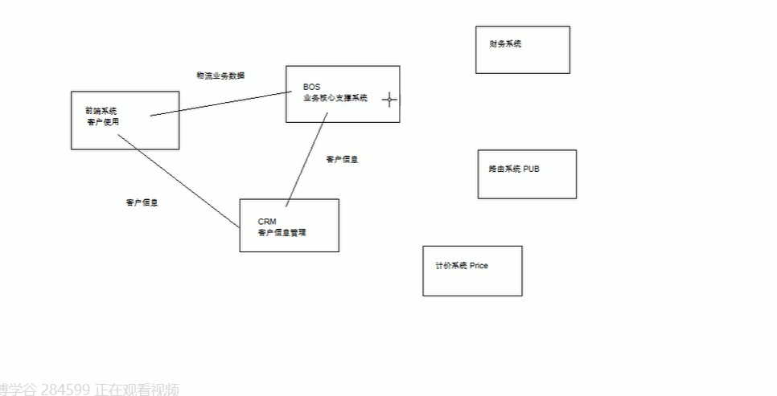

### BOS物流系统

1、主流软件系统类别介绍

（1）OA系统：office automation自动化办公

（2）CRM系统：customer relationship management客户关系管理

（3）ERP系统：enterprise resource planning企业资源计划，针对物资资源、人力资源、财务资源、信息资源管理集成一体化的企业管理软件。

MIS（信息管理系统，manage information system）

2、软件开发流程

瀑布开发模型：

（1）需求调研分析

（2）设计

（3）编码

（4）测试

（5）实施和运维

Java工程师：设计和编码

2.1 BOS模块关系：

2.2  开发环境

|          | 开发环境     | 产品环境 |
| -------- | ------------ | -------- |
| 操作系统 | windows      | Linux    |
| 开发工具 | VSCode、IDEA | JDK8     |
| 数据库   | mysql        | mysql    |
| web容器  | Tomcat8+     | Tomcat8+ |
| 浏览器   | Chrome       |          |

开发技术：

server端架构：struts2+spring+spring data+JPA接口+Hibernate

页面架构：jquery、easy UI

前端互联网系统页面架构：Bootstrap+AngularJS

Excel解析、生成：POI技术

远程调用：基于restful风格的CXF编程

Redis缓存使用、ActiveMQ消息队列

搜索服务器ElasticSearch、SpringData操作ElasticSearch服务器

定时调度框架：quartz

在线html编辑器：kindEditor使用

权限管理框架：Apache Shiro

