### 计算机网络

<hr>


### 1、计算机网络概述

#### 1.1 局域网

##### 1.1.1 局域网：覆盖范围小，自己花钱买设备，自己负责修理

心型结构

交换机：对网络信号进行加强并传输

（1）接入层交换机：接口较多，带宽固定，一般网线不超过100米

（2）汇聚层交换机：口不一定多，但是带宽要大

心型局域网示意图：

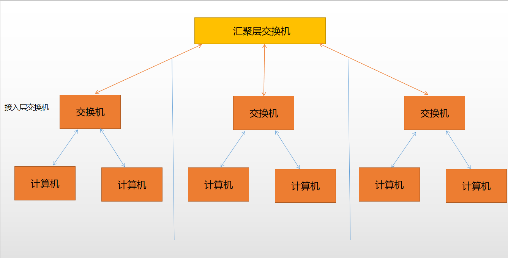


##### 1.1.2 Internet和广域网

（1）Internet

Internet网络运营商：（ISP: Internet service supplier）联通、电信、网通、移动等

每一个运营商都有自己的机房，用户访问自己运营商的网络会比较快，但是跨运营商会比较慢。

解决办法：双线机房，用户的网络分线在网络机房里同时连接不同的运营商的网络交换设备


（2）广域网

特点：网线较长，花钱租带宽，不需要自己维护，由服务商提供服务

为何带宽很高上网速度还很慢呢？

答：因为我们买的带宽是具体某一个网络运营商的带宽，但是这个运营商访问其它运营商或国外网络的带宽是不确定的，可能经过多层其它运营商，且带宽比较堵塞，导致网速较慢。


（3）计算机数据通信过程

机房计算机通过交换机，每一个运营商用一个不同的网段地址（公网地址）

举例：网络地址`13.0.0.0`，子网掩码`255.0.0.0`，有255表示网络部分，表示13代表的是网络部分，子网掩码是`255.255.0.0`，表示`13.0`是网络部分地址。网络后的部分是主机部分。

示意图：

绿色部分表示路由器地址

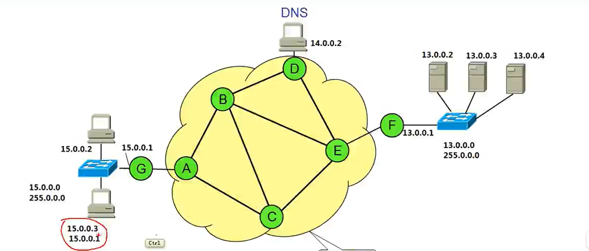


MAC地址（物理地址）：48位二进制地址，全球唯一

计算机网卡有MAC地址，计算机有IP地址


（4）数据发送到服务器的过程

> 1、浏览器输入网址：https://www.baidu.com
>
> 2、DNS域名服务器解析网址变为IP地址
>
> 3、过程
>
> 假设IP地址是`13.0.0.2`，MAC地址是`m2`
>
> 路由器IP地址是`13.0.0.1`，MAC地址是`m1`
>
> 访问IP地址为`15.0.0.0`的网站
>
> **数据包**：主机IP地址+目标主机IP地址+数据（data+13.0.0.2+15.0.0.0）
>
> **数据帧**：*<font color="blue">数据包</font>*+计算机MAC地址+路由器MAC地址（添加`m2`和`m1`）
>
> 4、经过中间路由数据的变化
>
> 物理地址的作用是路由器记录访问上级路由物理地址的信息，知道下一个网络找谁，最终找到目标服务器
>
> 比如`m1`路由器访问了`m3`路由器
>
> 数据帧的变化：将原来的`m2`和`m1`修改为`m1`和`m3`，其他不变
>
> 5、路由器的作用
>
> 将传过来的数据包进行修改，修改数据帧信息中的mac地址，变为自己的MAC地址和下一级路由器的MAC地址

示意图：

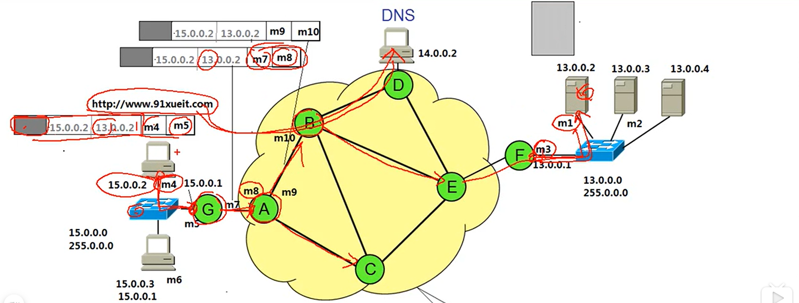


（5）服务器数据发送到我们的计算机的过程

> 1、将发送的数据进行切割
>
> 2、将数据放到缓存，要等到客户端确认接收完毕的时候才能清除缓存
>
> 3、传送过程就是一个反向的访问过程


##### 1.1.3 OSI参考模型

open system interconnection开方式系统互联

###### 模型分层

（1）应用层（应用程序）

所有能产生网络流量的程序（需要访问网络的，记事本不是，QQ和微信都是）

（2）表示层

在传输之前是否进行**加密**或**压缩**处理（主要是程序员的工作）

（3）会话层

记录服务器和我们计算机的会话信息和状态（如果浏览器打开多个窗口，要知道谁和谁链接，否则传错窗口不是很尴尬），没有流量后会话释放

查看会话：`netstat -n`，`Established`表示创建，`Time-Wait`表示会话要结束，`Close-Wait`表示将会话结束

通过查看会话层，查木马

+ 病毒破坏系统，木马分类比较多，在后台运行，比如窃取信息，需要通信，所以一定会建立会话

+ 通过`netstat -n`，查看所有会话

+ 通过`netstat -nb`可以查看哪个程序建立了会话（需要管理员权限）

**tip：**可以windows10左下角右键选择windows powershell（管理员选项输入命令），打开后就可以查看每个程序的端口，和会话状态


（4）传输层

进行数据传输，可靠传输（TCP协议），不可靠传输（UDP协议），主要进行流量控制

访问DNS就是不可靠的传输，没有响应继续发


（5）网络层

规划IP地址，选择最佳路径


（6）数据链路层（网络交换机带宽一致）

所有的网络数据传输，帧的开始和结束，透明传输，差错校验（什么时间开始传输，多长时间发送一个，如果出现与开始结束位相同的二进制，会加标记位，解码的时候去掉标记位）


（7）物理层（光纤等等。。。）

接口标准，电器标准（电压范围表示0和1），如何在物理链路上传输更快的速度


分层的好处，某一层改变，其它层不用变，实现模块化（比如`IPV4`变`IPV6`只是网络层的变化，不会影响其它层）


###### 排除网络故障

根据OSI模型从下往上查找（因为底层的最好找，越往上越难，不能一下子就重装系统吧！）

（1）物理层故障：查看连接状态，发送接收的数据包

（2）数据链路层故障

+ MAC地址冲突（可能有人通过改注册表不使用自己网卡的MAC地址）
+ 运营商停止服务，数据链路服务停止
+ 网口强制要求带宽导致的不匹配问题

（3）网络层错误

+ 配置了错误的IP地址、子网掩码、网关等
+ 路由器没有配置目标网络的路由

（4）应用层故障

+ 应用程序配置错误

+ 设置了错误的代理


##### 1.1.4 OSI参考模型与网络安全

（1）物理层安全隐患

别人接入到了我们的网络交换机

（2）数据链路层安全

ADSL拨号账号密码，交换机端口绑定MAC地址

（3）网络层安全

在路由器使用ACL控制数据包流量

（4）应用层安全

开发的应用程序没有漏洞（SQL注入获取设置自动登录，创建用户加入用户组，并开启远程，就能控制服务器）


##### 1.1.5 TCP/IP协议与OSI参考模型

示意图：

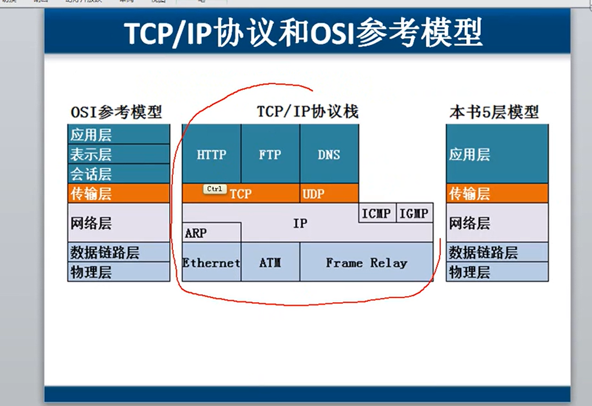

将应用层、表示层、会话层合并为应用层（主要协议HTTP、FTP、DNS）

传输层（主要协议TCP、UDP）

网络层（ARP协议为IP协议服务，IP协议为ICMP、IGMP协议服务）

数据链路层

物理层（Ethernet、ATM、Frame Relay协议）


访问网页过程：

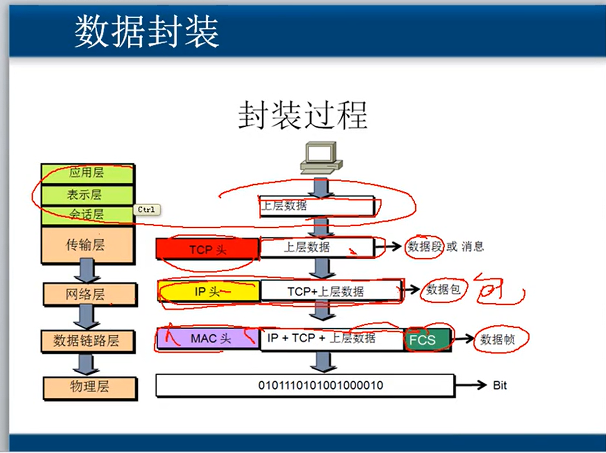


#### 1.2  计算机网络的性能

（1）速率：连接在计算机网络上的主机在数字信道上传送数据位数的速率，也叫`Data Rate`或`bit rate`，单位是b/s、kb/s、Mb/s、Gb/s

+ 我们申请的带宽是按照`b/s`计量的，安全程序的计量球是按照Byte计算的，所以4M带宽传输速度是在0.5M以内的

+ 信道：我们与服务器连接的传输通道，速率指在具体信道上的传输速率

（2）带宽：数字信道所能传送的最高数据传输速率

（3）吞吐量：在单位时间内通过某个网络的数据量，总的流量

我们与网站的连接，从不同的服务器获得的数据，一个5M带宽，一个10M带宽，那么吞吐量就是15M

（4）时延：

发送时延 =  数据块长度（bit）/   信道带宽（bit/s）

传播时延：数据在介质上传播的时间

处理时延：各级路由器和服务器处理数据的时间

排队时延：很多计算机给路由发送数据，后来的要排队，排队耽误的时间

**注意**：光纤传输速度比铜线快是因为光纤的设备可以支持解析更小的波形，可以让计算机以更快的频率发送数据，每秒发更多的波形（更多的数据），每秒可以传很大的数据量，但是在介质上的传播速度并不比铜线快多少（光纤20.5，铜线23.5）

（5）时延带宽积

时延带宽积 = 传播时延 * 带宽（在链路上的数据有多少）

（6）往返时间

从发送数据开始，到发送方收到接收方确认的时间

使用`ping`命令测试网络时间，`8.8.8.8`谷歌服务器，超过`2000ms`请求超时

（7）信道利用率

信道利用率 = 有数据通过时间  /  （有数据通过+无数据通过时间）

网络利用率：信道利用率加权平均值

> 网络当前时延 =  网络空闲时延 / （1 - 信道利用率）
>
> 100M带宽的时候，利用率100%，网络时延无穷大，所以是不可能打到理论带宽值的


### 2、通信基础

#### 2.1物理层

物理层解决如何连接各种计算机的传输媒体上传输数据比特流，而不是指具体的传输媒体。确定传输媒体的接口的一些特性。

定义机械特性、电气特性、功能特性、过程特性


#### 2.2 数据通信基础知识

##### 2.2.1 相关术语

数据：传送信息的实体

信号：数据的电气或电磁的表现

模拟信号：代表消息的参数的取值是连续的

数字信号：代表消息的参数的取值是离散的

码元：在使用时间域的波形表示数字信号时，代表不同离散值的基本波形就成为码元。数字通信中常常用时间间隔相同的的符号表示一个二进制数字，这样的时间间隔称为码元长度。1码元可以携带nbit信息量。

> 1码元携带nbit信息量：比如1码元携带3bit信息量
>
> 0V表示000，1V表示001，2V表示010......7V表示111


##### 2.2.2 信道相关

信道：表示向一个方向传送信息的媒体

单向通信（单工）

双向交替通信（半双工）

双向同时通信（全双工）


基带信号（基本频带信号）：传输距离近时采用基带传输

带通信号：传输距离远的时候，通过调制解调器进行功率放大


基带信号的几种调制方法

调幅：有振幅，无振幅来表示0和1

调频：高频表示1，低频表示0

调相：正弦波表示0，余弦波表示1


图解编码格式：

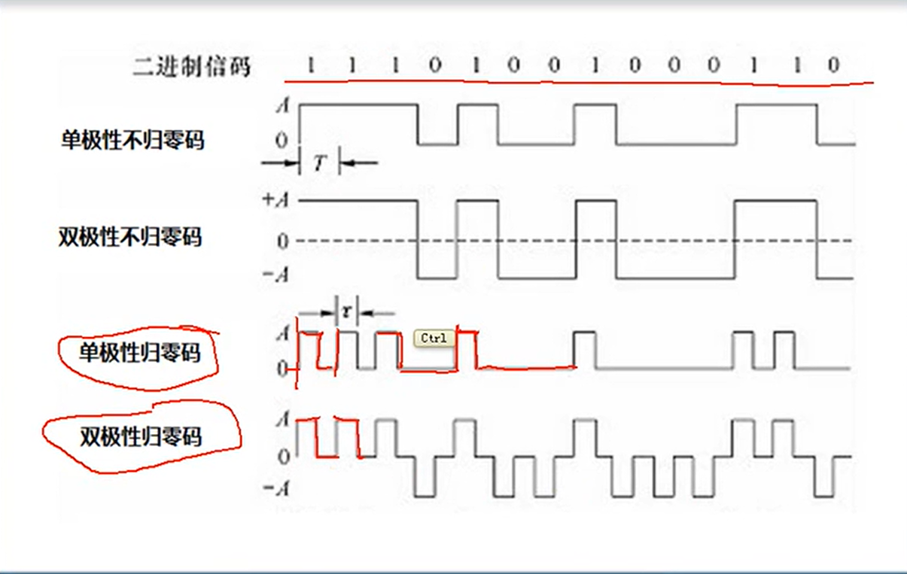


曼彻斯特编码：低电位 --> 高电位 0；高电位 --> 低电位 1

一个始终周期只表示一个bit，要通过两次采样，能携带时钟信号，且可表示没有数据传输（没有跳跃就是结束）

差分曼彻斯特编码：扛干扰强


奈式准则：假定理想条件下，为了避免码间串扰，码元的传输速率的上限值。（解析时因为频率太小无法识别导致的串扰）


香农公式：

极限传输速率 =  信道带宽  *  log（1 + S / N ）b/s

信噪比 = S /  N  （S表示信道内所传信号的平均功率，N表示信道内高斯噪声功率）

告诉我们有噪声干扰情况下，我们可以通过降低传输速率来保持无差错传输速率


#### 2.3 传输相关

##### 2.3.1 物理相关

网线

直通线：8根小线，两端对应（1，3，5发送，2，4，6发送，其它两根无作用）

使用场景：主机到交换机或集线器、路由器到交换机或集线器

网口的连接可以自动协商传输线缆和接收线缆


集线器（被淘汰）

只放大信号和重发，不具备信号的定向的传送能力，是一个大的冲突域。

因为所有连接集线器的设备，都会收到发送方的数据，只是MAC地址不匹配不做处理而已，设备互联多了，每个时刻只能两个计算机进行通信，计算机间通信要错开时间。


MAC地址：48位长度（计算机给我们的是16进制），前24位标识厂家

改MAC地址，在网络连接中高级可以设置指定的MAC地址（百度）

`ping www.baidu.com -t`可以一直`ping`，windows默认`ping`4次


##### 2.2.2 以太网和设备发展

标准以太网：Ethernet（10M）

优化以太网：集线器连接的计算机很多，冲突域增大，于是出现网桥


**网桥**：可以根据MAC地址，来判断是否通过，隔绝大的冲突域，优化以太网

网桥的口越来越多，然后就出现了交换机

**交换机**：全双工通信，会记录MAC地址，口可以存储数据帧，存储转发，没有冲突，效率很高，带宽独享（集线器带宽共享，冲突域大，效率低）


高速以太网：100M


企业局域网设计

以学院为例：

某某学院每个教室使用一个交换机（**接入层交换机**），然后所有接入层交换机连接到该学院的**汇聚层交换机**，汇聚层交换机连接该学院的服务器，并连接到学校的**核心层交换机**。


##### 2.3.3 信道复用技术

复用是通信技术中的基本概念，一条线缆上传输多个信道。


频分复用技术：不同信道用不同的频率，传的是波形叠加，解调时根据不同频率的过滤器获得原始信号。

时分复用技术：根据不同时间获取哪台机器的数据进行发送，另一边约定接收时间对应机器，实现复用。(容易造成线路资源浪费)

统计时分复用技术：每个数据加标记表示是哪一个VLAN

时分图：

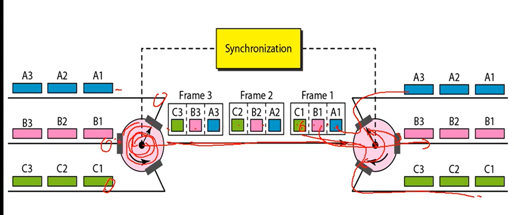

波分复用：光的频分复用


#### 2.4  数据链路层

##### 2.4.1 数据链路层信道类型

（1）点对点信道（广域网）

PPP协议，用户使用最多的数据链路层协议，电话拨号接入因特网一般就是使用PPP协议（可以封装TCP/IP协议）

PPP协议已经成为因特网正式标准

PPP协议组成部分：数据链路层协议（同步串行，异步串行介质）

PPP协议教学软件：Cisco Packet Tracer （可以支持身份验证，可以封装多个协议）


（2）广播信道（局域网）

链路：一条点对点的物理线路段

阶段一：总线

+ 一根总线，两端匹配电阻
+ 存在问题
  - 一个计算机发送的数据会给所有计算机发送数据，如果使用黑客工具，会获得所有发送数据
  - 技术：碰撞检测，发生碰撞后等待一个随机时间后在发送


阶段二：集线器（半双工）

+ 使用一个增强信号的集线器
+ 存在问题：和总线是一样的，存在安全问题

使用协议：CSMA/CD协议

只要满足带载波监听（检测是否有冲突）和冲突的碰撞检测的都可以认为是以太网


数据链路

解决问题：封装成帧，透明传输，差错控制

除了物理线路外，还必须有通信协议来控制这些数据的传输。若把实现这些协议的硬件和软件加到链路上，就构成了数据链路。

+ 现最常用是使用网卡来实现这些协议的硬件和软件
+ 一般的适配器包括了数据链路层和物理层这两层功能


数据链路传输的是帧

帧：枕头+帧尾+物理地址+校验和


透明传输示意图：

ESC表示转义字符

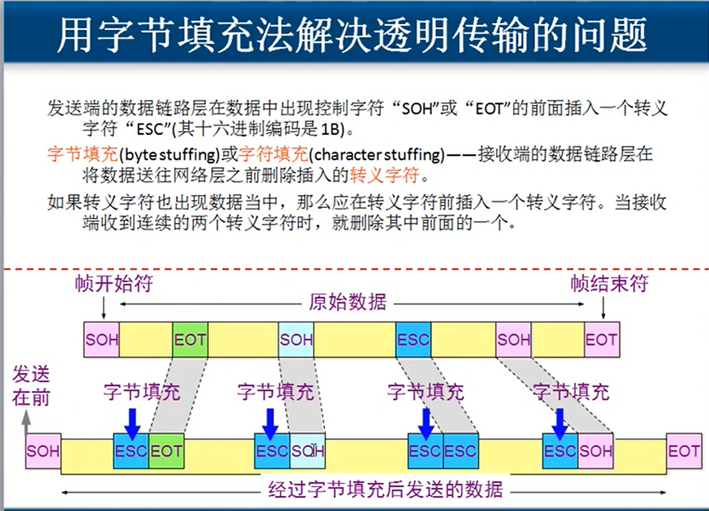


##### 2.4.2 差错检测

CRC循环冗余检验计算过程

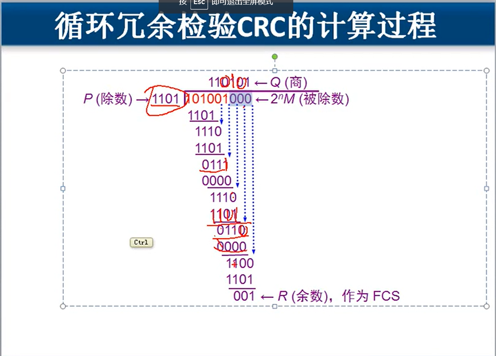

CRC算法分析：

> 假设传输数据为`101001`，除数`1101`，要比添加的0多一位
>
> ```
>    进位数据   110101 （Q商）
>     1101    101001000（被除数2^m）
> 	+		1101
>          -----------------
> 			 1110  (进位1)
> 	+		 1101  (进位1)
>          -----------------
> 			  0111 （0111首位不够，就加0）
> 	+		  0000  （进位0）
>          -----------------
> 			   1110
> 	+		   1101  (进位1)
>          -----------------
>                 0110
>     +           0000 (进位0)
>          -----------------
> 			     1100
>                  1101 （进位1）
>          -----------------
> 				  001  R（余数），作为FCS，帧校验序列
> 最后我们传输的数据是：101001（数据） + 001（FCS）
> 这个传输数据与1101进行运算时候的余数为0，我们认为数据没有差错
> ```

CRC是一种常用的检错方法，FCS是添加到数据后面的冗余码

FCS可以用CRC这种方法得到，但CRC并非用来获得FCS的唯一方法

CRC特点：

+ 这种检测方法不能判断哪一个或哪几个比特出错
+ 可能错误判断不出来，概率较小，添加的位数越小（冗余位越小），检错能力越强


#### 3、网络层

网络层负责：只负责在不同的网络中找传输的路径，然后传数据，不负责数据的检查和校验，也不负责顺序和丢失重传，尽力发送数据包。


##### 3.1 数据包在互联网中的传输

规划地址示意图：

**注意：**网关默认使用第一个能用的地址，可以任意设置，但是容易造成冲突。


网络部分必须一致（掩码表示网络部分长度），主机部分可以0-255中任意值

路由器必须配置路由表，告诉Router0下一跳是Router1，告诉Router1下一跳是Route0，不然路由器没有缓存，是不知道这个网络通路怎么选择的


##### 3.2 数据通信过程

> 1、应用程序准备要传输的文件
>
> 2、传输层：将文件分段，并编号（切割数据）
>
> 3、网络层：添加自身IP地址和目标IP地址
>
> 4、数据链路层：
>
> 使用自己子网掩码和判断目标地址在哪个网段
>
> （1）如果在同一网段，使用ARP协议，发送广播，解析IP地址和MAC
>
> （2）不在同一网段，使用ARP协议，发送广播，获取路由器MAC地址
>
> **注意**：跨网段通信必须有网关
>
> 添加计算机MAC地址和路由器的MAC地址
>
> 5、数据链路层
>
> 将数据转化为比特流，传给交换机
>
> 交换机将发送数据进行存储并转发给路由
>
> 路由将FCS和MAC地址去掉，根据路由表判断走什么线路，传给下一个路由
>
> 下一个路由添加上级路由和本机的MAC地址，给交换机
>
> 交换机找到目标主机，将数据发送给目标（交换机只能看懂MAC地址）
>
> 目标主机网络层去掉后面的MAC地址，传输层进行校验，最后准备发送的数据
>
> 6、交换机和路由器会中病毒吗？
>
> 答：不会，因为病毒是代码，因为数据被切割了，且他们只负责传输数据，并不负责解析数据，就不会运行程序，但是如果病毒是不断的发送广播报，会导致交换机和路由器不断转发没用的数据，让线路很忙。

数据传输示意图：

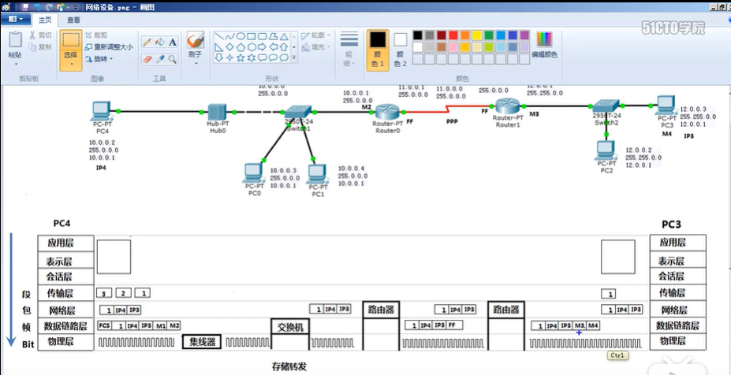


##### 3.3 网络层协议分层

###### 3.3.1 ARP协议

ARP协议为IP协议服务，发送广播，获取所有本网段的计算机的IP地址，目标地址是`FF-FF-FF-FF-FF-FF`就表示广播信息，获取所有目标计算机的MAC地址并缓存。


常见的ARP欺骗原理

ARP欺骗：A连接交换机，交换机还连着B和C计算机，A访问B发送广播，C收到广播后，在A缓存了B的MAC地址后，获得B的MAC地址，并让A缓存自己的MAC地址修改了原来缓存的B的MAC地址，这样A发送的消息，会先经过C计算机，C计算机可以对数据进行篡改后交给B。

网络执法官：收到A发送的广播，马上给一个不存在的MAC地址，缓存到A计算机，然后A发送的数据交换机都找不到对应的MAC地址，使得A无法通信。（只能欺骗本网段的通讯）

P2P终结者：可以控制本网段中的计算机访问Internet的上网流量，并控制能访问哪些网站。欺骗网关，网段内计算机A访问网关，会被计算机B拦截，并告诉网关地址为我B计算机的MAC地址，这样其它计算机访问网关的数据会到计算机B，然后它就可以实现流量控制，和控制访问的网站，然后发送数据给网关。


如何测试ARP

> 1、`ping 192.168.80.100`可以ping通的IP地址
>
> 2、`arp -a`查看刚刚ping的地址的MAC地址缓存
>
> 3、`arp -s 192.168.80.100（不存在的新地址） MAC地址`管理员身份禁止ping
>
> 4、ARP欺骗，属于数据链路层故障
>
> 5、问题：一台计算机可以访问网关内的计算机，但是不能访问外网，其它计算机都能正常访问外网？
>
> 分析：说明每一个层都是好的，因为ARP欺骗导致的
>
> **解决办法1**：本地计算机`arp -a`查看缓存，记录下缓存的MAC地址，然后用正常上网的计算机`arp -a`查看缓存，记录下缓存的MAC地址，在通过`arp -s  正常的IP地址 正常的MAC地址`，这样下一次访问就不再发送广播，直接用缓存访问到网关，实现正常上网。
>
> 如果网段内计算机都知道对方计算机地址，就不会发送广播，就不会发生ARP欺骗。
>
> **解决办法2：**新建一个静态批处理文件
>
> ```bat
> # 添加开机自启动静态ARP缓存
> arp -s 192.168.0.3 MAC1
> arp -s 192.168.0.4 MAC2
> arp -s 192.168.0.5 MAC3
> arp -s 192.168.0.6 MAC4
> ```
>
> `Win + R` 输入`gpedit.msc`，打开组本地策略，在windows设置启动/关机策略里添加开机启动脚本为我们编写的批处理文件
>
> （没有`gpedit.msc`可以根据百度执行批处理文件创建）
>
> **解决办法3**：下载ARP防火墙软件，设置ARP防火墙

清除ARP缓存在本地连接的修复里


###### 3.3.2 ICMP协议

ICMP协议是依赖于 IP协议的，主要用来跟踪包路径，和统计包的传输情况


**使用ICMP协议的命令**

ping命令：packet internet grope，因特网包探索器， 使用的ICMP协议

ping命令的常用参数：

（1）TTL：生存周期，最大为64，每经过一个路由自减1个

不修改的话，我们可以大概根据TTL看出来目标主机的操作系统

Linux默认开始`TTL=64`，windows默认`TTL=128`，Unix默认`TTL=255`

（2）`ping IP -t`一直`ping`下去

（3）`ping -l 200 IP`指定数据包大小进行ping操作

（4）`ping /?`可以查看ping指令的所有参数

（5）`ping IP -i 1`讲TTL设置为1，到下一个路由就停止了，就能看到下一个路由的IP地址，TTL设置多少就能看到某个沿途的的路由


**检查网络**

ADS：`202.99.160.68`

如果能ping通表示网络层没有问题

如果没有设置网关也是ping不通的，计算机不知道下一跳找谁，路由器没有下一跳路由表，也是无法访问另一个网段的计算机的

请求超时：数据包到了，但是没有回来，就会请求超时

目标主机无法到达：找不到目标主机


**`pathping`命令**

`pathping`：跟踪数据包的路径，能够追踪到最后出问题的路由器，还可以计算丢包情况。出现`*`表示超时，`*  *`表示当前设备拒绝`pathping`命令

可以查看并统计路由器丢包，数据链路丢包情况


**`tracert`命令**

`tracert IP`在路由器上跟踪数据包路径的明亮


###### 3.3.3 IGMP协议

组播（多播）：使用多播地址，分组发送流量，节省带宽，既可以在本网段多播，又可以广域网进行多播

两组人收看不同节目，两个节目的老师各用不同的多播地址，这样就能一份流量给一组人，但是必须实时，错过就没了。

点到点：一台机器到一台机器，每一个可以调整进度

广播：屏幕分享就是广播


多播：路由器上扫描，如果这个网段没有绑定多播数据包的，就不会请求多播数据包，不会建立会话。


###### 3.3.3 IP数据包结构

一个IP数据包由首部和数据两部分组成

+ 首部
+ 尾部

IP数据包示意图：

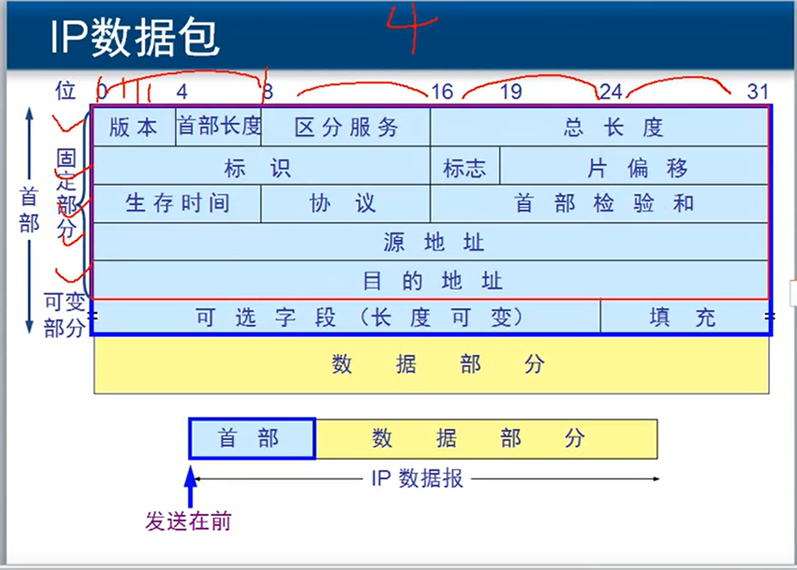

1）版本：4bit表示TCP/IP协议哪个版本的（分IPV4和IPV6）

2）首部长度：4bit，告诉首部长度，为了区分可变部分和数据部分

3）区分服务：1byte，QOS，设置优先级，让着急的数据包先过，不着急的排队（要在路由器）

如何设置QOS？

答：`gpedit.msc`打开本地组策略，windows设置下选择基于策略的QOS，右键新建策略，然后添加一个策略名和DSCP值，将所有包传输都添加这个服务区分字段，这样优先级就不一样了。

4）总长度：2byte（16bit），可以传65535个字节（网络层）

数据链路层帧：1500字节（**MIU**最大传输单元）。这时候会分片。

**泪滴攻击**：向目标计算机发送较大的分片却不完整的包，导致目标计算机一直在等着这个包完整，消耗计算机资源。对以前的老旧windows操作系统有作用，利用就是老操作系统的TCP/IP协议中的分片重组代码中的bug。

实例：微软的SMB2中发现了一个远程重启漏洞，利用该漏洞的溢出代码已经在互联网上广泛传播，使Windows 7和Windows Vista的用户暴露在泪滴攻击的风险中。

5）标识：2byte（16bit），给数据包进行编号。

6）标志位：3bit，只有后2bit有效，最后一位是MF（more fragment），MF=0表示最后一个分片，MF=1表示后面还有分片。DF（don't fragment），只有DF=0时才允许分片。

7）片偏移：29bit，表示第一个字节是整个数据包中的多少字节。

片偏移示意图：

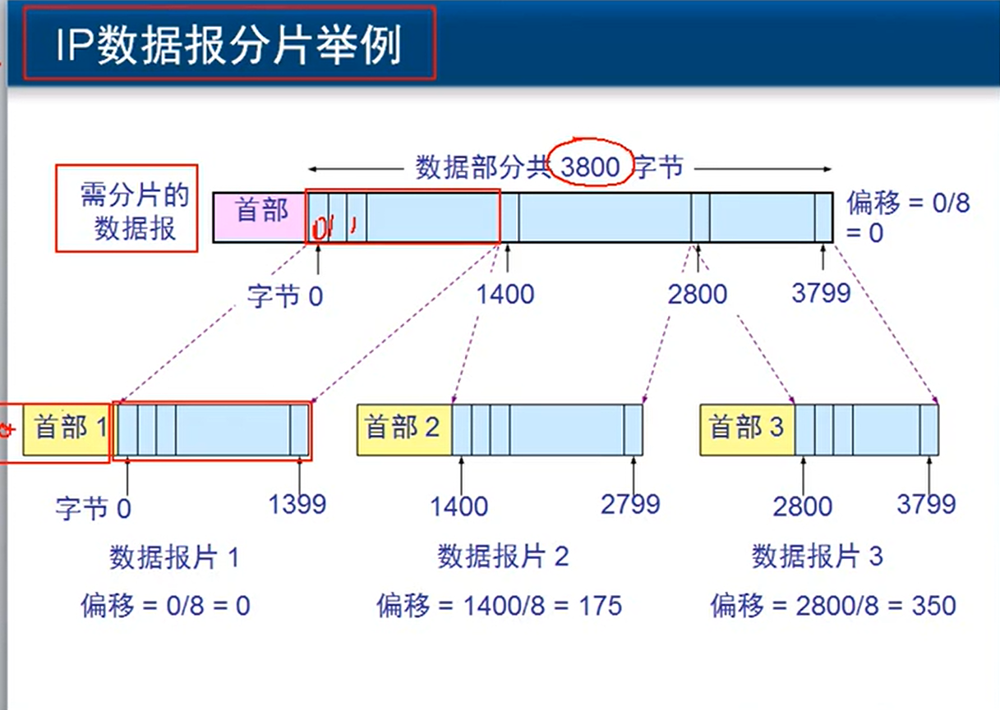

8）生存时间：1byte，每过一个TTL都会自减，防止路由环路出现

9）协议号：1byte，规定使用了那些协议，交给计算哪个进程来处理

常见协议号

ICMP：1	IGMP：2   TCP：6   UDP：17  IPV6：41  OSPF：89

域名解析使用的UDP协议

10）首部检验和：2byte（16bit），如果计算的时候检验和不为0，就丢弃数据包

11）源地址：4byte发送数据计算机IP

12）目标地址：4byte接收计算机IP

13）可选字段：2byte，不够填充，长度可变（通常发送数据不使用这个）

**注意**：IPV6就没有可选字段和填充了

14）填充

15）数据：我们发送的数据


###### 3.3.4 抓包工具排除网络故障

场景：交换机某台计算机发送了广播，交换机会给所有网内计算机发送广播，这样就会导致其它计算机访问外网就会很慢。

我们可以通过抓包，看这个广播包是什么计算机发送的。（如果是伪造的IP网址，就需要通过二分法在电脑间拔网线查哪一个电脑中了病毒）

二分法：先拔一半，如果好了，就能确定在那拔的一半中。


###### 3.3.5 IP协议

RIP协议

动态路由：路由器根据IP协议自己学习网络怎么走

静态路由：路由器根据管理员的设置来知道网络怎么走

网络畅通条件：数据包有去有回

问题实例：

局域网A通过路由A，路由A连接到路由B，路由B连接B局域网，两个路由内部的网都是畅通的，但是A网中的计算机访问服务器一直请求超时（数据包到了，但是发送的数据不知道怎么走回去），检查发现服务器没有设置网关，计算机不知道数据发给谁。


RIP协议：当网络里增加了路由器，被添加路由器连接的路由器会发送广播通知增加的新路由器，协议会根据走的路由数最小作为最佳路径，周期性广播路由表，跳数少为最佳路径，30s周期（目的是某个路由器宕机了，及时更新各个路由的信息），RIP协议最大条数15跳，超过后会认为不可到达，只适合规模较小的网络。**本质就是每个路由30s周期发广播自己获取所有连接设备的信息**。


OSPF协议

open shortest path first最短路径优先

**本质就是根据最佳带宽，选择最佳路径。**


###### 3.3.6  BGP协议

BGP 外部网关协议，不同自治系统路由器之间交换路由信息的协议。


#### 4、传输层

OSI和DoD模型示意图：

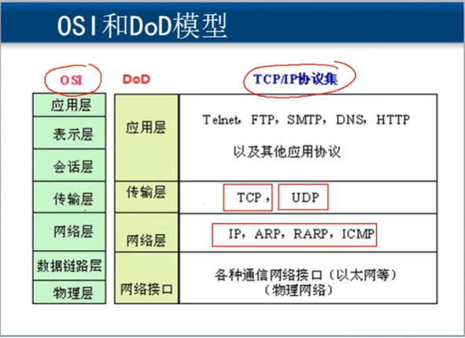


传输层协议：TCP、UDP协议

使用场景：TCP传输控制协议，UDP用户数据包协议，TCP可靠传输，UDP非可靠传输。

TCP：需要将传输的文件分段，建立会话，可靠传输，流量控制

UDP：一个数据包就能够完成数据通信（DNS域名解析、QQ聊天、屏幕广播、多播）

FTP在传输层使用的也是TCP协议。


传输层协议与应用层协议关系

TCP+3389端口：RDP协议，远程桌面协议

TCP+21端口：FTP协议，文件传输协议

TCP+23端口：Telnet协议

TCP+25端口：SMTP协议，邮件传输协议

TCP+110端口：POP3协议，接收邮件端口

TCP+69端口：TFTP协议

TCP+53端口：DNS、UDP协议

TCP+161端口：SNMP协议

TCP+520端口：RIP协议

TCP+445端口：共享文件夹


服务和应用层之间的关系

开启应用层程序，程序根据使用的协议开启服务，各自监听不同端口

外部来的数据包会根据TCP数据包中的端口号，找到对应监听该端口的程序。

网络安全：监听端口


如何在windows上安装服务

如何查看服务侦听端口

`netstat -an`

`netstat -n`查看建立会话

`netstat -nb`查看建立会话的进程

`telnet IPAddress 3389`测试到远程


如何更改服务使用默认端口

更改默认端口可以迷惑入侵者，即使开启了远程桌面，对方也不知道我端口开启的什么服务。


如何设置windows网络安全

黑客指定网段扫描，然后扫描端口，就是为了知道服务器开启的什么服务，然后就能知道远程是否打开，就能连接到远程，在破密码


传输层为互相通信的应用进程提供了逻辑通信，对收到报文进行差错检验，传输层面向连接和无连接服务。


端口是一个2byte（16bit），端口具有本地意义，不能冲突

常用协议端口：0-1023

登记端口号：1024-49151

客户端端口号：49152-65535

`netstat -n | findstr "ESTABLISED"`查看已经创建连接的端口


##### 4.1 UDP协议

###### 4.1.1 UDP介绍

+ UDP是无连接的，及发送数据之前不需要建立连接
+ UDP不保证可靠交付，同时也不适用拥塞控制
+ UDP面向报文，适合多媒体通信要求
+ UDP支持一对一，一对多，多对一和多对多的交互通信
+ UDP首部开销小，只有8byte（64bit）


###### 4.1.2 UDP协议

首部示意图：

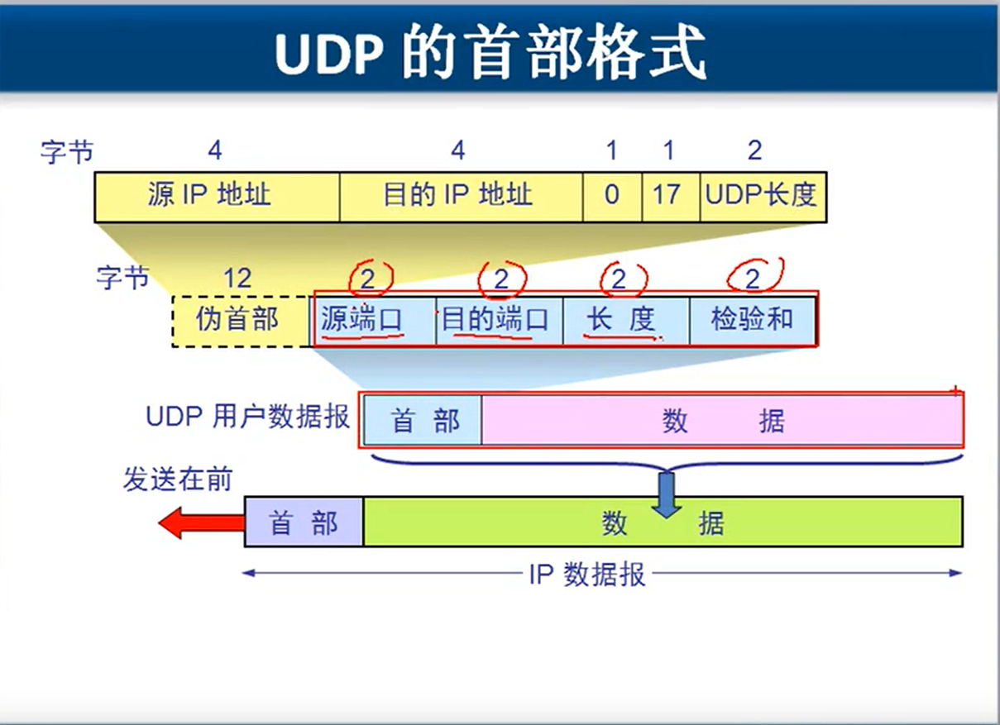

计算检验和示意图：

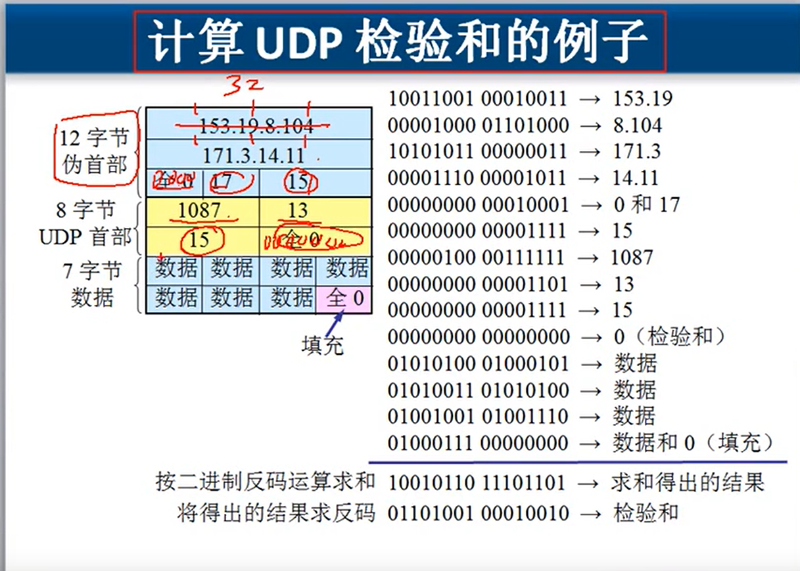


###### 4.1.3 TCP协议

TCP协议

+ 面向连接的传输层协议
+ 每一条TCP连接只能由两个端点
+ 提供可靠的交付服务
+ 提供全双工通信
+ 面向字节流


TCP协议特点

（1）可靠传输

套接字：IP地址+端口

确认丢失：A发送数据包，如果B没响应，就认为没收到，重新发送，可能出现重复，会丢弃重复。

确认迟到：A发送数据包1，B一直没给响应，就重新发送数据包1，然后B收到了刚刚的数据包1，并要求发数据包2，这时候B收到两个数据包1，去重复，并给了2个要数据包2的响应，A会确认迟到，不给理会，发送数据包2

这种可靠传输协议称为ARQ（automatic repeat request），ARQ的请求是自动进行的。


将数据变成字节流，加载到发送缓存，接收方也有一个接收缓存用来接收数据，每确认一个，删除一个缓存（都会建立两个缓存，接收缓存和发送缓存）


流水线传输：A的发送窗口为5个数据包，直接发送5个，如果B确认1，2接收到，窗口就后移2格，如果某一个没有确认收到，窗口不能移动，目的是不能清除缓存，重新发送。


累积确认：B计算机如果123都收到，发3收到，默认123都收到，A就会发送4


（2）TCP报文格式

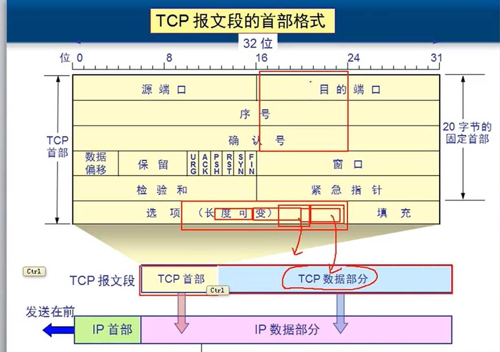

+ 源端口、目的端口：2byte
+ 序号：4byte，表示这个字节是整个数据的多少字节
+ 确认号：4byte，通知该发哪个字节开始的数据了
+ 数据偏移：4bit，记录从哪一个字节开始时是数据部分，1111，一个1表示15个字节，最大60个字节，就是选项和填充部分最大40字节（20个固定字节）
+ 保留字段：6bit
+ URG：1bit，如果是1，表示数据包不排队先发送
+ ACK：1bit，如果是0，确认号无效，1的时候表示建立连接
+ PSH：1bit，如果是1，表示数据包在拼接时直接放到前面
+ RST：1bit，如果是1，表示中断了需要重新建立连接
+ SYN：1bit，同步位，表示发起会话
+ FIN：1bit，如果是1，表示释放连接
+ 窗口：4byte，约定双方创建的发送和接收缓存大小
+ 检验和：2byte，用来确认数据是否正确
+ 紧急指针：2byte，表示需要紧急处理数据的位置
+ 选项和填充：最大40字节


SYN同步位攻击：攻击XP，不断给XP发送请求，但是伪造大量的IP不存在的地址，马上让XP的CPU占用率飙起来。

Land攻击：让XP不断自己给自己建立会话


以字节为单位的滑动窗口

超时重传时间：对报文段设置一次计时器，只要计时器设置的重传时间到还没收到确认，就要重传这段报文。

流量控制：计算机A给计算机B发送文件，根据缓存双方建立缓存大小（滑动窗口大小），但是A发送的比较快，B比较慢，B就会告诉A慢一点发送。**本质就是控制滑动窗口大小控制流量。**